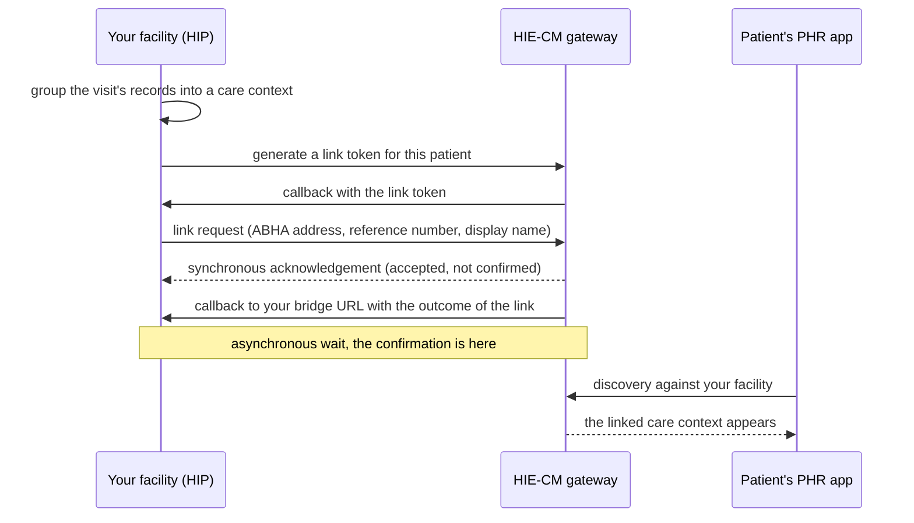

## In plain words

Linking is the [M2](shared.glossary.m2) step where your facility attaches
a [care context](hiecm.concept.care-context) to the patient's
[ABHA address](shared.glossary.abha-address). Your facility is the
[HIP](shared.glossary.hip) when it publishes a record, and your software
is how it takes that role. Once linked, the patient can see the record in
their [PHR](shared.glossary.phr) app, and an organisation that asks to
read it takes the [HIU](shared.glossary.hiu) role and can request it
under consent. Nothing you hold is discoverable until it is linked.

## Before you start

Three things must already be true, each checkable:

- Your facility holds a facility ID from the
  [HFR](shared.glossary.hfr) and a bridge linked with type `HIP`. See
  [link a facility to its bridge](m4-link-bridge.md).
- You hold a gateway session token from the sessions endpoint
  (gateway_sessions_create in the gateway reference).
- The patient has an ABHA address, which is the M1 module's job.

## What happens



1. **Get a link token for the patient.** Call
   [Generate Link Token](hiecm.endpoint.m2-generate-link-token), which
   posts to `/hiecm/v3/token/generate-token`. The token does not come
   back on that response. It arrives at your bridge, on
   [the token callback](hiecm.callback.m2-on-generate-token-result).
   Store it against the patient. A link token is valid for six months.
2. **Link the care context.** Call
   [Link care contexts to an ABHA address](hiecm.endpoint.m2-hip-link-care-context),
   which posts to `/hiecm/hip/v3/link/carecontext` and carries the link
   token. Send `abhaNumber` as digits only and `hiType` as a string.
   The response is an acknowledgement that the request was accepted,
   and nothing more.
3. **Wait for the outcome on your bridge.** It arrives at
   [the link callback](hiecm.callback.m2-on-carecontext-result), with
   `response.requestId` matching the `REQUEST-ID` you sent. Success is
   the absence of an `error` object; the `status` reads
   `Successfully Linked care context`.
4. **Notify ABDM that the care context is linked.** Wait at least five
   seconds, then call
   [Link Care Context Notify](hiecm.endpoint.m2-link-care-context-notify),
   which posts to `/hiecm/hip/v3/link/context/notify`, and read the
   outcome on
   [the notify callback](hiecm.callback.m2-on-context-notify-result).
   An `ERRORED` acknowledgement with
   [ABDM-1006](hiecm.error.abdm-1006) "No care context linked" means the
   link is not yet visible: retry at 5, 15 and 60 seconds. See
   [context notify timing](hiecm.concept.context-notify-timing).
5. **Be ready to serve the record at once.** Within about ten seconds of
   a successful notify the patient's PHR app requests the data itself,
   and a consent notification followed by a health information request
   arrive on your bridge. See
   [linking triggers a self requested fetch](hiecm.concept.linking-triggers-self-fetch).

## How you know it worked

Your bridge receives a POST at `/api/v3/link/on_carecontext` whose
`response.requestId` matches the `REQUEST-ID` you sent on the link call,
carrying `status: Successfully Linked care context` and no `error`. The care context then
appears when the patient's PHR app runs discovery against your facility.

Do not treat the synchronous acknowledgement on the link call as success.
It says the request was accepted, not that anything was linked.

```observation schema=exit-condition
channel: callback
path: <YOUR_BRIDGE_URL>/api/v3/link/on_carecontext
match:
  response.requestId: <THE_REQUEST_ID_YOU_SENT>
  error: absent
timeout_seconds: 60
note: >
  The success status is the sentence "Successfully Linked care context",
  so test for the absence of error rather than comparing status against
  SUCCESS. Delivery is usually within one second.
```

## When it goes wrong

The frequent failures, in rough order of frequency, each with its fix in
the linked error atom:

- A 400 with an empty body on the link call, when `abhaNumber` carries
  dashes or `hiType` is an array.
- hiecm.error.abdm-1006 on the notify acknowledgement when the notify
  was sent before the link became visible. Retry with backoff.
- hiecm.error.abdm-1056 when the care context is already linked or the
  link reference number is invalid.
- hiecm.error.abdm-1062 when the ABHA number does not match the link
  token.
- hiecm.error.abdm-1063 when the HIP id does not match the link token.
- hiecm.error.abdm-2406 when calls are made out of the logical sequence.
