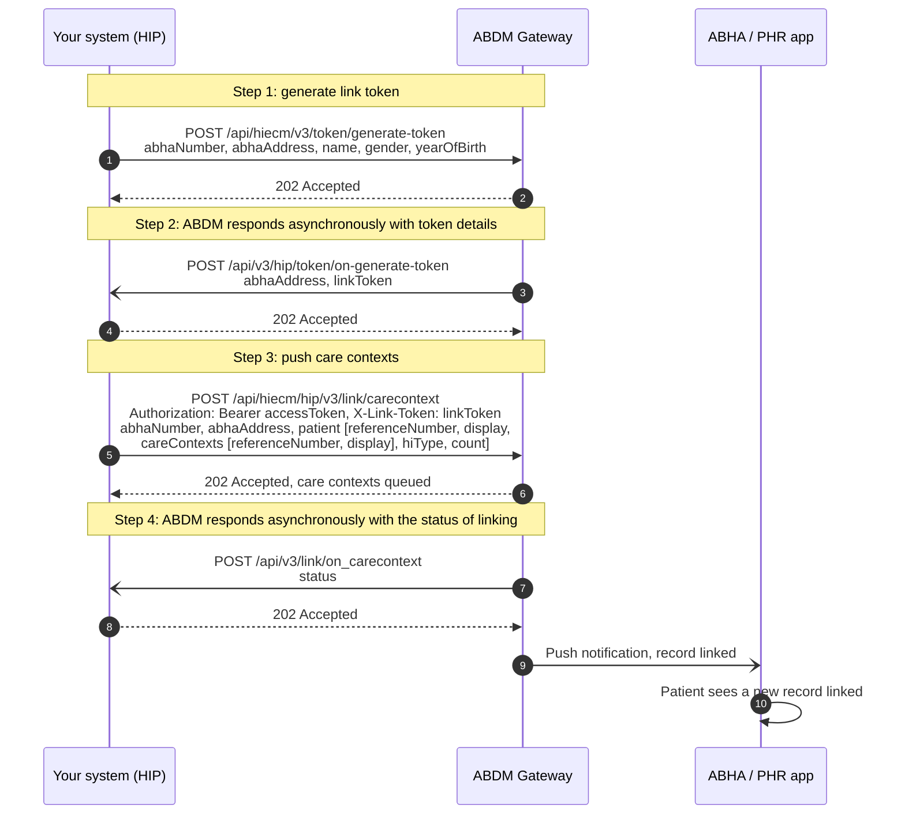

# Link a care context to a patient's ABHA

## In plain words

The Health Information Provider (HIP) initiates the linking process using the
patient's ABHA details. Upon successful authentication, a link token valid for
six months is generated, enabling the relevant Care Contexts to be linked with
the patient's ABHA Address.

```mermaid
sequenceDiagram
    autonumber
    participant S as Your system (HIP)
    participant G as ABDM Gateway
    participant P as ABHA / PHR app
    Note over S,G: Step 1: generate link token
    S->>G: POST /api/hiecm/v3/token/generate-token<br/>abhaNumber, abhaAddress, name, gender, yearOfBirth
    G-->>S: 202 Accepted
    Note over S,G: Step 2: ABDM responds asynchronously with token details
    G-)S: POST /api/v3/hip/token/on-generate-token<br/>abhaAddress, linkToken
    S-->>G: 202 Accepted
    Note over S,G: Step 3: push care contexts
    S->>G: POST /api/hiecm/hip/v3/link/carecontext<br/>Authorization: Bearer accessToken, X-Link-Token: linkToken<br/>abhaNumber, abhaAddress, patient [referenceNumber, display,<br/>careContexts [referenceNumber, display], hiType, count]
    G-->>S: 202 Accepted, care contexts queued
    Note over S,G: Step 4: ABDM responds asynchronously with the status of linking
    G-)S: POST /api/v3/link/on_carecontext<br/>status
    S-->>G: 202 Accepted
    G-)P: Push notification, record linked
    P->>P: Patient sees a new record linked
```

The steps, as drawn:

1. Your system calls `POST /api/hiecm/v3/token/generate-token` with the
   patient's ABHA number or ABHA address, name, gender and year of birth.
2. The gateway answers 202 Accepted.
3. The gateway calls `POST /api/v3/hip/token/on-generate-token` on your bridge
   with the ABHA address and the link token.
4. Your system answers 202 Accepted and stores the link token against the
   patient.
5. Your system calls `POST /api/hiecm/hip/v3/link/carecontext` with the gateway
   access token, the link token in `X-Link-Token`, and the patient's care
   contexts: for each, a reference number and a display name, the HI type and
   the count of records.
6. The gateway answers 202 Accepted and queues the care contexts.
7. The gateway calls `POST /api/v3/link/on_carecontext` on your bridge with the
   status of the linking.
8. Your system answers 202 Accepted.
9. The gateway pushes a notification to the patient's ABHA or PHR app that a
   record is linked.
10. The patient sees the new record linked in the app.

When a linked care context changes, tell ABDM with
`POST /api/hiecm/hip/v3/link/context/notify`. The outcome arrives on your
bridge at `/api/v3/links/context/on-notify`.

## Before you start

The facility holds a facility ID and a bridge linked with type HIP: see [Journey 4 on M4](/docs/hiecm/v3/milestones/m4#m4-link-bridge). You hold a gateway session token, and the patient has an ABHA address.

## What happens

Generate the link token; the 202 carries nothing, and the token arrives on `/api/v3/hip/token/on-generate-token`. Store it against the patient and reuse it: it is valid for six months. Link with `X-Link-Token` set to it, and wait for `/api/v3/link/on_carecontext`.

## How you know it worked

A POST reaches `/api/v3/link/on_carecontext` whose `response.requestId` matches the `REQUEST-ID` of your link call and whose status reads Successfully Linked care context. The care context then appears when the patient runs discovery against your facility. The 202 on the link call is receipt, not success.

## When it goes wrong

`ABDM-1056`: the care context is already linked. `ABDM-1038`: the ABHA address does not match the link token. `ABDM-1026`: the link token is invalid, so generate a fresh one. `ABDM-2406`: calls made out of the logical sequence. No callback at all: see [the callback never arrives](/docs/hiecm/v3/troubleshooting/callback-never-arrives).
