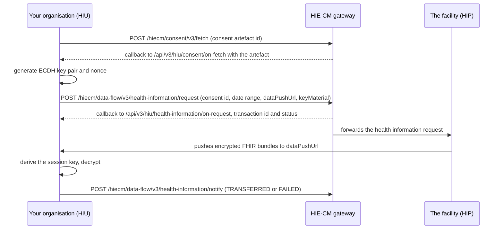

## In plain words

Fetching records is the M3 step after a grant. You hold one or more
[consent artefact](hiecm.concept.consent-artefact) ids from
[requesting consent](m3-request-consent.md). This flow turns an artefact
id into decrypted records on your own server: read the artefact, ask the
[HIP](shared.glossary.hip) for the data it covers, and decrypt
what the HIP pushes to your callback.

## Before you start

Four things must already be true, each checkable:

- A granted consent request, with at least one consent artefact id. See
  [request consent](m3-request-consent.md).
- You hold a gateway session token. See
  [the gateway session](hiecm.concept.gateway-session).
- You have generated an [ECDH](shared.glossary.ecdh) key pair
  and a 32 byte nonce for this exchange, on Curve25519. The data flow
  page at /docs/hiecm/v3/concepts/data-flow sets out who generates what.
  Use Fidelius, the reference implementation, rather than hand rolling
  the scheme.
- You expose a `dataPushUrl` endpoint that can receive encrypted
  [FHIR](shared.glossary.fhir) bundles: the URL you name in the
  health information request. Name the exact URL you will receive the
  push on, and treat it as its own route rather than assuming your
  other registered callbacks serve it.

## What happens



1. **Fetch the artefact.** Call
   [Consent Fetch](hiecm.endpoint.m3-consent-fetch), which posts to
   `/hiecm/consent/v3/fetch` with the consent artefact id from the
   grant. The answer arrives on
   [the consent artefact detail, fetched by artefact id](hiecm.callback.m3-on-consent-fetch)
   at `/api/v3/hiu/consent/on-fetch`. It carries the exact care contexts
   approved, the HI types permitted, the date range,
   the data erase date, and the HIP and
   [HIU](shared.glossary.hiu) identifiers. Store it: the health
   information request needs the artefact detail, not the id alone.
2. **Generate your key pair.** Before the next call, generate an ECDH
   key pair and a nonce, in the group the HIP will expect. The M3
   endpoint atom names `Curve25519` as the supported curve. This step
   happens inside your own system; it is not a gateway call.
3. **Ask for the data.** Call
   [HIU Health Information Request](hiecm.endpoint.m3-hiu-health-information-request),
   which posts to `/hiecm/data-flow/v3/health-information/request` with
   the consent id, the date range you want inside what the artefact
   permits, your `dataPushUrl`, and your public key in
   `keyMaterial.dhPublicKey`. The acknowledgement arrives on
   [acknowledgement of a health information request](hiecm.callback.m3-on-health-information-request)
   at `/api/v3/hiu/health-information/on-request`, carrying a
   transaction id and a status. This is an acknowledgement, not the
   records.
4. **Receive the push.** The HIP encrypts the FHIR bundles with the
   shared secret it derives from your public key and its own, and posts
   them to the `dataPushUrl` you supplied. This is not a call to an
   ABDM endpoint. It lands directly on your own server, from the HIP.
5. **Decrypt.** Derive the same session key from your private key and
   the HIP's public key, carried in the push payload's `keyMaterial`, and
   decrypt. The cipher is specified on the HIP side, and the data flow
   concept page above reproduces it.
6. **Acknowledge the transfer.** Call
   [HIU Data Flow Notification](hiecm.endpoint.m3-hiu-data-flow-notify),
   which posts to `/hiecm/data-flow/v3/health-information/notify` with
   `notification.statusNotification.sessionStatus` set to `TRANSFERRED` once you have
   decrypted everything, or `FAILED` with the reason if you have not.

## How you know it worked

```observation schema=exit-condition
channel: self
path: your own call to /hiecm/data-flow/v3/health-information/notify
match:
  notification.statusNotification.sessionStatus: TRANSFERRED
timeout_seconds: unknown
note: >
  The payload shape of what arrives at your dataPushUrl is not yet
  published, so no field name from that push is named here. The field
  you send once every care context in the artefact has decrypted is
  notification.statusNotification.sessionStatus, set to TRANSFERRED on
  the data flow notify call. Treat that outbound call, not an inbound
  field name, as the exit signal.
```

## When it goes wrong

- The chain stops partway between fetch, request and push. See
  [accepted, then nothing](hiecm.troubleshooting.accepted-then-nothing),
  which covers finding which callback in a multi step chain is missing.
- The consent was valid when you sent the request but is not granted by
  the time the HIP checks it. The error names this state, not a specific
  cause, and a mid flow revocation is one way it happens. See
  [ABDM-1062](hiecm.error.abdm-1062). Treat every fetch as a fresh
  permission check, not a cached yes.
- The artefact id is unknown, expired or already used past its window.
  See [ABDM-1112](hiecm.error.abdm-1112).
- The push never arrives at your `dataPushUrl`. See
  [the callback never arrives](hiecm.troubleshooting.callback-never-arrives).
  Check the `dataPushUrl` you sent on the health information request,
  not your other registered callback URLs.
- The clock is wrong and every call fails. See
  [ABDM-2402](hiecm.error.abdm-2402).
- The `REQUEST-ID` is missing, malformed or reused. See
  [ABDM-2404](hiecm.error.abdm-2404).
- No session token was sent. See [ABDM-2500](hiecm.error.abdm-2500).
- ABDM fails and does not say why. See [ABDM-9999](hiecm.error.abdm-9999).

Next: a decrypted bundle today is not a standing right to fetch again
tomorrow. Read
[consent, what it authorises and how it ends](hiecm.concept.consent-artefact)
for when the artefact you just used stops being usable, so you know
when a repeat fetch needs a fresh consent request instead.
