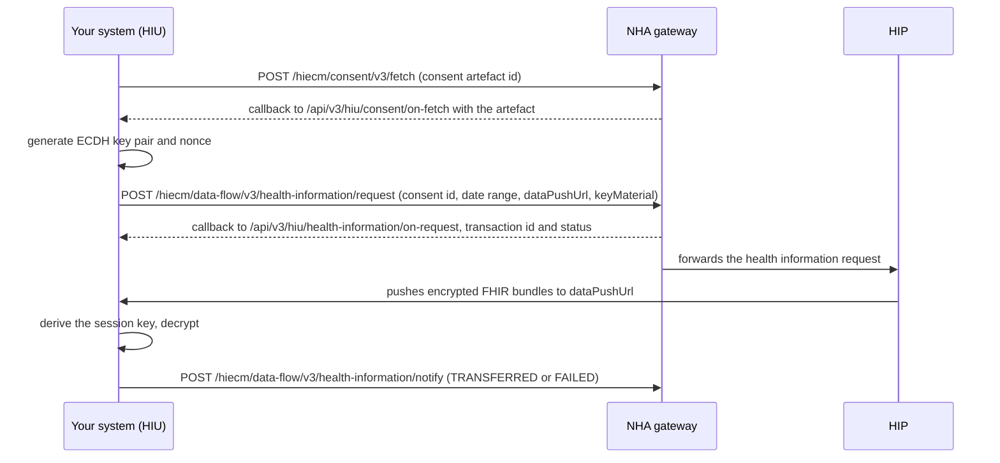

## In plain words

Fetching records is the M3 step after a grant. You hold one or more
[consent artefact](../concepts/consent-artefact.md) ids from
[requesting consent](m3-request-consent.md). This flow turns an artefact
id into decrypted records on your own server: read the artefact, ask the
[HIP](../../shared/glossary/hip.md) for the data it covers, and decrypt
what the HIP pushes to your callback.

## Before you start

Four things must already be true, each checkable:

- A granted consent request, with at least one consent artefact id. See
  [request consent](m3-request-consent.md).
- You hold a gateway session token. See
  [the gateway session](../concepts/gateway-session.md).
- You have generated an [ECDH](../../shared/glossary/ecdh.md) key pair
  and a 32 byte nonce for this exchange, on Curve25519. NHA's M2 document
  specifies the scheme; this repository's data flow concept page
  (`site/docs/hiecm/v3/concepts/data-flow.md`) sets out who generates
  what and points at NHA's reference implementation, Fidelius, rather
  than hand rolling it.
- You expose a `dataPushUrl` endpoint that can receive encrypted
  [FHIR](../../shared/glossary/fhir.md) bundles: the URL you name in the
  health information request. NHA's M3 file only says to expose one; it
  does not say whether that URL must differ from your other registered
  callback URLs. The data flow concept page notes it may differ from
  your registered gateway URL, not that it must.

## What happens



1. **Fetch the artefact.** Call
   [Consent Fetch](../endpoints/m3-consent-fetch.md), which posts to
   `/hiecm/consent/v3/fetch` with the consent artefact id from the
   grant. The answer arrives on
   [the consent artefact detail, fetched by artefact id](../callbacks/m3-on-consent-fetch.md)
   at `/api/v3/hiu/consent/on-fetch`. NHA's file says this carries the
   exact care contexts approved, the HI types permitted, the date range,
   the data erase date, and the HIP and
   [HIU](../../shared/glossary/hiu.md) identifiers. Store it: the health
   information request needs the artefact detail, not the id alone.
2. **Generate your key pair.** Before the next call, generate an ECDH
   key pair and a nonce, in the group the HIP will expect. The M3
   endpoint atom names `Curve25519` as the supported curve. This step
   happens inside your own system; it is not a gateway call.
3. **Ask for the data.** Call
   [HIU Health Information Request](../endpoints/m3-hiu-health-information-request.md),
   which posts to `/hiecm/data-flow/v3/health-information/request` with
   the consent id, the date range you want inside what the artefact
   permits, your `dataPushUrl`, and your public key in
   `keyMaterial.dhPublicKey`. The acknowledgement arrives on
   [acknowledgement of a health information request](../callbacks/m3-on-health-information-request.md)
   at `/api/v3/hiu/health-information/on-request`, carrying a
   transaction id and a status. This is an acknowledgement, not the
   records.
4. **Receive the push.** The HIP encrypts the FHIR bundles with the
   shared secret it derives from your public key and its own, and posts
   them to the `dataPushUrl` you supplied. This is not a call to an
   ABDM endpoint. It lands directly on your own server, from the HIP.
5. **Decrypt.** Derive the same session key from your private key and
   the HIP's public key, carried in the push payload's `keyMaterial`, and
   decrypt. NHA's M3 document does not describe the cipher; it is
   specified on the HIP side in NHA's M2 document, reproduced in the
   data flow concept page above.
6. **Acknowledge the transfer.** Call
   [HIU Data Flow Notification](../endpoints/m3-hiu-data-flow-notify.md),
   which posts to `/hiecm/data-flow/v3/health-information/notify` with
   `statusNotification.sessionStatus` set to `TRANSFERRED` once you have
   decrypted everything, or `FAILED` with the reason if you have not.

## How you know it worked

```observation schema=exit-condition
channel: self
path: your own call to /hiecm/data-flow/v3/health-information/notify
match:
  statusNotification.sessionStatus: TRANSFERRED
timeout_seconds: unknown
note: >
  NHA's M3 file documents no payload shape for what arrives at your
  dataPushUrl, so no field name from that push is confirmed here. What
  is confirmed, from hiecm-m3.yaml, is the field you send once every
  care context in the artefact has decrypted: statusNotification.sessionStatus
  set to TRANSFERRED on the data flow notify call. Treat that outbound
  call, not an inbound field name, as the exit signal until the push
  payload itself has been observed.
```

Not yet observed against the sandbox. This repository has not run a
fetch through to a decrypted bundle. When it has, record the real
payload shape here and set `verified.status`.

## When it goes wrong

- The chain stops partway between fetch, request and push. See
  [accepted, then nothing](../troubleshooting/accepted-then-nothing.md),
  which covers finding which callback in a multi step chain is missing.
- The consent was valid when you sent the request but is not granted by
  the time the HIP checks it. NHA's own error table names this state,
  not a specific cause; a mid flow revocation is one way it happens. See
  [ABDM-1062](../errors/abdm-1062.md). Treat every fetch as a fresh
  permission check, not a cached yes.
- The artefact id is unknown, expired or already used past its window.
  See [ABDM-1112](../errors/abdm-1112.md).
- The push never arrives at your `dataPushUrl`. See
  [the callback never arrives](../troubleshooting/callback-never-arrives.md).
  Check the `dataPushUrl` you sent on the health information request
  specifically, since it may not be the same endpoint your other
  registered callbacks land on.
- The clock is wrong and every call fails. See
  [ABDM-2402](../errors/abdm-2402.md).
- The `REQUEST-ID` is missing, malformed or reused. See
  [ABDM-2404](../errors/abdm-2404.md).
- No session token was sent. See [ABDM-2500](../errors/abdm-2500.md).
- ABDM fails and does not say why. See [ABDM-9999](../errors/abdm-9999.md).

Next: a decrypted bundle today is not a standing right to fetch again
tomorrow. Read
[consent, what it authorises and how it ends](../concepts/consent-artefact.md)
for when the artefact you just used stops being usable, so you know
when a repeat fetch needs a fresh consent request instead.
