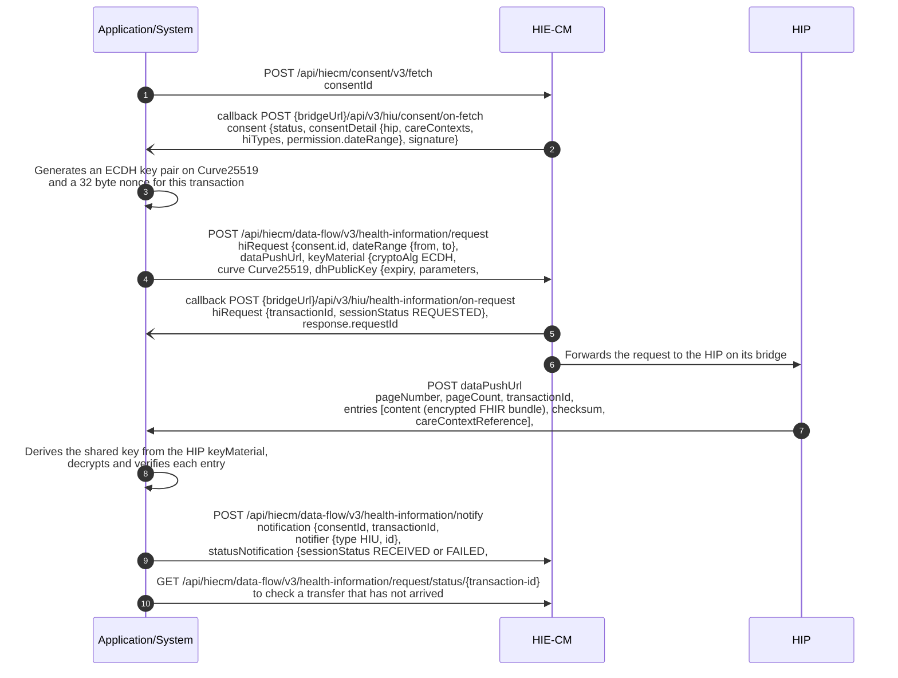

# Fetch the records a granted consent artefact covers

## In plain words

Using the consent artefact ID, the HIU fetches the consent artefact and
requests the health information covered under that consent. The requested
health data is then securely delivered to the data push URL provided by the
HIU.

```mermaid
sequenceDiagram
    autonumber
    participant S as Application/System
    participant CM as HIE-CM
    participant H as HIP
    S->>CM: POST /api/hiecm/consent/v3/fetch<br/>consentId
    CM-)S: callback POST {bridgeUrl}/api/v3/hiu/consent/on-fetch<br/>consent {status, consentDetail {hip, careContexts,<br/>hiTypes, permission.dateRange}, signature}
    S->>S: Generates an ECDH key pair on Curve25519<br/>and a 32 byte nonce for this transaction
    S->>CM: POST /api/hiecm/data-flow/v3/health-information/request<br/>hiRequest {consent.id, dateRange {from, to},<br/>dataPushUrl, keyMaterial {cryptoAlg ECDH,<br/>curve Curve25519, dhPublicKey {expiry, parameters,
    CM-)S: callback POST {bridgeUrl}/api/v3/hiu/health-information/on-request<br/>hiRequest {transactionId, sessionStatus REQUESTED},<br/>response.requestId
    CM->>H: Forwards the request to the HIP on its bridge
    H->>S: POST dataPushUrl<br/>pageNumber, pageCount, transactionId,<br/>entries [content (encrypted FHIR bundle), checksum,<br/>careContextReference],
    S->>S: Derives the shared key from the HIP keyMaterial,<br/>decrypts and verifies each entry
    S->>CM: POST /api/hiecm/data-flow/v3/health-information/notify<br/>notification {consentId, transactionId,<br/>notifier {type HIU, id},<br/>statusNotification {sessionStatus RECEIVED or FAILED,
    S->>CM: GET /api/hiecm/data-flow/v3/health-information/request/status/{transaction-id}<br/>to check a transfer that has not arrived
```

A decrypted bundle today is not a standing right to fetch again tomorrow. Every
fetch is a fresh permission check against an artefact the patient can revoke.

## Before you start

A granted consent request with at least one artefact id, a gateway session token, and a `dataPushUrl` endpoint of your own that accepts the encrypted FHIR bundles. Use a maintained implementation of the key exchange rather than writing it yourself: see [how a record travels](/docs/hiecm/v3/concepts/data-flow).

## What happens

Fetch the artefact and store what arrives on `/api/v3/hiu/consent/on-fetch`: the care contexts, HI types and date range it allows. Generate an ECDH key pair on `Curve25519` and a nonce for this transaction. Send the health information request with the consent id, a date range inside the artefact's, your `dataPushUrl` and your public key in `keyMaterial`. The on-request callback carries the `transactionId`. The HIP posts the pages to your `dataPushUrl` directly, not through the gateway. Derive the shared key from the HIP's `keyMaterial`, decrypt, then send the notify call.

## How you know it worked

Every entry for every care context decrypts, and your notify call reports `sessionStatus` `RECEIVED`.

## When it goes wrong

The chain stops between fetch, request and push: find the missing step on [accepted, then nothing](/docs/hiecm/v3/troubleshooting/accepted-then-nothing), and check the `dataPushUrl` you sent rather than your registered callback URL. `ABDM-1062`, consent not granted: the patient revoked or the grant lapsed mid flow. `ABDM-1112`: the artefact id is invalid or already expired. A transfer that never arrives can be checked with the status call against its `transactionId`.
