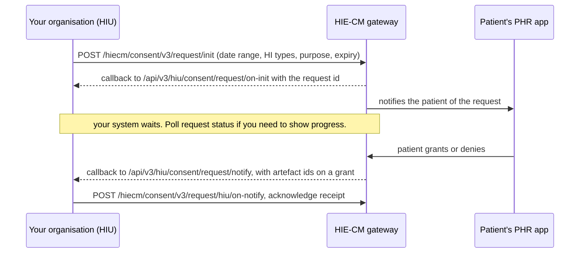

## In plain words

Requesting consent is the M3 step where your organisation asks a patient
for permission to read health records held somewhere else. Your
organisation is the [HIU](shared.glossary.hiu) whenever it asks to read
records it did not create, and your software is how it asks. The ask and
the permission are two different things. A
[consent artefact](hiecm.concept.consent-artefact) exists only if the
patient grants the request. Until then you hold a request id, not a
right to any record.

## Before you start

Five things must already be true, each checkable:

- You hold a gateway session token. See
  [the gateway session](hiecm.concept.gateway-session).
- Your organisation holds a [bridge](shared.glossary.bridge) linked in
  the `HIU` type, so the [HIE-CM](shared.glossary.hie-cm) can route the
  patient's decision to it. For a facility, that link is the last step of
  [linking a facility to its bridge](m4-link-bridge.md).
- Your callback URL is registered with ABDM and reachable from the
  public internet. See
  [the callback URL](shared.sandbox.callback-url).
- You know the patient's [ABHA address](shared.glossary.abha-address).
  That is [M1](shared.glossary.m1)'s job. Without it there is no
  one to ask.
- You have a [purpose of use](shared.glossary.purpose-of-use)
  code for the request. There are six codes, and an insurer checking a
  claim uses `HPAYMT`.

## What happens



1. **Build the consent request and call init.** Name the patient's ABHA
   address, the [HI types](shared.glossary.hi-type) wanted, the
   date range the records must fall in, the purpose code, and the
   expiry you are setting for the request itself, the window the
   patient has to answer. That expiry is not the same as the validity
   period the patient sets when they grant. See the two clocks on the
   consent concept page. Call
   [Consent Init Request](hiecm.endpoint.m3-consent-request-init), which
   posts to `/hiecm/consent/v3/request/init`. The request and response
   shapes are in the M3 specification, published at /specs/hiecm-m3.yaml,
   rather than copied here.
2. **Receive the acknowledgement callback.**
   [The consent request was accepted, with its request id](hiecm.callback.m3-on-consent-request-init)
   arrives at `/api/v3/hiu/consent/request/on-init` and carries the
   consent request id. Store it. Everything that follows keys off it.
3. **Wait, and poll if you need to show progress.** The patient acts in
   their own time. Call
   [Consent Request Status](hiecm.endpoint.m3-consent-request-status)
   to read the current state without waiting for the next callback; its
   answer arrives on
   [the consent manager reports the state of a consent request you asked about](hiecm.callback.m3-on-consent-request-status).
   A consent request is in one of five states: `REQUESTED`, `GRANTED`,
   `DENIED`, `EXPIRED`, `REVOKED`.
4. **The patient grants or denies, in their [PHR](shared.glossary.phr)
   app.** This step is not a call your system makes. The whole decision
   happens on the patient's side, in the app they use.
5. **The decision arrives on your callback.**
   [The patient's decision, sent to the requester](hiecm.callback.m3-on-consent-request-notify-hiu)
   arrives at `/api/v3/hiu/consent/request/notify`, carrying the status
   and, on a grant, the consent artefact ids created against the
   request. Store every id. A granted request can produce more than one.
6. **Acknowledge receipt.** Call
   [Consent HIU On-Notify](hiecm.endpoint.m3-consent-hiu-on-notify),
   which posts to `/hiecm/consent/v3/request/hiu/on-notify`, so the
   gateway stops retrying delivery.

## How you know it worked

```observation schema=exit-condition
channel: callback
path: /api/v3/hiu/consent/request/notify
match:
  notification.status: GRANTED
timeout_seconds: unknown
note: >
  the payload also carries at least one id in notification.consentArtefacts.
  How long the patient has to act is the window you set on the init
  call, not a gateway timeout.
```

## When it goes wrong

- The request sits in `REQUESTED` with no decision. See
  [consent stuck in Requested](hiecm.troubleshooting.consent-stuck-requested),
  which covers the request window against the validity period, the two
  separate clocks: running out of the request window moves the state to
  `EXPIRED`, not a change in what a grant would later allow.
- The on-init or on-notify callback never lands. See
  [the callback never arrives](hiecm.troubleshooting.callback-never-arrives).
- The clock is wrong and every call fails. See
  [ABDM-2402](hiecm.error.abdm-2402).
- The `REQUEST-ID` is missing, malformed or reused. See
  [ABDM-2404](hiecm.error.abdm-2404).
- No session token was sent. See [ABDM-2500](hiecm.error.abdm-2500).
- ABDM fails and does not say why. See [ABDM-9999](hiecm.error.abdm-9999).

Next: once a grant arrives with artefact ids, go to
[fetch the records](m3-fetch-records.md).
