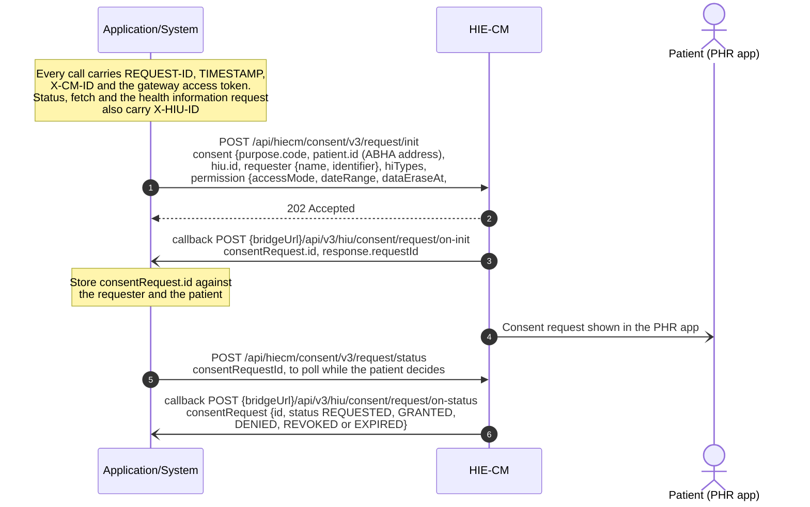

# Request consent for a patient's health records

## In plain words

- An HIU requests access to a patient's health data by sending a consent request
  with the patient's ABHA address via the HIE-CM.
- The HIE-CM acknowledges the request and returns a Consent Request ID through
  the Gateway.
- The patient is notified by the HIE-CM and can review, approve, or deny the
  consent request.
- The HIE-CM then communicates the patient's consent status back to the HIU
  through the Gateway.

```mermaid
sequenceDiagram
    autonumber
    participant S as Application/System
    participant CM as HIE-CM
    actor P as Patient (PHR app)
    Note over S: Every call carries REQUEST-ID, TIMESTAMP,<br/>X-CM-ID and the gateway access token.<br/>Status, fetch and the health information request<br/>also carry X-HIU-ID
    S->>CM: POST /api/hiecm/consent/v3/request/init<br/>consent {purpose.code, patient.id (ABHA address),<br/>hiu.id, requester {name, identifier}, hiTypes,<br/>permission {accessMode, dateRange, dataEraseAt,
    CM-->>S: 202 Accepted
    CM-)S: callback POST {bridgeUrl}/api/v3/hiu/consent/request/on-init<br/>consentRequest.id, response.requestId
    Note over S: Store consentRequest.id against<br/>the requester and the patient
    CM-)P: Consent request shown in the PHR app
    S->>CM: POST /api/hiecm/consent/v3/request/status<br/>consentRequestId, to poll while the patient decides
    CM-)S: callback POST {bridgeUrl}/api/v3/hiu/consent/request/on-status<br/>consentRequest {id, status REQUESTED, GRANTED,<br/>DENIED, REVOKED or EXPIRED}
```

The consent request ID is the handle for everything that follows. Store it against the requester and the patient.

The patient's decision arrives later, on your bridge, as described in Journey 2.

## Before you start

A gateway session token, a bridge linked with type HIU for your facility, a callback URL reachable over public HTTPS, the patient's ABHA address, and a purpose of use code: an insurer checking a claim uses `HPAYMT`.

## What happens

Init the request with the ABHA address, the HI types, the date range the records must fall in, the purpose, and the expiry of the request itself, which is how long the patient has to answer. Store `consentRequest.id` from the on-init callback. Poll the status call only to show progress. On the notify callback, store every id in `consentArtefacts`, then acknowledge with `/api/hiecm/consent/v3/request/hiu/on-notify` so delivery stops.

## How you know it worked

A POST reaches `/api/v3/hiu/consent/request/notify` with status GRANTED and at least one consent artefact id. The window the patient has to act is the one you set on init, not a gateway timeout.

## When it goes wrong

The request stays in REQUESTED: see [consent stuck in Requested](/docs/hiecm/v3/troubleshooting/consent-stuck-requested). The on-init or notify callback never lands: see [the callback never arrives](/docs/hiecm/v3/troubleshooting/callback-never-arrives). DENIED is an answer, not a fault, and no retry changes it.
