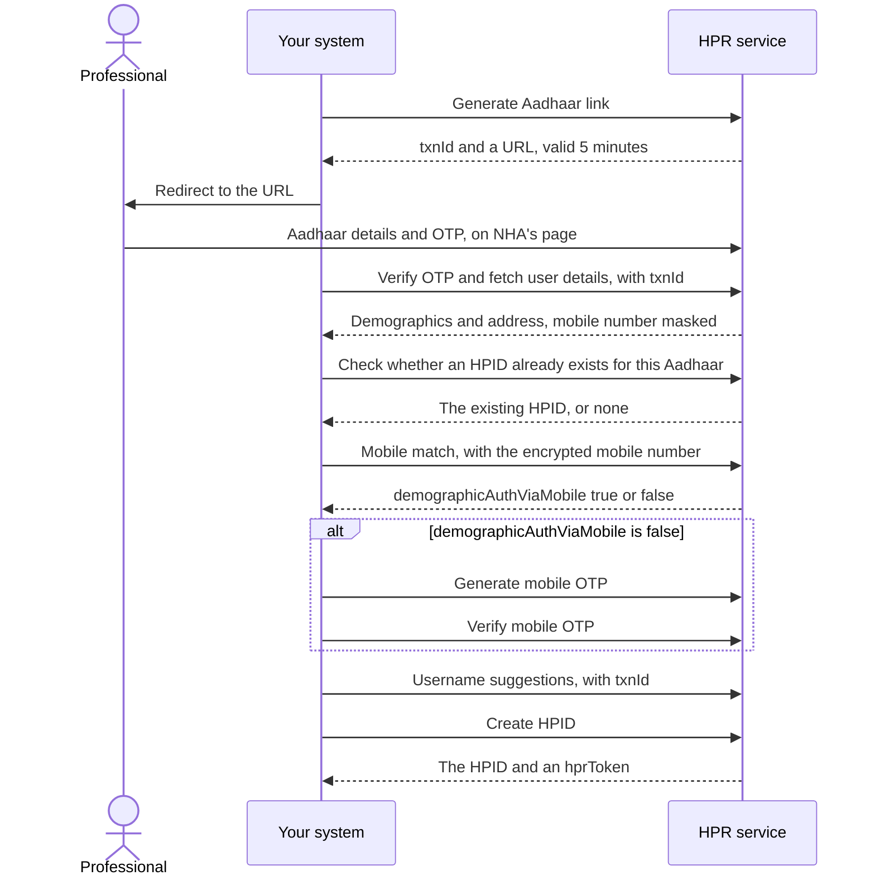

## In plain words

An [HPID](../../shared/glossary/hpid.md) is a healthcare professional's
identity number in ABDM, 14 digits long, issued by the
[HPR](../../shared/glossary/hpr.md). This flow is how a person gets one.
They prove who they are against Aadhaar, confirm a mobile number, and
the registry issues the number and a token that stands for them on later
calls.

Your system never handles the Aadhaar number or the Aadhaar
[OTP](../../shared/glossary/otp.md). The professional enters those on a
page the HPR hosts. Your system handles a transaction id and a redirect.

Three categories are open today: doctor, nurse and pharmacist.

## Before you start

Four things must already be true, each checkable:

- You hold a gateway session token. See
  [the gateway session](../concepts/gateway-session.md). Every call in
  this flow carries it in `Authorization`.
- You can redirect the professional to a URL and bring them back. The
  Aadhaar step happens in a browser, not in your API client.
- You can encrypt a value with NHA's public certificate. See
  [encrypting an identifier](../concepts/input-encryption.md). The mobile
  number, the email address and the password all travel encrypted, and
  the certificate is fetched from `/v4/int/api/v1/auth/cert`.
- You know which category and subcategory the professional falls in, as
  codes rather than names. Fetch them from the HPR master data calls
  rather than hard coding them: the subcategory codes create HPID uses
  are not the same as the ones register professional uses.

## What happens

1. **Generate the Aadhaar link.** You get back a `txnId` and a temporary
   URL. The URL expires after five minutes. If the professional does not
   finish in that window, call this again rather than reusing the URL.
2. **Poll the authentication status if you want to show progress.** This
   call is optional and it returns a bare boolean, not an object. Read it
   as a boolean or your client will fail to parse it.
3. **Verify the OTP and fetch the user's details.** The response carries
   demographic and address details from Aadhaar, with the mobile number
   masked.
4. **Check whether an HPID already exists for this Aadhaar.** A person
   who already has one does not get a second. Stop here and use the one
   that comes back.
5. **Match the mobile number.** Send it encrypted. The response field is
   `demographicAuthViaMobile`. When it is true the number is already
   verified against Aadhaar and the OTP steps are skipped entirely.
6. **Verify the mobile by OTP when the match said false.** Generate the
   OTP with the mobile number and the `txnId`, then verify it with the
   OTP and the same `txnId`.
7. **Ask for username suggestions, then create the HPID.** Create HPID
   takes the professional's details, with the email address and password
   encrypted. It returns the HPID and an `hprToken`.

Keep the `hprToken`. Registering the professional's profile carries it in
the payload, and onboarding a facility needs an HPR token in a header.

Method and path are not published for any of these nine calls. Take them
from the sandbox documentation for the healthcare professional registry
and use the field tables on the operations page.

## How you know it worked

The create HPID response carries an HPID of 14 digits and a non empty
`hprToken`. Calling check HPID exists by Aadhaar again, for the same
Aadhaar, then returns that same HPID rather than none.

Neither of those means the professional has a profile. The HPID is an
identity, not a registration. See
[register the professional](m4-register-professional.md).

## When it goes wrong

The failures the M4 sources document, each with its fix in the linked
error atom:

- [HIS-3021](../errors/his-3021.md) when an HPID already exists for this
  Aadhaar. Step 4 is what stops you reaching this.
- [HIS-2045](../errors/his-2045.md) when the session behind the `txnId`
  has expired, which the five minute URL window makes easy to hit.
- A bare boolean where your client expected an object, from the optional
  status poll. That is the documented shape, not a fault.
