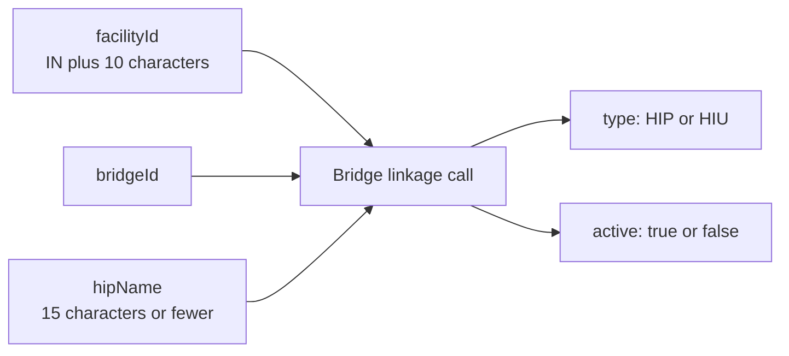

## In plain words

A facility ID on its own moves no records. The facility has to be linked
to a [bridge](../../shared/glossary/bridge.md), which is the software
that acts for it on the network, and each link says whether that software
acts as a [HIP](../../shared/glossary/hip.md), a
[HIU](../../shared/glossary/hiu.md), or both through separate links.

One facility can have several bridges. This is the last registration step
in front of production for M2 and M3.

## Before you start

Three things must already be true, each checkable:

- The facility is onboarded and holds a facility ID in the form `IN`
  followed by 10 characters. See
  [onboard a facility](m4-onboard-facility.md). A facility still in draft
  has no id to link.
- You hold the bridge id for the software that will act for the facility.
- You have chosen the name patients will see. Three rules bind it: 15
  characters or fewer, no special characters, and unique for every bridge
  on that facility.

## What happens

One call carries six values: `facilityId`, `facilityName`, `bridgeId`,
`hipName`, `type` and `active`. The `type` is `HIP` or `HIU`. A facility
whose software both publishes records and requests them needs a link of
each type, not one link that claims both.

The `hipName` is what a person sees in their
[PHR](../../shared/glossary/phr.md) application when they search for this
hospital, so it is a naming decision as much as a technical one. NHA's
worked example builds it from the hospital name plus the bridge name.

Method and path are not published for this call. The parameter table is,
on the operations page.

## How you know it worked

The link is present and `active` is true for the facility and bridge you
sent. The proof that it works, rather than merely exists, is the flow it
unblocks: a facility with an active HIP link can complete
[linking a care context](m2-link-care-context.md), and one with an active
HIU link can raise a consent request.

## When it goes wrong

The failures the M4 sources document, each with its fix in the linked
error atom:

- [HIS-1124](../errors/his-1124.md) when a call needs a bridge that is
  not linked to this facility.
- [HIS-1128](../errors/his-1128.md) when the HIP name is already in use,
  which the uniqueness rule makes common on a facility's second bridge.
- A name longer than 15 characters or carrying a special character,
  rejected as validation rather than as a naming rule.
