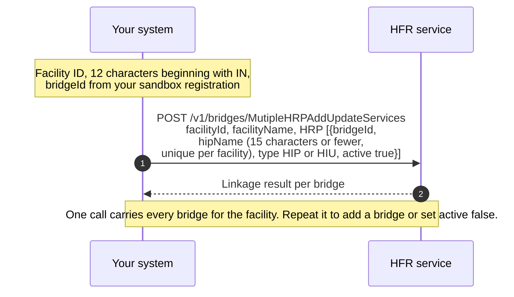

# Link a facility to its bridge

## In plain words

### Facility-Bridge linkage

A Facility ID alone does not enable health record exchange. The facility must be linked to a bridge, with each linkage designated as either a HIP or an HIU.

- A single facility can be linked to multiple bridges.
- A single bridge can be linked to multiple facilities. See [one bridge, many facilities](/docs/hiecm/v3/concepts/how-it-fits#one-bridge-many-facilities).
- The HIP/HIU role is defined for each facility-Bridge linkage.
- Integration-level configurations are set once, while facility-specific configurations are maintained separately for each linked facility.

```mermaid
sequenceDiagram
    autonumber
    participant S as Your system
    participant H as HFR service
    Note over S: Facility ID, 12 characters beginning with IN,<br/>bridgeId from your sandbox registration
    S->>H: POST /v1/bridges/MutipleHRPAddUpdateServices<br/>facilityId, facilityName, HRP [{bridgeId,<br/>hipName (15 characters or fewer,<br/>unique per facility), type HIP or HIU, active true}]
    H-->>S: Linkage result per bridge
    Note over S,H: One call carries every bridge for the facility. Repeat it to add a bridge or set active false.
```

The HIP name is the name displayed to patients in their [ABHA](/docs/hiecm/v3/getting-started/glossary#abha) or [PHR](/docs/hiecm/v3/getting-started/glossary#phr) app when they search for a hospital. The following rules apply to the HIP name:

- Maximum 15 characters
- No special characters
- Must be unique for every Bridge linked to the same facility

For example, the HIP name can be derived by combining the hospital name and Bridge name, while ensuring that the above naming rules are met.

A facility with a Facility ID and a linked HIP bridge can perform [M2](/docs/hiecm/v3/api/m2) activities, including linking care contexts and sharing health records. A facility with a linked HIU bridge can perform [M3](/docs/hiecm/v3/api/m3) activities, including requesting patient consent and fetching health records. M4 covers the registration of the facility and the healthcare professionals working at the facility.

Next: [M4 API reference](/docs/hiecm/v3/api/m4).

## Before you start

The facility is submitted and holds its Facility ID, 12 characters beginning with IN. A facility still in Draft has no ID to link. You hold the `bridgeId` of the software that will act for it.

## What happens

Call `/v1/bridges/MutipleHRPAddUpdateServices` with `facilityId`, `facilityName` and one entry per bridge carrying `bridgeId`, `hipName`, `type` and `active`. A facility that publishes and fetches needs one entry of type HIP and one of type HIU, not one entry that claims both.

## How you know it worked

The linkage result lists the bridge as active for the facility. The proof that it works is the flow it unblocks: a facility with an active HIP link completes [linking a care context](/docs/hiecm/v3/milestones/m2#m2-link-care-context), and one with an active HIU link can raise a consent request.

## When it goes wrong

A `hipName` longer than 15 characters or carrying a special character is refused as validation. A name already used by another bridge on the same facility is refused, which is common on a facility's second bridge.
