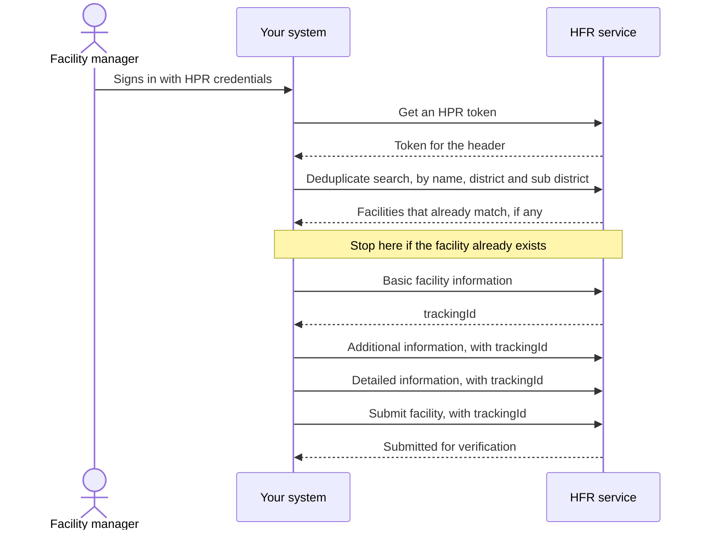

## In plain words

The [HFR](../../shared/glossary/hfr.md) is the registry of health
facilities. Onboarding puts a hospital, clinic, laboratory, imaging
centre, pharmacy or blood bank in it and issues a facility ID in the form
`IN` followed by 10 characters, 12 in total.

The sequence is one search, three writes and a submit. Each write adds a
layer of detail to the same record. Until the submit call, the facility
sits in draft and ABDM cannot see it.

## Before you start

Four things must already be true, each checkable:

- Someone at the facility holds an HPR account. Onboarding needs an HPR
  token in the header of the create calls, generated from an HPR id and
  password, so it usually starts with a person getting an
  [HPID](m4-create-hpid.md).
- You hold a gateway session token. See
  [the gateway session](../concepts/gateway-session.md).
- You hold the LGD codes for the facility's state, district, sub district
  and village. They come from the Local Government Directory and from the
  LGD lookup calls.
- You hold the facility's board photograph and building photograph, each
  under 5 MB, base64 encoded, with the file extension in the name
  matching the file.

## What happens

1. **Search before you create.** Name, district and sub district are
   mandatory on the deduplicate search. A facility that already exists
   must not be created twice.
2. **Send the basic information.** This is the call that creates the
   record, and it returns a `trackingId`. That id is the facility's
   identity for every later call in this flow. Ownership drives which
   other fields apply: `ownershipSubTypeCode` is `C` or `S` when
   ownership is government, and `P` or `NP` when it is private or public
   private.
3. **Send the additional information.** The yes or no flags for a
   pharmacy, blood bank, dialysis centre, cath laboratory, diagnostic
   laboratory and imaging centre, plus any scheme identifiers the
   facility already holds.
4. **Send the detailed information.** Which sections are mandatory
   depends on the facility type, the type of service and the system of
   medicine. Specialities are not required for a blood bank, cath
   laboratory, diagnostic laboratory, dialysis centre, imaging centre or
   pharmacy. Medical infrastructure is mandatory for inpatient and day
   care, and `totalNumberOfBeds` must be at least the sum of the
   individual bed counts.
5. **Submit.** The submit call takes the `trackingId` and needs an
   `x-hpird-auth` token in the header. Leave `sourceOfInformation` empty
   and the facility is treated as a submitted entity.

NHA's HFR test case sheet names the sandbox host,
`https://facilitysbx.abdm.gov.in`, one full path, and the operation id
behind each of the writes:

| Call | What NHA's sheet gives |
|---|---|
| Deduplicate search | `/FacilityManagement/v1.5/facility/search`, and the operation `v15SearchFacilitiesFuzzyPostUsingPOST` |
| Basic facility information | the operation `v15FacilityBasicInformationUsingPOST` |
| Additional information | the operation `v15FacilityAdditionalInformationUsingPOST` |
| Detailed information | the operation `v15FacilityDetailedInformationUsingPOST` |
| Submit facility | the operation `v15SubmitFacilityDetailsUsingPOST` |

An operation id is not a path. The four writes are addressable through
that host's own API browser under Onboarding APIs; the parameter tables
are on the operations page. Nothing here has been called from this
repository.

## How you know it worked

The basic information call returns a `trackingId`, and the submit call
accepts that same `trackingId` and reports the facility submitted for
verification. Searching for the facility afterwards returns it rather
than nothing.

A facility that was written but never submitted stays in draft. A draft
is invisible to ABDM, so an integration that stopped after step 4 has not
onboarded anything, whatever the three write calls returned.

## When it goes wrong

The failures the M4 sources document, each with its fix in the linked
error atom:

- [HIS-1132](../errors/his-1132.md) when the registry detects a duplicate
  facility. Step 1 is what stops you reaching this.
- [HIS-4003](../errors/his-4003.md) when the facility already exists
  under the identifiers you sent.
- A conditional field rejected on detailed information, because the rule
  that makes it mandatory depends on the facility type and the system of
  medicine rather than on the field itself.
