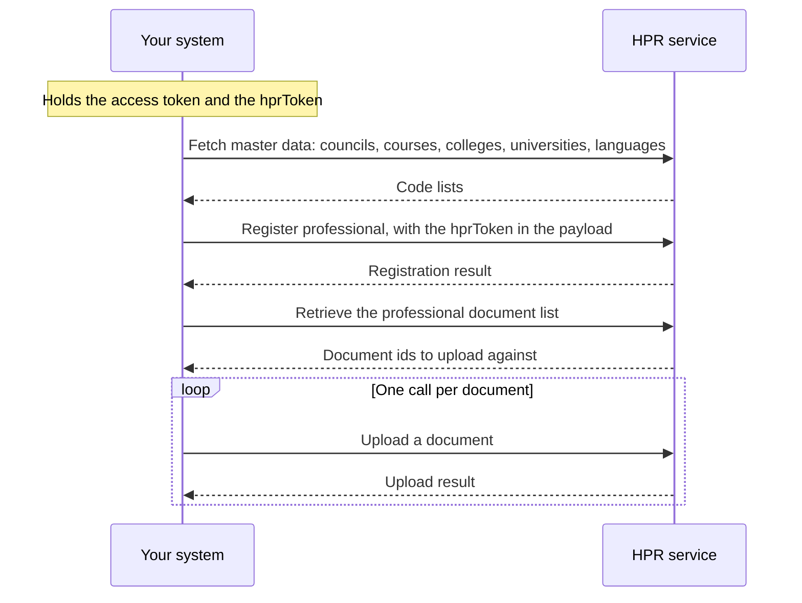

## In plain words

An [HPID](shared.glossary.hpid) says who a professional is. It
does not say what they are qualified to do. Registering the professional
adds the qualifications, the council registration and the current place
of work, and attaches the certificates that back them.

Only after this does the [HPR](shared.glossary.hpr) hold a
profile rather than an identity.

## Before you start

Four things must already be true, each checkable:

- The professional holds an HPID. See
  [get an HPID](m4-create-hpid.md).
- You hold the `hprToken` that create HPID returned. This call carries it
  in the payload, not only in a header.
- You hold a gateway session token. See
  [the gateway session](hiecm.concept.gateway-session).
- You have fetched the code lists this call needs. Council, course,
  college, university, state, district and language all go in as codes.
  The call takes codes, not names, and the subcategory codes here are
  not the ones create HPID used.

## What happens

1. **Fetch the master data first.** Every code you are about to send has
   a list behind it. Fetching them is cheaper than a rejected
   registration, and the lists change without notice.
2. **Register the professional.** The `hprToken` goes in the payload.
   Qualifications, council registration and current work go with it.
3. **Retrieve the document list.** It tells you which document ids this
   professional must upload against.
4. **Upload each document, one call per document.** Two are always
   mandatory: the degree certificate and the registration certificate. A
   proof of work certificate is mandatory as well when the professional
   works for government, or for both government and private.

NHA's HPR test case sheet names the sandbox paths for this journey, all
on the host `https://doctorsbx.abdm.gov.in`:

| Call | Path |
|---|---|
| Register professional | `/apis/v1/doctors/register-professional-new` |
| Fetch the professional's details | `/apis/v1/doctors/fetch-professional-info` |
| Update the professional | `/apis/v1/doctors/update-professional` |
| Fetch the document list | `/apis/v1/doctors/fetch-documents-list` |
| Upload one document | `/apis/v1/uploads/upload-document` |

The master data calls have no published path. None of the five above has
been called from this repository.

## How you know it worked

The register professional call returns a success result for the HPID you
sent, and the document list call then returns the ids that professional
must upload against. After the uploads, retrieving the professional's
profile shows the qualification and council registration you sent rather
than an empty profile.

A registration with its mandatory documents missing is not finished, even
where the registration call itself was accepted.

## When it goes wrong

The failures the M4 sources document, each with its fix in the linked
error atom:

- [HIS-5005](hiecm.error.his-5005) when this professional is already
  registered, which is a state to read rather than an error to retry.
- [HIS-5011](hiecm.error.his-5011) when the `hprToken` has expired
  between creating the HPID and registering the profile.
- A code that is not on the current master list, which reads as a
  validation failure on a field you believed was correct. Refetch the
  list rather than trusting a value you cached.
