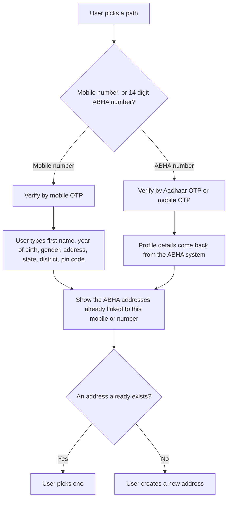

## In plain words

Every person on ABDM is known by an
[ABHA address](shared.glossary.abha-address), which looks like
`username@abdm`. Consent, notifications and record sharing all hang off
it, so a person with no address cannot take part.

This is the same job [M1](shared.glossary.m1) does at a hospital
desk, done instead by the person's own
[PHR](shared.glossary.phr) application. Two paths lead to an
address, and a PHR application builds both.

## Before you start

Four things must already be true, each checkable:

- You hold a gateway session token. See
  [the gateway session](hiecm.concept.gateway-session).
- You can send and verify an [OTP](shared.glossary.otp), and
  your screens keep resend locked for 60 seconds in every flow.
- You can store a refresh token securely, because login follows
  immediately and the application holds the session from here on.
- You know which path the user is on. A mobile number produces a
  Self-Declared profile with no [KYC](shared.glossary.kyc); an
  existing 14 digit [ABHA number](shared.glossary.abha-number)
  produces a KYC Verified one.

## What happens

1. **Take the path the user chose.** On the mobile number path, first
   name, year of birth, gender, address, state, district and pin code are
   mandatory, and the user types them. Middle name, last name, day and
   month of birth are optional. On the ABHA number path the profile comes
   back from the ABHA system rather than from the user.
2. **Validate.** Mobile OTP on the first path. Aadhaar OTP or mobile OTP
   on the second.
3. **Show what already exists before creating anything.** After
   validation, list the ABHA addresses already linked to that mobile
   number or ABHA number. A person who already has an address should pick
   it, not create a second one.
4. **Create the address only when there is none to pick.**

A Self-Declared profile needs a "Link ABHA number" action of its own. The
user enters their 14 digit number and validates by Aadhaar OTP or mobile
OTP. Profile details then follow the ABHA number and the status becomes
KYC Verified.

NHA's PHR V3 document publishes the paths for this flow on the sandbox host
`https://abhasbx.abdm.gov.in`, and the endpoint atoms above carry them with
the request bodies that document gives.

## How you know it worked

The user holds an ABHA address in the form `username@abdm`, and the
profile screen shows it marked Self-Declared or KYC Verified according to
the path they took. The ABHA number is visible only on a KYC Verified
profile.

Listing the addresses linked to that mobile number or ABHA number now
returns the address the user ended with, which is what proves the
creation landed rather than the screen merely closing.

## When it goes wrong

The failures these sources document, in rough order of frequency:

- A duplicate address, because step 3 was skipped and the user created a
  second one rather than picking the one they had.
- A mandatory demographic field missing on the mobile number path, which
  is rejected as validation. The mandatory set is narrower than it looks:
  day and month of birth are not in it.
- An expired OTP, where the user waited out the window. Resend is locked
  for 60 seconds by design, so the screen must say so rather than appear
  broken.
