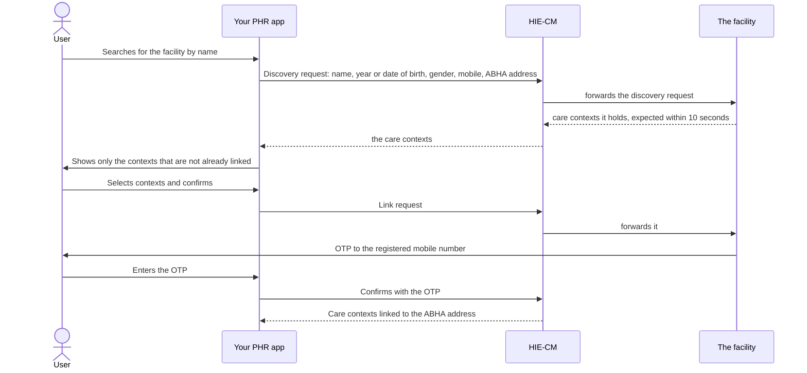

## In plain words

A person visits a hospital and gives no health address. The hospital
still holds their records. Discovery is how their own application finds
those records afterwards, and linking is how the records become part of
the person's account.

This is the mirror of [M2](shared.glossary.m2). There, a
provider publishes a [care context](hiecm.concept.care-context). Here,
the person finds one and claims it.

## Before you start

Four things must already be true, each checkable:

- The person is signed in and holds an
  [ABHA address](shared.glossary.abha-address). See
  [sign a user in](p1-login.md).
- You hold a verified mobile number for them. Discovery carries it.
- You can show only participating facilities in the search. A facility
  qualifies when it is registered in the [HIP](shared.glossary.hip) role
  with an active bridge link.
- You can hold a request open across a callback. Discovery is answered
  asynchronously. See
  [asynchronous callbacks](hiecm.concept.asynchronous-callbacks).

## What happens

1. **Search, then discover.** The discovery request carries name, year or
   date of birth, gender, the verified mobile number and the ABHA
   address. A provider issued registration number is optional and
   narrows the match when the person has one.
2. **Show what came back, minus what is already linked.** Never show a
   care context that is already linked. A person offered the same record
   twice cannot tell which of the two is theirs.
3. **Let the person select and confirm.** The facility sends an
   [OTP](shared.glossary.otp) to the mobile number it has
   registered, which may not be the one in your application.
4. **Verify the OTP.** On success the care contexts link to the ABHA
   address.

The same flow serves government health programmes such as CoWIN,
AB-PMJAY, e-Sanjeevani OPD, e-Sanjeevani HWC and RCH, each with one
programme specific optional field.

Three situations have wording NHA specifies, and an application should
use it rather than its own:

| Situation | Message |
|---|---|
| The facility is unreachable | "Couldn't Connect: We are sorry. Unable to contact your hospital. Please try again later" |
| The person never visited | "No health records found" |
| Everything is already linked | "No new health record to link: Records of all visits are already linked and there is nothing new to link" |

The three calls this flow makes are published on the consent manager, under
`/api/hiecm/user-initiated-linking/v3/`. The endpoint atoms carry them.

## How you know it worked

The care contexts the person selected are linked to their ABHA address,
and running discovery against that facility again returns them as already
linked rather than as new. The records themselves should arrive within
two hours.

A linked care context is not a record in hand. Fetching what a link
points at is a consent flow. See
[fetch the records](p3-fetch-records.md).

## When it goes wrong

The failures these sources document, in rough order of frequency:

- The facility does not answer inside the expected 10 seconds, which is
  the unreachable case and has its own specified wording.
- Nothing comes back, because the person gave a different name or date of
  birth at the facility than they hold in their profile.
- Everything comes back already linked, which is the third specified
  message and not an error.
- The OTP goes to the mobile number the facility registered, which the
  person may no longer use.
