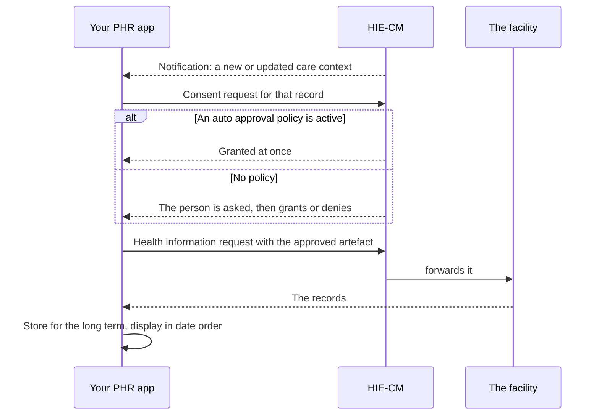

## In plain words

A linked care context says a record exists somewhere. It does not put the
record in the person's hands. Fetching it is a consent flow, and the
person is the [HIU](shared.glossary.hiu) when their records are fetched
from the facility that holds them. Your application is how they take that
role, so this is an HIU flow like any other.

## Before you start

Four things must already be true, each checkable:

- The care context is linked to the person's health address. See
  [find records held elsewhere and link them](p2-discover-and-link.md).
- Your application implements the consent and data flow calls. This is
  work it does as well as linking, not instead of it.
- You have a subscription, so you are told when a care context appears or
  changes. See
  [subscribe and set an auto approval policy](p3-subscribe-and-auto-approve.md).
- You can store records for the long term. Fetching without storing means
  fetching again, and the person loses their history when the request
  window closes.

## What happens

1. **Receive the notification.**
2. **Create a consent request for that record and send it to the
   HIE-CM.**
3. **Wait for the grant.** Automatic where a policy exists, otherwise the
   person decides.
4. **Raise a health information request** with the approved
   [consent artefact](hiecm.concept.consent-artefact).
5. **Receive the records** the facility sends across the network.
6. **Store and display them,** preferably in date order.

The person also needs to see and steer all of this: the requests that
have come in with the requester, purpose, data types, date range and
validity; a way to modify a request before granting; a way to grant or
deny; a list of who currently has access; and a way to revoke at any
time, which stops sharing under that consent immediately.

Test cases cover every health information type, structured and
unstructured: diagnostic report, prescription, discharge summary,
consultation note, immunisation record, wellness record and health
document record. An application that handles one shape is not finished.

## How you know it worked

The records arrive for the care context the notification named, your
application has stored them, and they are displayed in date order. Asking
again is not needed, which is what proves they were stored rather than
held for the length of a screen.

A grant on its own is not the exit condition. A granted consent with no
health information request behind it leaves the person with permission
and no records.

## When it goes wrong

The failures, in rough order of frequency:

- [ABDM-1112](hiecm.error.abdm-1112) when the artefact is expired or has
  been revoked. Revocation is the person exercising a right, so it is a
  state to handle rather than an error to report.
- Records fetched but not stored, which reads as working until the
  consent window closes and the history disappears.
- A health information type the application cannot display, from the
  seven the test cases cover.
