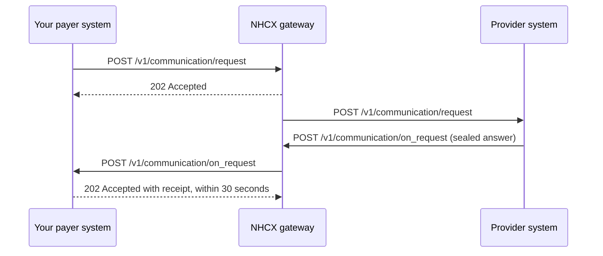

# Receiving POST /v1/communication/on_request

## In plain words

After you send a communication request, the [provider](../glossary/provider.md) answers through [NHCX](../../shared/glossary/nhcx.md). NHCX delivers the answer to your system as `POST /v1/communication/on_request`. You receive it as the [payer](../glossary/payer.md) that asked. It carries the documents or information you requested. Acknowledge the delivery within 30 seconds, then resume the case it belongs to.

## Before you start

**Who receives it:** the payer that sent `/v1/communication/request`. **Who sends it:** the provider, through NHCX.

- Your participant record in the [participant registry](../concepts/participant-registry.md) holds an `endpoint_url`. [NHCX](../../shared/glossary/nhcx.md) posts to that address with `/v1/communication/on_request` appended.
- You set `endpoint_url` when you register, in [sandbox onboarding](../flows/sandbox-onboarding.md). You change it with [`/participant/update`](../endpoints/participant-update.md).
- The URL uses a domain name over HTTPS. It has no IP address and no port number.
- The server behind it is in India. Your firewall accepts calls from the NHCX egress addresses in [callback URL rules](../sandbox/callback-url-requirements.md).
- Your handler can open a [JWE](../glossary/jwe.md) with your private key. That key pairs with the certificate in your registry record. See [your encryption certificate](../concepts/encryption-certificate.md).
- Your handler answers within 30 seconds and does slow work afterwards. See [the 202 acknowledgement](../concepts/synchronous-acknowledgement.md).
- You sent the request with [`/v1/communication/request`](../endpoints/communication-request.md). You stored its `x-hcx-api_call_id` and `x-hcx-correlation_id` before sending it.
- You also host [`/v1/error`](error.md), so a request that dies is never silent.

## What happens



### What arrives

[NHCX](../../shared/glossary/nhcx.md) sends `POST <YOUR_ENDPOINT_URL>/v1/communication/on_request`. The body takes one of two forms. Branch on its `type` field.

- `ProtocolResponse`: the provider could not process your request. The body is plain JSON with the error details, and nothing is sealed.
- Any other body carries the provider's answer sealed in `payload`, with `type` set to `JWEPayload`.

```json
{
  "type": "JWEPayload",
  "payload": "<JWE_COMPACT_STRING>"
}
```

The payload is a JWE in compact form: five base64url parts joined by dots. Decode the first part to read the protected header. You do not need your private key for that step.

```json
{
  "alg": "RSA-OAEP-256",
  "enc": "A256GCM",
  "x-hcx-sender_code": "<PROVIDER_PARTICIPANT_CODE>",
  "x-hcx-recipient_code": "<YOUR_PARTICIPANT_CODE>",
  "x-hcx-api_call_id": "<API_CALL_ID_SET_BY_THE_SENDER>",
  "x-hcx-correlation_id": "<CORRELATION_ID_OF_YOUR_REQUEST>",
  "x-hcx-timestamp": "<TIME_THE_SENDER_SEALED_IT>",
  "x-hcx-status": "response.complete",
  "x-hcx-ben-abha-id": "<BENEFICIARY_ABHA_NUMBER>"
}
```

| Protected header | What it tells you |
|---|---|
| `x-hcx-sender_code` | The provider that answered. |
| `x-hcx-recipient_code` | Your participant code. |
| `x-hcx-api_call_id` | This one message. Each answer has its own value. A repeat delivery carries the same value. |
| `x-hcx-correlation_id` | The exchange you started. Match it to the request you stored. |
| `x-hcx-workflow_id` | The step the answer reports. Read it when present. See [workflow codes](../concepts/workflow-codes.md). |
| `x-hcx-status` | Where the exchange stands. See the status list below. |
| `x-hcx-error_details` | An object with `code`, `message` and `trace` when something failed. |
| `x-hcx-ben-abha-id` | The beneficiary's [ABHA](../../shared/glossary/abha.md) number. Accept it with or without hyphens. |

Look up `x-hcx-correlation_id` against the correlation ids you sent. If nothing matches, look it up against the `x-hcx-api_call_id` values you sent.

`x-hcx-status` takes these values:

- `response.complete`: the provider's answer. Accept `response.completed` as the same value.
- `response.error`: the request failed on protocol grounds. Treat `response.fail` the same way.

Decrypt the payload with your private key. Use the algorithm the header names in `alg`. [RSA-OAEP or RSA-OAEP-256](../decisions/key-encryption-algorithm.md) covers both values. The plaintext is a [FHIR](../../shared/glossary/fhir.md) collection bundle built around a Task: see [the Task bundle](../fhir/task.md). The Task has `status` `completed`. Its input is a Communication, and the documents sit in `payload.contentAttachment`. The `x-hcx-workflow_id` matches the one on your request.

#### When `type` is `ProtocolResponse`

The body is plain JSON. Read `x-hcx-error_details` for the reason.

```json
{
  "type": "ProtocolResponse",
  "x-hcx-sender_code": "<PROVIDER_PARTICIPANT_CODE>",
  "x-hcx-recipient_code": "<YOUR_PARTICIPANT_CODE>",
  "x-hcx-api_call_id": "<API_CALL_ID_SET_BY_THE_SENDER>",
  "x-hcx-correlation_id": "<CORRELATION_ID_OF_YOUR_REQUEST>",
  "x-hcx-workflow_id": "<WORKFLOW_ID>",
  "x-hcx-timestamp": "<TIME_THE_SENDER_SENT_IT>",
  "x-hcx-debug_flag": "Error",
  "x-hcx-status": "response.error",
  "x-hcx-redirect_to": "",
  "x-hcx-error_details": {
    "code": "<ERROR_CODE>",
    "message": "<ERROR_MESSAGE>",
    "trace": "<TRACE>"
  },
  "x-hcx-debug_details": {
    "code": "",
    "message": "",
    "trace": ""
  },
  "x-hcx-domain-header": {
    "use_case_name": "<USE_CASE_NAME>",
    "amt_processed": "<AMOUNT_PROCESSED>"
  },
  "x-hcx-entity-type": "<ENTITY_TYPE>",
  "x-hcx-ben-abha-id": "<BENEFICIARY_ABHA_NUMBER>"
}
```

### What you send back

Answer the delivery first, before you decrypt or act on it. Return HTTP status `202 Accepted` with this receipt:

```json
{
  "timestamp": "<CURRENT_TIME_AS_DD/MM/YYYY hh:mm:ss:sss>",
  "api_call_id": "<X_HCX_API_CALL_ID_FROM_THIS_DELIVERY>",
  "correlation_id": "<X_HCX_CORRELATION_ID_FROM_THIS_DELIVERY>",
  "result": {
    "sender_code": "<X_HCX_SENDER_CODE_FROM_THIS_DELIVERY>",
    "recipient_code": "<YOUR_PARTICIPANT_CODE>",
    "entity_type": "<ENTITY_TYPE>",
    "protocol_status": "request.queued"
  },
  "error": {
    "code": "",
    "message": ""
  }
}
```

- `api_call_id` and `correlation_id` repeat the values in this delivery.
- `result.sender_code` is the sender's code. `result.recipient_code` is yours.
- An `entity_type` value for this exchange is not yet published. The published values are `coverageeligibility`, `preauth`, `claim`, `task`, `payment` and `insuranceplan`.
- `result.protocol_status` is one of `request.queued`, `request.dispatched` or `request.error`.
- `error.code` and `error.message` stay empty when you accept the message.
- `timestamp` takes the form `DD/MM/YYYY hh:mm:ss:sss`.

### Retries and repeat deliveries

- NHCX waits 30 seconds for your 202 and receipt.
- A late answer, another status code or a receipt in another shape counts as a failed delivery. NHCX sends the same message again.
- After 5 attempts NHCX stops. It deletes the request and retires its correlation id. The original sender learns of it on its own `/v1/error`.
- A repeat delivery is the same sealed message, so it carries the same `x-hcx-api_call_id`. Record every `x-hcx-api_call_id` you accept.
- On a repeat, return 202 with the same receipt and do not process the message again.
- Never deduplicate on `x-hcx-correlation_id`. Every message in one exchange shares it.

## How you know it worked

- NHCX receives your HTTP 202 and receipt within 30 seconds of the delivery.
- Your log shows one delivery per `x-hcx-api_call_id`. A second delivery with the same value means NHCX did not accept your receipt.
- The `x-hcx-correlation_id` matches a request you sent.
- You decrypted the payload and hold the Communication with its attachments, matched to your request.

## When it goes wrong

- **It never arrives.** Check these in order.
  1. Your `/v1/communication/request` call got a 202 from NHCX. Without it, NHCX never forwarded the request.
  2. Your `/v1/error` endpoint holds no report for this correlation id. A report means the provider never received your request.
  3. The `endpoint_url` in your registry record is right. It uses a domain name, with no IP address and no port number.
  4. Your server is in India, and your firewall accepts the NHCX egress addresses in [callback URL rules](../sandbox/callback-url-requirements.md).
  5. Your application routes the path to the handler: load balancer rules, service routes and endpoint versions.
  6. Ask NHCX with [`/v1/status`](../endpoints/status.md). `request.dispatched` means the provider has your request, so wait. `request.stopped` means it is dead.
  If the provider cannot seal its answer to your certificate, it reports [PAYR-1002](../errors/payr-1002.md). Update the certificate in your registry record. See [accepted with 202 and no callback arrives](../troubleshooting/accepted-then-no-callback.md).
- **It arrives as a `ProtocolResponse`.** The provider could not open or validate your request. Read `x-hcx-error_details.code` and open its error atom. [PAYR-1001](../errors/payr-1001.md) means your payload could not be decrypted: fetch the recipient's certificate again with [`/fetch/certs`](../endpoints/fetch-certs.md). The correlation id of a failed request is inactive. Send a fresh request with a new correlation id; reusing the old one is refused as [NHCX-1006](../errors/nhcx-1006.md).
- **The same message arrives again and again.** NHCX did not accept your receipt. It was later than 30 seconds, used another status code, or had another shape. Fix the receipt, and keep processing each `x-hcx-api_call_id` once. An invalid answer from a receiver is reported as [NHCX-1015](../errors/nhcx-1015.md), "Invalid response received from receiver."
- **The correlation id matches nothing you sent.** You stored the ids after sending instead of before, or you looked in one field only. Look up `x-hcx-correlation_id` against the correlation ids you sent. If nothing matches, look it up against the `x-hcx-api_call_id` values you sent. See [responses arrive against the wrong request](../troubleshooting/duplicate-or-mismatched-correlation.md).
- **The attachments are missing.** Answer the provider with a new communication request that names what is still needed.
