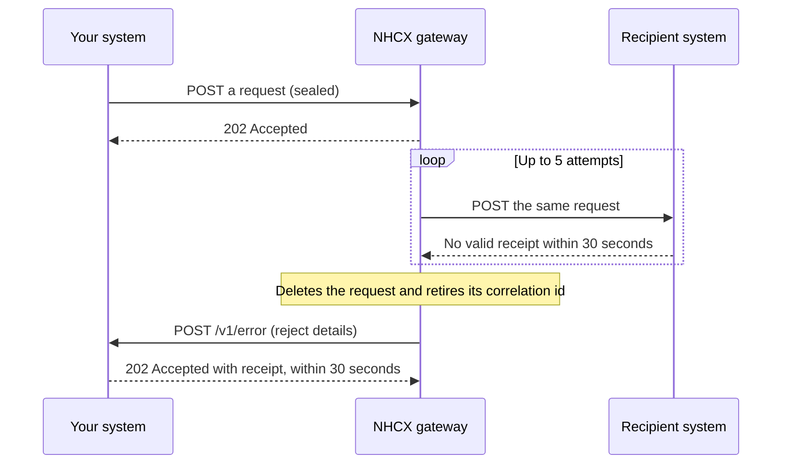

# Receiving POST /v1/error

## In plain words

When [NHCX](../../shared/glossary/nhcx.md) cannot deliver a request you sent, it tells you on `POST /v1/error`. Every participant receives it: [providers](../glossary/provider.md) and [payers](../glossary/payer.md) alike. It arrives after NHCX has tried 5 times and given up. Without it, a dead request looks the same as a case still under review. Acknowledge the report within 30 seconds, then mark the case undelivered.

## Before you start

**Who receives it:** every participant, as the sender of the failed request. **Who sends it:** NHCX.

- Your participant record in the [participant registry](../concepts/participant-registry.md) holds an `endpoint_url`. [NHCX](../../shared/glossary/nhcx.md) posts to that address with `/v1/error` appended.
- You set `endpoint_url` when you register, in [sandbox onboarding](../flows/sandbox-onboarding.md). You change it with [`/participant/update`](../endpoints/participant-update.md).
- The URL uses a domain name over HTTPS. It has no IP address and no port number.
- The server behind it is in India. Your firewall accepts calls from the NHCX egress addresses in [callback URL rules](../sandbox/callback-url-requirements.md).
- Your handler answers within 30 seconds and does slow work afterwards. See [the 202 acknowledgement](../concepts/synchronous-acknowledgement.md).
- Your handler for this path accepts a plain JSON body. It does not expect a sealed payload.
- You store the `x-hcx-correlation_id` of every request you send, so a report can find its case.

## What happens



### Why it arrives

- A recipient must return 202 with the receipt for every delivery. A rejection, a late answer or a receipt in another shape counts as a failure.
- NHCX tries the same request 5 times. Then it deletes the request identified by the correlation id.
- The reject details come back to you, the sender, on `/v1/error`.
- The gateway validates protocol headers too, and can report a header failure to you asynchronously.

### What arrives

[NHCX](../../shared/glossary/nhcx.md) sends `POST <YOUR_ENDPOINT_URL>/v1/error`. The body is a protocol response in plain JSON, not a sealed payload:

```json
{
  "type": "ProtocolResponse",
  "x-hcx-sender_code": "<SENDER_CODE>",
  "x-hcx-recipient_code": "<YOUR_PARTICIPANT_CODE>",
  "x-hcx-api_call_id": "<API_CALL_ID_SET_BY_THE_SENDER>",
  "x-hcx-correlation_id": "<CORRELATION_ID_OF_YOUR_FAILED_REQUEST>",
  "x-hcx-workflow_id": "<WORKFLOW_ID>",
  "x-hcx-timestamp": "<TIME_THE_SENDER_SENT_IT>",
  "x-hcx-debug_flag": "Error",
  "x-hcx-status": "response.error",
  "x-hcx-redirect_to": "",
  "x-hcx-error_details": {
    "code": "<ERROR_CODE>",
    "message": "<ERROR_MESSAGE>",
    "trace": "<TRACE>"
  },
  "x-hcx-debug_details": {
    "code": "",
    "message": "",
    "trace": ""
  },
  "x-hcx-domain-header": {
    "use_case_name": "<USE_CASE_NAME>",
    "amt_processed": "<AMOUNT_PROCESSED>"
  },
  "x-hcx-entity-type": "<ENTITY_TYPE>",
  "x-hcx-ben-abha-id": "<BENEFICIARY_ABHA_NUMBER>"
}
```

- `x-hcx-correlation_id` names your failed request.
- `x-hcx-error_details.code` names the failure. Codes that start `NHCX-` come from the gateway; see [error code spaces](../concepts/error-code-spaces.md).
- [NHCX-1001](../errors/nhcx-1001.md) means the receiver system is not reachable.
- `x-hcx-entity-type` names the exchange: `coverageeligibility`, `payment`, `insuranceplan`, `task`, `claim` or `preauth`.

Store the body whole before you parse it. Do not refuse a body because it has fields you do not expect.

### What you send back

Answer the report first, before you act on it. Return HTTP status `202 Accepted` with this receipt:

```json
{
  "timestamp": "<CURRENT_TIME_AS_DD/MM/YYYY hh:mm:ss:sss>",
  "api_call_id": "<X_HCX_API_CALL_ID_FROM_THIS_DELIVERY>",
  "correlation_id": "<X_HCX_CORRELATION_ID_FROM_THIS_DELIVERY>",
  "result": {
    "sender_code": "<X_HCX_SENDER_CODE_FROM_THIS_DELIVERY>",
    "recipient_code": "<YOUR_PARTICIPANT_CODE>",
    "entity_type": "<X_HCX_ENTITY_TYPE_FROM_THE_REPORT>",
    "protocol_status": "request.queued"
  },
  "error": {
    "code": "",
    "message": ""
  }
}
```

- `api_call_id` and `correlation_id` repeat the values in this delivery.
- `result.sender_code` is the sender's code. `result.recipient_code` is yours.
- `result.entity_type` repeats `x-hcx-entity-type` from the report.
- `result.protocol_status` is one of `request.queued`, `request.dispatched` or `request.error`.
- `error.code` and `error.message` stay empty when you accept the message.
- `timestamp` takes the form `DD/MM/YYYY hh:mm:ss:sss`.

### Repeat reports

NHCX expects your 202 and receipt within 30 seconds, as for every delivery. If the same report arrives twice, store it once and return the same receipt.

### What you do next

- Mark the case named by the correlation id as undelivered, so nobody waits for a decision that will not come.
- Fix the cause. For an unreachable recipient, wait until it is reachable, or contact [NHCX support](../sandbox/support-contacts.md).
- Send a fresh request with a new correlation id. The old one is inactive; reusing it is refused as [NHCX-1006](../errors/nhcx-1006.md).

## How you know it worked

- NHCX receives your HTTP 202 and receipt within 30 seconds of the report.
- The case named by `x-hcx-correlation_id` shows as undelivered in your system, with the error code stored.
- Your resubmission, under a new correlation id, gets a 202 from NHCX and later its answer on your callback.

## When it goes wrong

- **It never arrives.** The most common cause is that you do not host `/v1/error` at all, so failures pass unseen. Host it before any other asynchronous path. Then check the registration. The `endpoint_url` uses a domain name with no IP address or port. The server is in India, and your firewall accepts the addresses in [callback URL rules](../sandbox/callback-url-requirements.md). NHCX names a failure to deliver a protocol response to you as [NHCX-1014](../errors/nhcx-1014.md): unable to send protocol response to sender. If a case goes quiet with no report, ask with [`/v1/status`](../endpoints/status.md). `request.stopped` means the request is dead.
- **Your handler refuses the report.** It parsed the body against a fixed schema and returned an error. Store the body whole, return 202 with the receipt, and parse afterwards.
- **Your retry is refused as a duplicate.** You resent the request on its retired correlation id. That is [NHCX-1006](../errors/nhcx-1006.md). Send it again under a new correlation id.
- **The same recipient keeps failing.** Its endpoint is down or rejects deliveries. [NHCX-1001](../errors/nhcx-1001.md) and [NHCX-1015](../errors/nhcx-1015.md) name these conditions. Contact the recipient, or [NHCX support](../sandbox/support-contacts.md).
