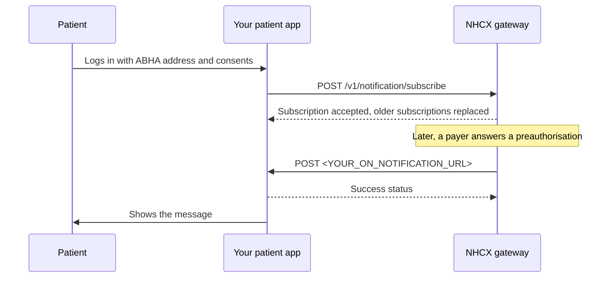

# Receiving a notification on a patient app

## In plain words

A patient app can follow a patient's claims on [NHCX](../../shared/glossary/nhcx.md). After it subscribes, NHCX pushes each claim event to the app as a notification. You receive it as the [PHR](../../shared/glossary/phr.md) app the patient last logged in to. Each notification carries a ready-to-show message, such as a preauthorisation approval, and optional detail for audit. Only one app receives a patient's notifications at a time: the one that subscribed last.

## Before you start

**Who receives it:** the patient app, registered in NHCX as a beneficiary service provider. **Who sends it:** NHCX.

- Your app has completed [ABHA](../../shared/glossary/abha.md) integration, milestone [M1](../../shared/glossary/m1.md) of [ABDM](../../shared/glossary/abdm.md).
- Your app is registered in NHCX as a beneficiary service provider: sandbox testing, sandbox certification, then onboarding to the production registry.
- Your notification endpoint is an HTTPS address with TLS 1.2 or newer.
- When the patient logs in and consents, your app calls [`/v1/notification/subscribe`](../endpoints/notification-subscribe.md). The call names the patient's [ABHA address](../../shared/glossary/abha-address.md) in `subscriber.id` and your endpoint in `on_notification_url`. See [subscribe a patient app to notifications](../flows/notification-subscribe.md).
- Your app stored the `subscription_id` it sent.
- The subscription is the registration that makes notifications arrive. A later subscription for the same patient by another app replaces yours.

## What happens



### What arrives

NHCX sends `POST <YOUR_ON_NOTIFICATION_URL>`. The notification carries these fields:

| Field | Meaning |
|---|---|
| `notification_id` | This notification. Unique to it. |
| `topic_code` | The topic, for example `workflow_events`. |
| `timestamp` | When the event happened, in ISO 8601. |
| `subscriber.id` | The patient's ABHA address. |
| `message` | A human-readable message to show the patient as it is. |
| `domain_values` | Optional. The `x-hcx-*` values of the underlying exchange, for audit or custom formatting. |

```json
{
  "notification_id": "<NOTIFICATION_ID>",
  "topic_code": "workflow_events",
  "timestamp": "<EVENT_TIME_ISO_8601>",
  "subscriber": {
    "id": "<PATIENT_ABHA_ADDRESS>"
  },
  "message": "<READY_TO_SHOW_MESSAGE>",
  "domain_values": {
    "x-hcx-workflow_id": "<WORKFLOW_ID>",
    "x-hcx-correlation_id": "<CORRELATION_ID>",
    "x-hcx-timestamp": "<EVENT_TIME_ISO_8601>",
    "x-hcx-sender_code": "<PAYER_PARTICIPANT_CODE>",
    "x-hcx-recipient_code": "<YOUR_PARTICIPANT_CODE>",
    "x-hcx-status": "response.complete",
    "x-hcx-action": "preauth_response",
    "x-hcx-amount_submitted": "<AMOUNT_SUBMITTED>"
  }
}
```

Show `message` to the patient without parsing anything else. You can ignore `domain_values` if you only display messages.

Under `workflow_events`, these events arrive:

| Event | Trigger | Status values |
|---|---|---|
| `preauth_request` | The provider submitted a preauthorisation | `queued`, `processing` |
| `preauth_response` | The payer decided a preauthorisation | `approved`, `rejected` |
| `claim_request` | The provider submitted a claim | `queued`, `processing` |
| `claim_response` | The payer adjudicated a claim | `approved`, `rejected` |
| `payment_notice` | The payment was processed | `paid`, `pending` |
| `communication` | Information was requested | `information_required` |

Notifications and subscriptions use [JWE](../glossary/jwe.md) with `RSA-OAEP` and `A256GCM`. If the body arrives sealed, decrypt it with your private key first. The fields above are its content.

### Checks on every delivery

- Validate the token NHCX presents against the NHCX public certificate.
- Check that the sender code is the NHCX gateway's.
- Rate-limit the endpoint.

### What you send back

An acknowledgement body for a notification is not yet published. Answer with an HTTP success status as soon as you have stored the notification. Do the display work afterwards.

### Repeat deliveries

Each notification has its own `notification_id`. Store the ids you have shown. If one arrives again, answer with success and do not show it twice.

## How you know it worked

- Your endpoint stored the notification and answered with a success status.
- `subscriber.id` matches a patient whose subscription you hold.
- The patient sees `message` in your app once for each `notification_id`.

## When it goes wrong

- **It never arrives.** Check these in order.
  1. The patient has not logged in to another app since. A later subscription by another app replaced yours. Subscribe again at the patient's next login.
  2. Your subscribe call succeeded. A 401 means your token expired: generate a new one and subscribe again. See [NHCX-401](../errors/nhcx-401.md).
  3. A 403 means your app is not authorised. Check your beneficiary service provider registration in the NHCX registry.
  4. A 500 means a gateway failure. Retry the subscription with backoff.
  5. `on_notification_url` is exact, with no trailing space, and serves HTTPS with TLS 1.2 or newer.
  6. Your `topic_code` array includes `workflow_events`.
- **The subscribe call returns 409.** A subscription for this patient already exists. Check your subscription parameters.
- **The same notification shows twice.** You did not store `notification_id`. Show each id once.
