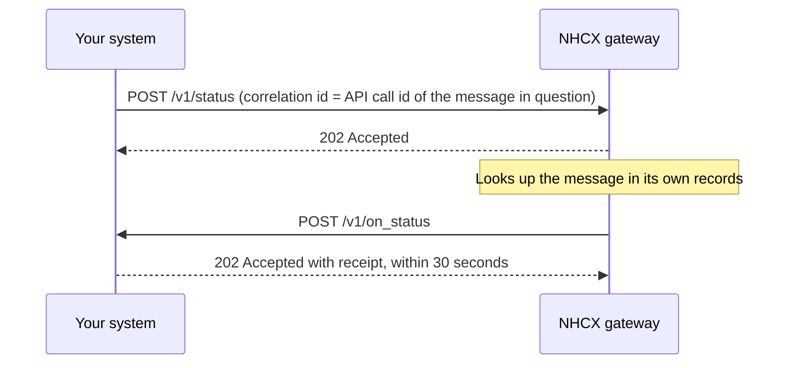

# Receiving POST /v1/on_status

## In plain words

When a case goes quiet, you can ask [NHCX](../../shared/glossary/nhcx.md) where one of your own messages stands. You ask with [`/v1/status`](../endpoints/status.md). NHCX answers from its own records and delivers the answer to your system as `POST /v1/on_status`. You receive it as the participant that asked: usually a [provider](../glossary/provider.md), sometimes a [payer](../glossary/payer.md) checking a message it sent. The answer says whether NHCX still holds the message, delivered it, or gave up.

## Before you start

**Who receives it:** the participant that sent `/v1/status`. **Who sends it:** NHCX, which answers status requests itself.

- Your participant record in the [participant registry](../concepts/participant-registry.md) holds an `endpoint_url`. [NHCX](../../shared/glossary/nhcx.md) posts to that address with `/v1/on_status` appended.
- You set `endpoint_url` when you register, in [sandbox onboarding](../flows/sandbox-onboarding.md). You change it with [`/participant/update`](../endpoints/participant-update.md).
- The URL uses a domain name over HTTPS. It has no IP address and no port number.
- The server behind it is in India. Your firewall accepts calls from the NHCX egress addresses in [callback URL rules](../sandbox/callback-url-requirements.md).
- Your handler can open a [JWE](../glossary/jwe.md) with your private key. That key pairs with the certificate in your registry record. See [your encryption certificate](../concepts/encryption-certificate.md).
- Your handler answers within 30 seconds and does slow work afterwards. See [the 202 acknowledgement](../concepts/synchronous-acknowledgement.md).
- You sent [`/v1/status`](../endpoints/status.md) with `x-hcx-correlation_id` set to the `x-hcx-api_call_id` of the message you asked about.
- You keep every `x-hcx-api_call_id` you send. Without it you cannot ask, and you cannot match the answer.
- You also host [`/v1/error`](error.md), so a request that dies is never silent.

## What happens



### What arrives

[NHCX](../../shared/glossary/nhcx.md) sends `POST <YOUR_ENDPOINT_URL>/v1/on_status`. The answer travels in the protocol header attributes. There is no FHIR bundle.

- If the body carries a sealed `payload`, decode the first part of the JWE to read the protected header.
- If the body is a plain object of `x-hcx-*` attributes, read them directly.

```json
{
  "alg": "RSA-OAEP-256",
  "enc": "A256GCM",
  "x-hcx-sender_code": "<SENDER_PARTICIPANT_CODE>",
  "x-hcx-recipient_code": "<YOUR_PARTICIPANT_CODE>",
  "x-hcx-api_call_id": "<API_CALL_ID_SET_BY_THE_SENDER>",
  "x-hcx-correlation_id": "<API_CALL_ID_OF_THE_MESSAGE_YOU_ASKED_ABOUT>",
  "x-hcx-timestamp": "<TIME_THE_SENDER_SEALED_IT>",
  "x-hcx-status": "request.dispatched",
  "x-hcx-ben-abha-id": "<BENEFICIARY_ABHA_NUMBER>"
}
```

Match the answer by `x-hcx-correlation_id`. It equals the `x-hcx-api_call_id` of the message you asked about. `x-hcx-error_details`, with `code`, `message` and `trace`, reports a failure when there is one.

| `x-hcx-status` | Meaning | What you do |
|---|---|---|
| `request.queued` | NHCX holds the message and has not delivered it yet. | Wait, then ask again later. |
| `request.dispatched` | The message reached the recipient's system. | Wait for the recipient's answer on your callback. |
| `request.stopped` | NHCX stopped after failed attempts to reach the recipient. | Treat the request as dead. Fix the cause and send a fresh request with a new correlation id. |

### What you send back

Answer the delivery first, before you decrypt or act on it. Return HTTP status `202 Accepted` with this receipt:

```json
{
  "timestamp": "<CURRENT_TIME_AS_DD/MM/YYYY hh:mm:ss:sss>",
  "api_call_id": "<X_HCX_API_CALL_ID_FROM_THIS_DELIVERY>",
  "correlation_id": "<X_HCX_CORRELATION_ID_FROM_THIS_DELIVERY>",
  "result": {
    "sender_code": "<X_HCX_SENDER_CODE_FROM_THIS_DELIVERY>",
    "recipient_code": "<YOUR_PARTICIPANT_CODE>",
    "entity_type": "<ENTITY_TYPE>",
    "protocol_status": "request.queued"
  },
  "error": {
    "code": "",
    "message": ""
  }
}
```

- `api_call_id` and `correlation_id` repeat the values in this delivery.
- `result.sender_code` is the sender's code. `result.recipient_code` is yours.
- An `entity_type` value for this exchange is not yet published. The published values are `coverageeligibility`, `preauth`, `claim`, `task`, `payment` and `insuranceplan`.
- `result.protocol_status` is one of `request.queued`, `request.dispatched` or `request.error`.
- `error.code` and `error.message` stay empty when you accept the message.
- `timestamp` takes the form `DD/MM/YYYY hh:mm:ss:sss`.

### Retries and repeat deliveries

- NHCX waits 30 seconds for your 202 and receipt.
- A late answer, another status code or a receipt in another shape counts as a failed delivery. NHCX sends the same message again.
- After 5 attempts NHCX stops. It deletes the request and retires its correlation id. The original sender learns of it on its own `/v1/error`.
- A repeat delivery is the same sealed message, so it carries the same `x-hcx-api_call_id`. Record every `x-hcx-api_call_id` you accept.
- On a repeat, return 202 with the same receipt and do not process the message again.
- Never deduplicate on `x-hcx-correlation_id`. Every message in one exchange shares it.

## How you know it worked

- NHCX receives your HTTP 202 and receipt within 30 seconds of the delivery.
- Your log shows one delivery per `x-hcx-api_call_id`. A second delivery with the same value means NHCX did not accept your receipt.
- `x-hcx-correlation_id` equals the `x-hcx-api_call_id` of a message you sent. You recorded the `x-hcx-status` against that message.
- After `request.stopped`, your fresh request under a new correlation id gets a 202 from NHCX.

## When it goes wrong

- **It never arrives.** Check that your `/v1/status` call got a 202 from NHCX. [NHCX-1012](../errors/nhcx-1012.md), "No records found with the requested api caller id", means the id you asked about is not one NHCX holds. Put the `x-hcx-api_call_id` of your original message in `x-hcx-correlation_id`. Then check your registration. The `endpoint_url` uses a domain name with no IP address or port. The server is in India, and your firewall accepts the addresses in [callback URL rules](../sandbox/callback-url-requirements.md).
- **You matched it to the wrong case.** The correlation id of this answer is the API call id of the message you asked about. Compare it with the API call ids you stored, not with correlation ids.
- **You retried a stopped request on its old correlation id.** That correlation id is inactive. A new request under it is refused as [NHCX-1006](../errors/nhcx-1006.md). Send a fresh request with a new correlation id.
- **You expected a bundle.** The status answer has no FHIR payload. Everything you need is in the header attributes.
- **The same message arrives again and again.** NHCX did not accept your receipt. It was later than 30 seconds, used another status code, or had another shape. Fix the receipt, and keep processing each `x-hcx-api_call_id` once. An invalid answer from a receiver is reported as [NHCX-1015](../errors/nhcx-1015.md), "Invalid response received from receiver."
