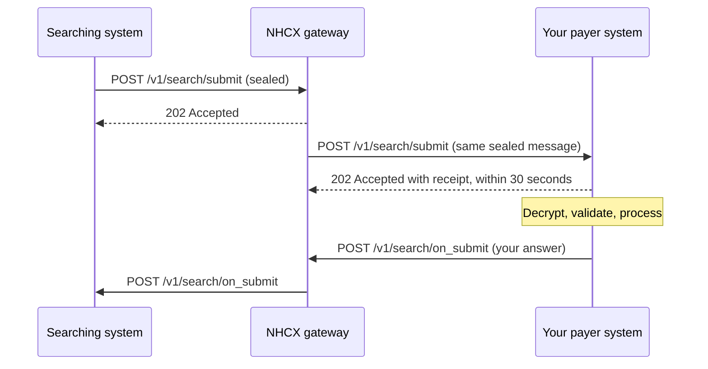

# Receiving POST /v1/search/submit

## In plain words

A [provider](../glossary/provider.md), a regulator or NHA can search for claim information that a payer holds. [NHCX](../../shared/glossary/nhcx.md) delivers the search to your system as `POST /v1/search/submit`. You receive it as the [payer](../glossary/payer.md). It names the claims to look for, by claim number, policy, product or date range. Acknowledge the delivery within 30 seconds. Then answer on [`/v1/search/on_submit`](../endpoints/search-on-submit.md) with the matching claim responses.

## Before you start

**Who receives it:** the payer, as the system that processes the request for the policy. **Who sends it:** a provider, a regulator or NHA, through NHCX.

- Your participant record in the [participant registry](../concepts/participant-registry.md) holds an `endpoint_url`. [NHCX](../../shared/glossary/nhcx.md) posts to that address with `/v1/search/submit` appended.
- You set `endpoint_url` when you register, in [sandbox onboarding](../flows/sandbox-onboarding.md). You change it with [`/participant/update`](../endpoints/participant-update.md).
- The URL uses a domain name over HTTPS. It has no IP address and no port number.
- The server behind it is in India. Your firewall accepts calls from the NHCX egress addresses in [callback URL rules](../sandbox/callback-url-requirements.md).
- Your handler can open a [JWE](../glossary/jwe.md) with your private key. That key pairs with the certificate in your registry record. See [your encryption certificate](../concepts/encryption-certificate.md).
- Your handler answers within 30 seconds and does slow work afterwards. See [the 202 acknowledgement](../concepts/synchronous-acknowledgement.md).
- Your system can call [`/v1/search/on_submit`](../endpoints/search-on-submit.md) to answer.
- You also host [`/v1/error`](error.md), so a request that dies is never silent.

## What happens



### What arrives

[NHCX](../../shared/glossary/nhcx.md) sends `POST <YOUR_ENDPOINT_URL>/v1/search/submit`. The JSON body carries one field, `payload`:

```json
{
  "payload": "<JWE_COMPACT_STRING>"
}
```

The payload is a JWE in compact form: five base64url parts joined by dots. Decode the first part to read the protected header. You do not need your private key for that step.

```json
{
  "alg": "RSA-OAEP-256",
  "enc": "A256GCM",
  "x-hcx-sender_code": "<SENDER_PARTICIPANT_CODE>",
  "x-hcx-recipient_code": "<YOUR_PARTICIPANT_CODE>",
  "x-hcx-api_call_id": "<API_CALL_ID_SET_BY_THE_SENDER>",
  "x-hcx-request_id": "<REQUEST_ID_SET_BY_THE_SENDER>",
  "x-hcx-correlation_id": "<CORRELATION_ID_SET_BY_THE_SENDER>",
  "x-hcx-timestamp": "<TIME_THE_SENDER_SEALED_IT>",
  "x-hcx-status": "request.initiated",
  "x-hcx-ben-abha-id": "<BENEFICIARY_ABHA_NUMBER>"
}
```

| Protected header | What it tells you |
|---|---|
| `x-hcx-sender_code` | The participant that searched. Your answer goes back to this code. |
| `x-hcx-recipient_code` | Your participant code. |
| `x-hcx-api_call_id` | This one message. A repeat delivery carries the same value. |
| `x-hcx-request_id` | The originating request. Read it when present. |
| `x-hcx-correlation_id` | The whole exchange. Copy it into your answer. |
| `x-hcx-workflow_id` | The business step. Read it when present. See [workflow codes](../concepts/workflow-codes.md). |
| `x-hcx-timestamp` | When the sender sealed the message. |
| `x-hcx-status` | `request.initiated` for a new request. Accept `request.initiate` as the same value. |
| `x-hcx-ben-abha-id` | The beneficiary's [ABHA](../../shared/glossary/abha.md) number. Accept it with or without hyphens. |

Decrypt the payload with your private key. Use the algorithm the header names in `alg`. [RSA-OAEP or RSA-OAEP-256](../decisions/key-encryption-algorithm.md) covers both values. The plaintext is a [FHIR](../../shared/glossary/fhir.md) Task bundle: see [the Task bundle](../fhir/task.md). Read the Task inputs to learn what is asked. Do not refuse a search on its Task code alone; codes in use include `search`, `status` and `poll`.

| Task input | What it narrows |
|---|---|
| `ClaimNumber` | One claim |
| `PolicyNumber` | Claims under a policy |
| `ProductNumber` | Claims under a product |
| `FromDate` and `ToDate` | Claims in a date range |

### What you send back

Answer the delivery first, before you decrypt or act on it. Return HTTP status `202 Accepted` with this receipt:

```json
{
  "timestamp": "<CURRENT_TIME_AS_DD/MM/YYYY hh:mm:ss:sss>",
  "api_call_id": "<X_HCX_API_CALL_ID_FROM_THIS_DELIVERY>",
  "correlation_id": "<X_HCX_CORRELATION_ID_FROM_THIS_DELIVERY>",
  "result": {
    "sender_code": "<X_HCX_SENDER_CODE_FROM_THIS_DELIVERY>",
    "recipient_code": "<YOUR_PARTICIPANT_CODE>",
    "entity_type": "<ENTITY_TYPE>",
    "protocol_status": "request.queued"
  },
  "error": {
    "code": "",
    "message": ""
  }
}
```

- `api_call_id` and `correlation_id` repeat the values in this delivery.
- `result.sender_code` is the sender's code. `result.recipient_code` is yours.
- An `entity_type` value for this exchange is not yet published. The published values are `coverageeligibility`, `preauth`, `claim`, `task`, `payment` and `insuranceplan`.
- `result.protocol_status` is one of `request.queued`, `request.dispatched` or `request.error`.
- `error.code` and `error.message` stay empty when you accept the message.
- `timestamp` takes the form `DD/MM/YYYY hh:mm:ss:sss`.

### Retries and repeat deliveries

- NHCX waits 30 seconds for your 202 and receipt.
- A late answer, another status code or a receipt in another shape counts as a failed delivery. NHCX sends the same message again.
- After 5 attempts NHCX stops. It deletes the request and retires its correlation id. The original sender learns of it on its own `/v1/error`.
- A repeat delivery is the same sealed message, so it carries the same `x-hcx-api_call_id`. Record every `x-hcx-api_call_id` you accept.
- On a repeat, return 202 with the same receipt and do not process the message again.
- Never deduplicate on `x-hcx-correlation_id`. Every message in one exchange shares it.

### What you do next

Process the message, then answer on [`/v1/search/on_submit`](../endpoints/search-on-submit.md):

- Copy `x-hcx-correlation_id` from this message.
- Give your answer its own fresh `x-hcx-api_call_id`.
- Send it to the sender: its `x-hcx-sender_code` becomes your `x-hcx-recipient_code`.
- Set `x-hcx-status` to `response.partial` for an interim answer, or `response.complete` for the final one.
- Seal a Task bundle to the sender's certificate. Its output carries the ClaimResponse resources that match the inputs. See [the claim response bundle](../fhir/claim-response.md).
- If you cannot decrypt or validate this message, answer with a protocol response instead. Set `type` to `ProtocolResponse`, `x-hcx-status` to `response.error`, and fill `x-hcx-error_details`.

## How you know it worked

- NHCX receives your HTTP 202 and receipt within 30 seconds of the delivery.
- Your log shows one delivery per `x-hcx-api_call_id`. A second delivery with the same value means NHCX did not accept your receipt.
- You decrypted the payload and hold the Task inputs, stored against its `x-hcx-correlation_id`.
- Your answer on `/v1/search/on_submit` gets its own 202 from NHCX. No NHCX error names its correlation id.

## When it goes wrong

- **It never arrives.** Check these in order.
  1. The `endpoint_url` in your registry record is the address you expect.
  2. It uses a domain name, with no IP address and no port number.
  3. Your server is in India, and your firewall accepts the NHCX egress addresses in [callback URL rules](../sandbox/callback-url-requirements.md).
  4. Your application routes the path to the handler: load balancer rules, service routes and endpoint versions.
  5. The sender addressed the search to your participant code.
  When NHCX cannot reach you, the sender is told [NHCX-1001](../errors/nhcx-1001.md), "Receiver system is not reachable." See [your callback URL is rejected or never called](../troubleshooting/callback-url-rejected.md).
- **The same message arrives again and again.** NHCX did not accept your receipt. It was later than 30 seconds, used another status code, or had another shape. Fix the receipt, and keep processing each `x-hcx-api_call_id` once. An invalid answer from a receiver is reported as [NHCX-1015](../errors/nhcx-1015.md), "Invalid response received from receiver."
- **You cannot decrypt it.** The sender sealed it to an old certificate, or your registry certificate does not match your private key. Still return 202 with the receipt. Then answer on `/v1/search/on_submit` with a protocol response. [PAYR-1001](../errors/payr-1001.md) names a decryption failure. See [the recipient cannot decrypt your message](../troubleshooting/recipient-cannot-decrypt.md).
- **Your answer is refused.** [NHCX-1010](../errors/nhcx-1010.md) means NHCX holds no exchange with that correlation id. [NHCX-1016](../errors/nhcx-1016.md) means the action does not fit that correlation id. [NHCX-1011](../errors/nhcx-1011.md) means the `x-hcx-status` value is invalid. Copy the correlation id from this message, answer on the paired path, and use a documented status. See [responses arrive against the wrong request](../troubleshooting/duplicate-or-mismatched-correlation.md).
