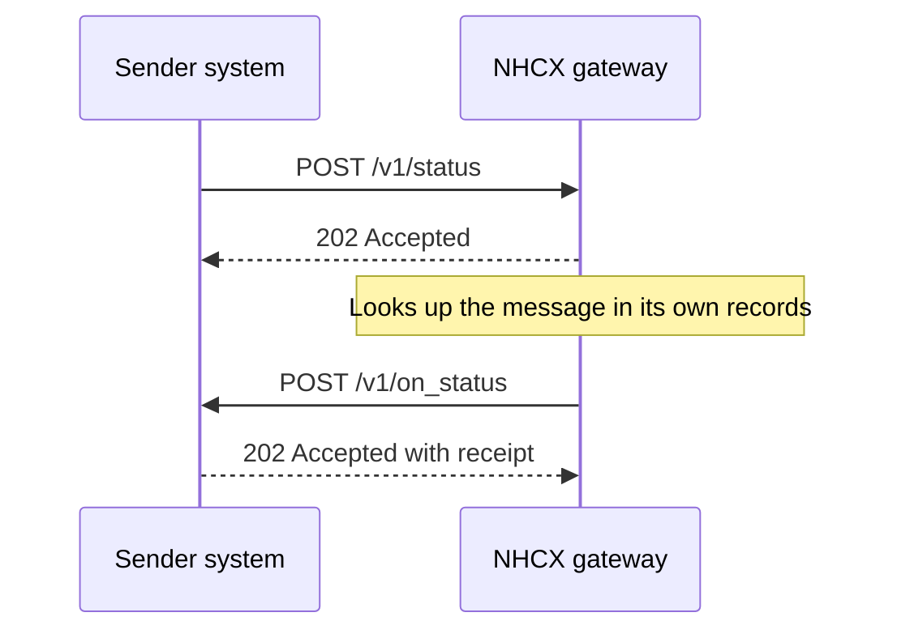

# Receiving POST /v1/status

## In plain words

`/v1/status` is the question a sender asks [NHCX](../../shared/glossary/nhcx.md) about one of its own messages. NHCX answers it from its own records. It does not forward the question to a [payer](../glossary/payer.md) or a [provider](../glossary/provider.md). The answer goes back to the sender on [`/v1/on_status`](on-status.md). In normal operation, no participant receives `/v1/status`.

## Before you start

**Who receives it:** NHCX, which implements `/v1/status` for providers and payers alike. **Who sends it:** any participant asking about a message it sent.

- Your registered `endpoint_url` stays as it is for every other path. You need no business logic for `/v1/status`.
- To ask about your own messages, see [`/v1/status`](../endpoints/status.md) and [receiving `/v1/on_status`](on-status.md).
- Every path under your `endpoint_url` answers a delivery within 30 seconds. See [the 202 acknowledgement](../concepts/synchronous-acknowledgement.md).

## What happens



### What a status request carries

A status request is sealed as a [JWE](../glossary/jwe.md) like any other message. Its payload is an empty string. Its protected header names the message in question:

```json
{
  "alg": "RSA-OAEP-256",
  "enc": "A256GCM",
  "x-hcx-sender_code": "<SENDER_PARTICIPANT_CODE>",
  "x-hcx-recipient_code": "<RECIPIENT_PARTICIPANT_CODE>",
  "x-hcx-api_call_id": "<API_CALL_ID_SET_BY_THE_SENDER>",
  "x-hcx-correlation_id": "<API_CALL_ID_OF_THE_MESSAGE_IN_QUESTION>",
  "x-hcx-timestamp": "<TIME_THE_SENDER_SEALED_IT>",
  "x-hcx-status": "request.initiated",
  "x-hcx-ben-abha-id": "<BENEFICIARY_ABHA_NUMBER>"
}
```

`x-hcx-correlation_id` holds the `x-hcx-api_call_id` of the message the sender asks about. Everything else follows [the x-hcx protocol headers](../concepts/protocol-headers.md).

### If one reaches your endpoint

Answer it like any other delivery: HTTP 202 with the receipt, within 30 seconds. Take no further action. NHCX, not you, reports the status on `/v1/on_status`.

Answer the delivery first, before you decrypt or act on it. Return HTTP status `202 Accepted` with this receipt:

```json
{
  "timestamp": "<CURRENT_TIME_AS_DD/MM/YYYY hh:mm:ss:sss>",
  "api_call_id": "<X_HCX_API_CALL_ID_FROM_THIS_DELIVERY>",
  "correlation_id": "<X_HCX_CORRELATION_ID_FROM_THIS_DELIVERY>",
  "result": {
    "sender_code": "<X_HCX_SENDER_CODE_FROM_THIS_DELIVERY>",
    "recipient_code": "<YOUR_PARTICIPANT_CODE>",
    "entity_type": "<ENTITY_TYPE>",
    "protocol_status": "request.queued"
  },
  "error": {
    "code": "",
    "message": ""
  }
}
```

- `api_call_id` and `correlation_id` repeat the values in this delivery.
- `result.sender_code` is the sender's code. `result.recipient_code` is yours.
- An `entity_type` value for this exchange is not yet published. The published values are `coverageeligibility`, `preauth`, `claim`, `task`, `payment` and `insuranceplan`.
- `result.protocol_status` is one of `request.queued`, `request.dispatched` or `request.error`.
- `error.code` and `error.message` stay empty when you accept the message.
- `timestamp` takes the form `DD/MM/YYYY hh:mm:ss:sss`.

## How you know it worked

- You have nothing to build for this path.
- Your own `/v1/status` calls are answered on `/v1/on_status`, with `x-hcx-status` `request.queued`, `request.dispatched` or `request.stopped`.
- If your endpoint ever logs a delivery at `/v1/status`, it returned 202 with the receipt within 30 seconds.

## When it goes wrong

- **It never arrives.** That is expected. NHCX answers status requests itself.
- **You are waiting for a status answer.** It comes on `/v1/on_status`. See [receiving `/v1/on_status`](on-status.md).
- **Your status call is refused with [NHCX-1012](../errors/nhcx-1012.md).** NHCX holds no message with that API call id. Put the `x-hcx-api_call_id` of your original message in `x-hcx-correlation_id`.
- **Your server answers `/v1/status` with a 404.** Route the path to a handler that returns the receipt. NHCX then stops sending it again.
