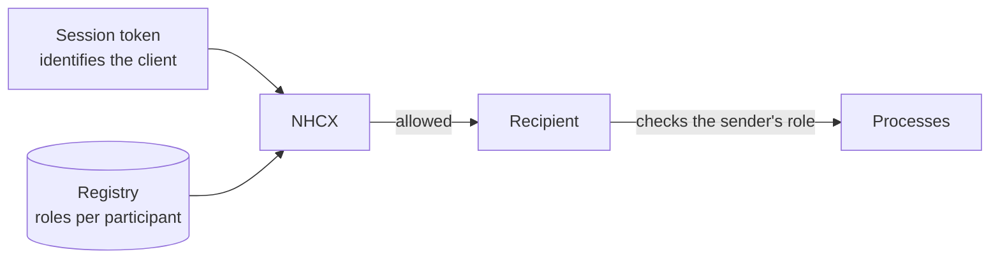

# Who may call what: the NHCX access control matrix

## In plain words

Not every participant may send every message. A hospital may submit claims but not payment notices. A payer may send payment notices but not claims. A regulator may search claims but not submit them.

These rules follow from each participant's registered role. NHCX and the payers check them on every call.

## Before you start

Read [participant roles](./participant-roles.md).

## What happens

### The matrix, version 1

| Role | May send | May receive | May search |
|---|---|---|---|
| `provider` | Eligibility, preauthorisation and claim requests; payment acknowledgements | Their responses; payment notices | Status of preauthorisations and claims it sent |
| `payer`, `agency.tpa` | Responses to eligibility, preauthorisation and claim; payment notices | Those requests; payment acknowledgements | Payment confirmation for notices it sent |
| `agency.regulator` | Claim searches | Search results | Claims, forwarded by NHCX to all payers |
| `research` | Eligibility responses | Eligibility requests | Preauthorisations and claims, aggregate and anonymised only |
| `member.isnp` | As research | As research | As research, plus individual claims with the beneficiary's consent |
| `agency.sponsor` | As a payer | As a payer | As a payer |
| Other NHCX instances | As the use case needs | As the use case needs | Never the payload |

A TPA acts exactly like a payer in version 1. A scheme sponsor, such as the owner of a government scheme, gets payer-level access.

### How the rules are enforced

- Your session token identifies your client. NHCX compares it with the participant that client registered.
- The registry records your role. NHCX and payers read it.
- Some actions are tied to one participant. Only the participant named as `payerid` or `processingid` on a policy link may de-link it.

### Losing access

A participant can be removed. A regulator may suspend a provider for fraud, or a payer or TPA. NHCX may remove a participant for serious policy breaches, hacking attempts, or traffic that harms the exchange. A participant may also leave on its own. Removal that is not voluntary comes with warnings, and the participant can appeal through [grievance redressal](./grievance-redressal.md).

## How you know it worked

You have understood this when you can answer both of these.

1. A research body asks NHCX for a named patient's claim history. What does its role allow it to see?
2. Your hospital system tries to search claims raised by another hospital. What does the matrix allow?

## When it goes wrong

**Role and registry type do not match.** A wrong mapping at creation leads to refused calls and wrong routing later.

**No role for the sender.** A payer refuses a sender with no role with the message "No user role found/associated for sender code".

**De-linking with the wrong credentials.** The token must come from the client that created the `payerid` or `processingid` participant.

**Individual data without consent.** An insurance self network platform may query an individual's claims only with that person's consent. See [beneficiary consent](./beneficiary-consent.md).
