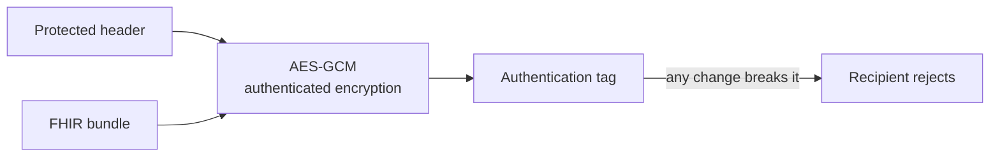

# Audit logging and non-repudiation

## In plain words

Claims involve money and health data, so every party must be able to show later what happened. NHCX keeps a record of every call it receives. It records only what it can read: the envelope, never the sealed claim.

The sealing does the rest. A message cannot be changed without breaking it, so a received message is provably the one that was sent.

## Before you start

Read [the JWE envelope](./jwe-envelope.md).

## What happens

### What NHCX records

For every call it receives, NHCX logs:

- the protocol and domain headers,
- the signature and encryption algorithm details,
- the sender and the recipient,
- the result of signature verification.

It cannot log the payload, because it cannot open it.

Each NHCX instance publishes the audit reports it offers for payers, providers, beneficiaries, regulators and observers. It publishes an archival policy for how long logs are kept, and it can limit how much each log holds. Participants can query the audit records about their own transactions through an API. Method and path for that API are not yet published.

### Why a message cannot be denied

The authentication tag covers the protected header and the payload together. A changed header or payload fails the tag, and the recipient must reject it. So NHCX adds no separate signature to a message.

### The event audit rules

Every event in a claim, such as a claim created, forwarded, queried, authorised or paid, is to be logged and signed by the systems involved. Logs are append only and never edited. They are kept for the period the law sets, and the audit trail is open to the beneficiary it concerns.

### What your system should keep

| Record | Why |
|---|---|
| Every envelope you sent and received, with its identifiers and your 202 | To prove delivery and answer a dispute |
| The insurance plan version each preauthorisation and claim used | A rate dispute turns on it |
| The UTR from each payment notice | Reconciliation and payment disputes |
| Biometric capture times for each cycle of a cyclic treatment | The payer checks them against the claim |

## How you know it worked

You have understood this when you can answer both of these.

1. A regulator asks NHCX for the diagnosis on a disputed claim. What can NHCX's audit log show, and who holds the diagnosis?
2. A payer says your preauthorisation arrived with a different amount. How does the envelope itself settle whether it was changed on the way?

## When it goes wrong

**Logs that can be edited.** Audit logs must be append only. A log you can rewrite proves nothing.

**No record of the plan version.** Without it, a claim priced from an older tariff cannot be defended.

**Discarded payment references.** Keep the UTR from every payment notice. It is the only link to the bank transfer.

**Relying on NHCX to hold the payload.** NHCX never sees it. Keep your own copies of what you sent and received.
