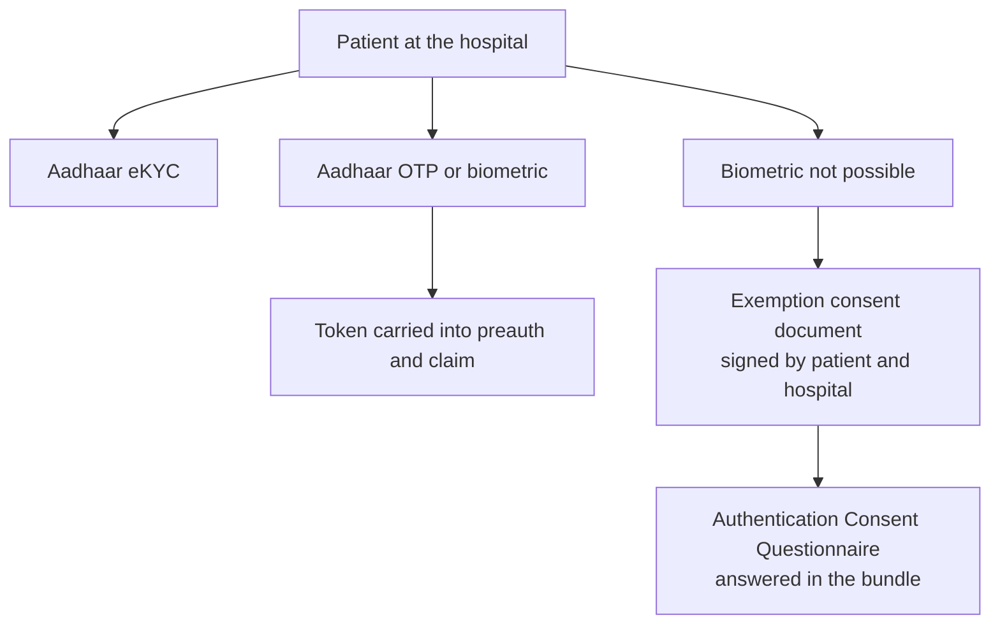

# Beneficiary consent and data rights

## In plain words

A claim carries a patient's diagnosis, treatment and money. The exchange is built so that this data reaches only the parties that need it.

Some protections are technical: the exchange cannot read the claim at all. Others are rules about consent: some parties may see a patient's data only if the patient agrees. And the patient must prove who they are before a claim starts.

## Before you start

Read [access control](./access-control.md).

## What happens

### Where the patient's data can go

| Who | What they may see |
|---|---|
| The hospital and the payer on the claim | The full claim, sealed for each other |
| NHCX | The envelope only, never the payload |
| Research bodies | Aggregate and anonymised data only |
| Insurance self network platforms | Individual claims only with the patient's consent |
| The patient | The audit trail of events on their claims |

An insurance self network platform submits the patient's consent in the domain header of its request. The consent flow works with the existing [consent manager](../../shared/glossary/consent-manager.md) infrastructure.

### Consent before notifications

A patient app must get the patient's explicit consent before it subscribes to their claim updates. It must show the subscription status and let the patient turn it off. See [notifications](./notifications.md).

### Proving the patient is present

A provider verifies the patient with Aadhaar eKYC, or with Aadhaar [OTP](../../shared/glossary/otp.md) or biometric authentication. For PMJAY, biometric presence is required at registration, preauthorisation and discharge. See [biometric authentication](./biometric-authentication.md).

When biometric authentication is not possible, the hospital obtains an Aadhaar exemption consent document signed by the patient and a hospital representative. It stores the document, links it to the patient's record, and answers the Authentication Consent Questionnaire in the bundle.

### Linking the patient's policy

A payer links a patient's [ABHA](../../shared/glossary/abha.md) to the policies the patient holds, so hospitals can find their cover. Only the payer or its TPA can change that link. See [policy linking](./policy-linking.md).

## How you know it worked

You have understood this when you can answer both of these.

1. A patient cannot give a fingerprint after an accident. What must the hospital obtain and store, and what goes into the preauthorisation instead of the token?
2. A research body wants to study claim delays at one hospital. What data may it receive?

## When it goes wrong

**No authentication and no consent questionnaire.** The PMJAY payer refuses the preauthorisation with [PAYR-1256](../errors/payr-1256.md) and the claim with [PAYR-1363](../errors/payr-1363.md).

**Subscribing without consent.** A patient app must ask first and must let the patient see and switch off the subscription.

**Exemption without the signed document.** The questionnaire answer relies on a document signed by both the patient and the hospital. Keep it linked to the patient's record.

**Individual data sent to a research body.** Research access is aggregate and anonymised only.
