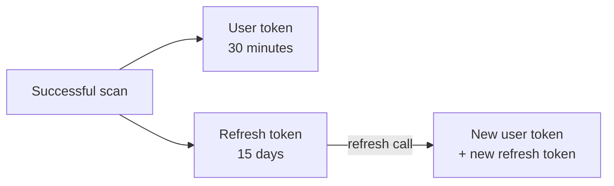

# Biometric authentication of the beneficiary

## In plain words

PMJAY pays only for patients who were really at the hospital. So the hospital proves it: the patient places a finger on a scanner, looks into an iris camera, or has their face scanned on a phone. The scan is checked against Aadhaar through the ABHA biometric service.

A successful check gives the hospital a user token. The hospital carries that token, or a signed exemption, into the preauthorisation and the claim.

## Before you start

The patient's [ABHA number](../../shared/glossary/abha-number.md) must be linked to their PMJAY card. For patients without that link, the scheme's other [KYC](../../shared/glossary/kyc.md) procedures apply. Fingerprint and iris need a registered device with its [RD service](../glossary/rd-service.md) on the hospital computer.

## What happens

### When to authenticate

| Moment | `process` header |
|---|---|
| Patient registration and preauthorisation | `Preauth` |
| Every cycle of a cyclic treatment, such as dialysis | `Discharge` |
| Discharge, before the claim | `Discharge` |

Biometric authentication is not an NHCX use case call. The hospital system calls the ABHA biometric service directly, sending the payer's participant code in `payerid`.

### The three modalities

| Modality | `authMode` | `scope` | Evidence sent |
|---|---|---|---|
| Fingerprint | `FINGERPRINT` | `abha-login`, `aadhaar-bio-verify` | The device's [PID block](../glossary/pid-block.md) in `fingerPrintAuthPid` |
| Iris | `IRIS` | `abha-login`, `aadhaar-iris-verify` | The PID block in `irisAuthPid` |
| Face | `FACE_AUTH` | from the face auth init call | A phone scan through the ABHA app, then the Aadhaar number, RSA encrypted |

Fingerprint and iris take two calls: init returns a `txnId`, and verify sends the PID block with it. Face takes four steps: init, show a QR code for the patient's phone, poll `capture/pid` until it returns `COMPLETE`, then verify. Which to use is covered in [choosing a modality](../decisions/biometric-modality.md). A PMJAY integration must support all three.

### The tokens

Refresh at least once every 10 days to keep a long stay covered without scanning again. A cyclic treatment cycle is the exception: every cycle needs a live scan, never a refresh, and two cycles of the same procedure need 24 hours between them.

The request header that carries the user token on preauthorisation and claim is not yet published.

### When a scan is impossible

For trauma, amputations or unreadable biometrics, the hospital obtains an Aadhaar exemption consent document signed by the patient and a hospital representative. It stores the document, and answers the Authentication Consent Questionnaire from the insurance plan in the preauthorisation or claim instead of sending a token. Cyclic treatments cannot use this route.

## How you know it worked

You have understood this when you can answer both of these.

1. A dialysis patient came in yesterday at 18:00. Can you scan them for the next cycle at 09:00 today? Can you use the refresh token instead?
2. A patient's fingerprints cannot be read at discharge. What does your claim carry in place of the discharge token?

## When it goes wrong

**Neither token nor questionnaire.** The PMJAY payer refuses a preauthorisation with [PAYR-1256](../errors/payr-1256.md) and a claim with [PAYR-1363](../errors/payr-1363.md). A questionnaire with a blank link id fails with [PAYR-1271](../errors/payr-1271.md) or [PAYR-1364](../errors/payr-1364.md).

**Invalid or expired user token.** [PAYR-1272](../errors/payr-1272.md) at preauthorisation, [PAYR-1366](../errors/payr-1366.md) at claim. Scan again.

**Missing cycle scans.** A cycle with no scan on its date fails with [PAYR-1367](../errors/payr-1367.md). Two scans for one date fail with [PAYR-1369](../errors/payr-1369.md).

**Device error K-547 on fingerprint.** Set the `lr` attribute to `Y` when computing the WADH value.
