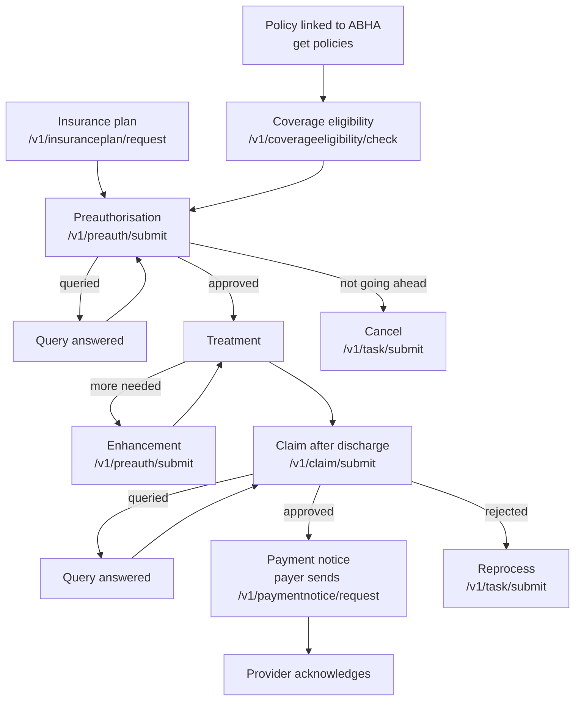

# The claim cycle from eligibility to payment

## In plain words

A cashless hospital stay produces a series of exchanges between the hospital and the payer. First the hospital checks the patient's cover. Then it asks the payer to approve the treatment. After discharge it submits the claim. Finally the payer tells the hospital the money has been paid.

Each of those steps is a separate request and response on NHCX. Together they are the claim cycle.

## Before you start

Read [the four message legs](./four-message-legs.md). Every stage below follows that pattern.

## What happens

| Stage | Who starts | Request path | Bundle |
|---|---|---|---|
| [Coverage eligibility](./coverage-eligibility-purposes.md) | Provider | `/v1/coverageeligibility/check` | CoverageEligibilityRequest |
| [Insurance plan](./insurance-plan.md) | Provider | `/v1/insuranceplan/request` | Task with code `poll` |
| Preauthorisation | Provider | `/v1/preauth/submit` | Claim with use `preauthorization` |
| Enhancement | Provider | `/v1/preauth/submit` | Claim, resubmitted with added items |
| Query | Payer | See [queries](./queries-and-communication.md) | ClaimResponse or CommunicationRequest |
| Claim | Provider | `/v1/claim/submit` | Claim with use `claim` |
| Payment notice | Payer | `/v1/paymentnotice/request` | Task with PaymentNotice |
| Reprocess or cancel | Provider | `/v1/task/submit` | Task |
| Status and search | Provider or regulator | `/v1/status`, `/v1/search/submit` | Protocol headers, Task |

Every request path has an `on_` answer path, as described in [the four message legs](./four-message-legs.md). The [workflow id](./workflow-codes.md) on each message names the stage.

### Rules that shape the cycle

- Preauthorisation comes before planned treatment. Under PMJAY it cannot be raised more than one day before admission.
- An enhancement asks for more on an approved preauthorisation. It goes to the same path with workflow id `13`.
- The claim follows discharge. Under PMJAY, discharge details travel inside the claim, and a claim cannot be cancelled.
- A payment notice follows claim approval. The provider acknowledges it, which closes the cycle.
- A rejected or short-paid claim can be sent for reprocess. See [reprocess and cancel](./reprocess-and-cancel.md).

## How you know it worked

You have understood this when you can answer both of these.

1. Your patient needs a further procedure during an approved stay. Which path do you call, with which workflow id, and what bundle?
2. The payer approved the claim. What message does the payer send next, and what must your system send back?

## When it goes wrong

**Claim before preauthorisation.** A standard payer refuses it with [PAYR-1010](../errors/payr-1010.md), preauthorisation required but not obtained.

**Claiming more than was approved.** A standard payer refuses it with [PAYR-1012](../errors/payr-1012.md).

**Answering a query with a fresh request.** A query is part of the same case. Answer it with the query response workflow id. See [queries and communication](./queries-and-communication.md).

**Skipping the payment acknowledgement.** The cycle stays open on the payer's side until you acknowledge.
