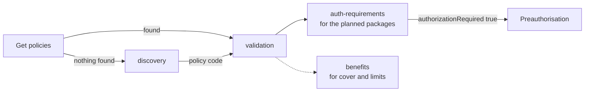

# The four coverage eligibility purposes

## In plain words

Before treatment, a hospital asks the payer about the patient's cover. That request is a [coverage eligibility](../glossary/coverage-eligibility.md) check.

The check always asks one question, set in `CoverageEligibilityRequest.purpose`. Is there a policy at all? Is it in force? What does it cover? Does this treatment need approval first? The purpose you choose decides what you must send and what you get back.

## Before you start

You need the patient's policy code, or at least their beneficiary ID. See [policy linking](./policy-linking.md). For a PMJAY patient, fetch the [insurance plan](./insurance-plan.md) first, so you know the package codes.

## What happens

| Purpose | The question | Procedure or package items | What comes back |
|---|---|---|---|
| `discovery` | Does this beneficiary have an active policy? | Not used | The active policy code |
| `validation` | Is the policy in force today? | Not used | `insurance.inforce`, used and available amounts |
| `benefits` | What cover and limits apply to these items? | Required | Benefit lines with allowed amounts, and exclusions |
| `auth-requirements` | Does this treatment need preauthorisation? | Required | `authorizationRequired`, covered amount, required documents and questionnaires |

Every purpose needs the beneficiary ID, the coverage or policy code, the payer and the provider. For a PMJAY patient the beneficiary ID is the PMJAY member ID, the [ABHA number](../../shared/glossary/abha-number.md), or both.

### Reading the response

- `outcome` is `complete` when the payer processed the check.
- `disposition` is a sentence such as "Policy is currently in-force".
- `insurance[].inforce` is `true` when the policy is active.
- For each item, `excluded` says whether it is covered and `authorizationRequired` whether it needs approval first.
- `authorizationSupporting` lists the document codes the preauthorisation must carry, such as `MAND0409`.

### When to check again

Run an eligibility check whenever a new or additional treatment is planned, before you submit or enhance a preauthorisation. The choice between purposes is covered in [which eligibility purpose](../decisions/eligibility-purpose.md).

## How you know it worked

You have understood this when you can answer both of these.

1. A patient arrives and the get policies call returns nothing. Which purpose do you send first, and what do you do with its answer?
2. You plan package `MG004A` for a patient. Which purpose tells you whether you need preauthorisation, and which response fields answer it?

## When it goes wrong

**Purpose not accepted.** The PMJAY payer refuses an unknown purpose with [PAYR-1101](../errors/payr-1101.md). Its structure checks use [PAYR-1032](../errors/payr-1032.md) for "Invalid purpose received".

**Items missing for benefits or auth-requirements.** The PMJAY payer refuses the request with [PAYR-1033](../errors/payr-1033.md), no items received for the purpose.

**Not covered, no policy, expired.** A standard payer answers with [PAYR-1005](../errors/payr-1005.md), [PAYR-1006](../errors/payr-1006.md) or [PAYR-1007](../errors/payr-1007.md). These codes carry other meanings from the PMJAY payer, so read the message text. See [error code spaces](./error-code-spaces.md).

**Beneficiary not covered by this payer.** The PMJAY payer answers [PAYR-1123](../errors/payr-1123.md).
