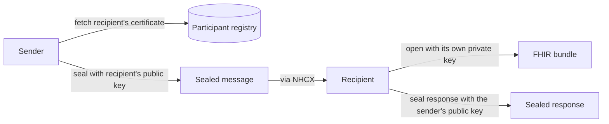

# Your encryption certificate and the recipient's

## In plain words

Every message on NHCX is sealed for one recipient. To seal it, the sender needs the recipient's public key. To open it, the recipient needs its own private key.

So every participant does two things. It publishes a public [X.509 certificate](../glossary/x509-certificate.md) in the participant registry. It keeps the matching private key secret on its own servers.

## Before you start

You need a participant record you can update. See [the participant registry](./participant-registry.md).

## What happens

### Two keys in every exchange

Your certificate is how others reach you. The recipient's certificate is how you reach them. A response travels the same way in reverse: the payer seals it with your public key.

### Your certificate

- An RSA key pair of 2048 bits.
- A self-signed X.509 certificate made from it, valid for 365 days.
- The PEM certificate, Base64 encoded, sent as the encryption certificate when you update your participant record.

The steps are in [generate and register a certificate](../flows/generate-and-register-certificate.md). The private key never leaves your system.

### The recipient's certificate

You fetch it with `/fetch/certs`, passing the recipient's participant code as `participantid`. The response carries the certificate in `encryption_cert`. The value is either a PEM X.509 certificate or a bare public key, so try X.509 first and fall back to the public key form.

Cache each fetched certificate for 24 hours. Do not call `/fetch/certs` before every message.

### Rotation

Rotate your key pair once a year, and at once if the private key may be compromised. Upload the new certificate to your record. In production the certificate update needs no passcode. Senders that cached your old certificate keep using it until their cache expires, so keep the old private key able to open messages for a day after rotating.

## How you know it worked

You have understood this when you can answer both of these.

1. You are about to send a claim to a payer. Whose certificate seals it, and where does your system get that certificate?
2. You rotated your key pair this morning and a payer's response fails to open. What is the likely cause, and how do you avoid it next time?

## When it goes wrong

**The recipient cannot open your message.** It reports [PAYR-1001](../errors/payr-1001.md). Fetch the recipient's certificate again from `/fetch/certs` and seal with that. See [the recipient cannot decrypt](../troubleshooting/recipient-cannot-decrypt.md).

**The payer cannot seal its response to you.** It reports [PAYR-1002](../errors/payr-1002.md). Your certificate in the registry is missing, invalid or out of date. Update it.

**Certificate not Base64 encoded.** The update is refused. Encode the whole PEM file, header and footer lines included.

**Expired certificate.** A self-signed certificate made with `-days 365` expires after a year. Rotate before it does.
