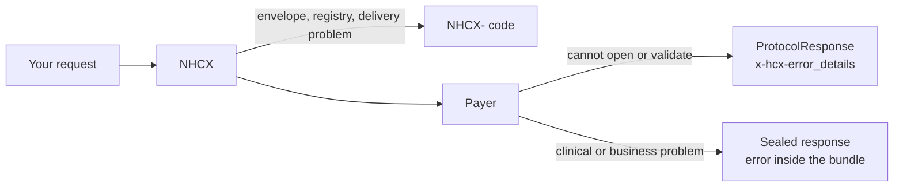

# Error code spaces: NHCX codes, standard payer codes and reference payer codes

## In plain words

An error on NHCX can come from three places. The exchange refuses a bad envelope. A payer refuses a request it cannot accept. And the PMJAY payer has its own, much longer catalogue.

Each source has its own codes. The catch: some payer codes are shared between the standard list and the PMJAY catalogue with different meanings. So a code alone does not always tell you what went wrong.

## Before you start

Read [the JWE envelope](./jwe-envelope.md) and [retries and expiry](./retries-and-expiry.md). Your system needs a `/v1/error` endpoint.

## What happens

### The three spaces

| Space | Codes | Sent by | Arrives |
|---|---|---|---|
| Gateway | `NHCX-401`, `NHCX-1001` to `NHCX-1018` | NHCX itself | In the HTTP response to your call, or later on your callback or `/v1/error` |
| Standard payer | `PAYR-1001` to `PAYR-1020` | Any payer following the published standard | In `x-hcx-error_details` of a `ProtocolResponse`, or inside the sealed response |
| PMJAY reference payer | `PAYR-1001` to `PAYR-1520` | The PMJAY payer | The same way |

A payer that cannot decrypt or validate your request answers with a `ProtocolResponse` in the clear, `x-hcx-status` `response.error`, and the code, message and trace in `x-hcx-error_details`. Clinical and business errors go inside the sealed response instead, so NHCX never sees them.

### Gateway codes

`NHCX-` codes are about the envelope, the registry and delivery: unregistered sender or receiver, bad headers, duplicate correlation id, unknown status, unreachable receiver. `NHCX-1001` is a transport error. The rest are business errors.

### Standard payer codes

| Codes | Meaning |
|---|---|
| `PAYR-1001` to `PAYR-1003` | Transport: cannot decrypt, cannot encrypt, cannot reach NHCX |
| `PAYR-1004` to `PAYR-1020` | Business: provider not registered, beneficiary not covered, policy missing or expired, amounts, preauthorisation, time limits, bank details |

### PMJAY reference payer bands

| Band | Where it arises | What it usually means |
|---|---|---|
| `PAYR-10xx` and `PAYR-15xx` | Envelope and bundle structure | An element, id, sequence, type or attachment is missing or malformed |
| `PAYR-11xx` | Coverage eligibility | The policy, the beneficiary or the hospital configuration |
| `PAYR-12xx` | Preauthorisation | Codes, amounts, dates, sequencing and scheme rules |
| `PAYR-13xx` | Claim | The same, checked against the approved preauthorisation |
| `PAYR-14xx` | Insurance plan | Empanelment, policy association, plan configuration |

The PMJAY catalogue also has messages with no code, and marks `PAYR-1003`, `PAYR-1006` and `PAYR-1007` as deprecated in the structure band.

### Eighteen codes with two readings

`PAYR-1001` and `PAYR-1002` mean decryption and encryption failure in both spaces. From `PAYR-1003` to `PAYR-1020`, every code has one meaning from a standard payer and another from the PMJAY payer.

| Code | Standard payer | PMJAY reference payer |
|---|---|---|
| `PAYR-1003` | Error connecting to NHCX; it will resend | Invalid workflow requested |
| `PAYR-1004` | Provider not registered with the payer for the policy | Received FHIR bundle is malformed |
| `PAYR-1005` | Beneficiary not covered by the policy | Maximum time limit exceeded in receiving the request |
| `PAYR-1006` | Policy does not exist | Invalid name in request |
| `PAYR-1007` | Policy expired | Invalid gender in request |
| `PAYR-1008` | Coverage amount insufficient | Invalid FHIR bundle received |
| `PAYR-1009` | Items not valid or not covered | No identifier for the patient |
| `PAYR-1010` | Preauthorisation required but not obtained | No type for the patient identifier |
| `PAYR-1011` | Package does not support enhancement | No identifier for the claim |
| `PAYR-1012` | Claim above the approved preauthorisation | No type for the claim identifier |
| `PAYR-1013` | No prior approval for the packages | No identifier for the provider organisation |
| `PAYR-1014` | Date of birth after date of service | No type for the provider organisation identifier |
| `PAYR-1015` | Date of service after date of death | No identifier for the payer organisation |
| `PAYR-1016` | Duplicate claim | No type for the payer organisation identifier |
| `PAYR-1017` | Amount calculations wrong | No task code received |
| `PAYR-1018` | Time limit for submission expired | No task reason code received |
| `PAYR-1019` | Additional information not received in time | Invalid sequence in supporting info |
| `PAYR-1020` | No valid bank details for the provider | Invalid category in supporting info |

### The rule

Handle a `PAYR` code together with its message text, never by the code alone. Log the code, the message and the trace. Keep a note of which payer sent it: the sender code on the response tells you.

## How you know it worked

You have understood this when you can answer both of these.

1. A response arrives with `PAYR-1004` and the message "Received FHIR bundle is malformed". Which reading applies, and what do you fix?
2. Your claim submission gets `NHCX-1003` in the HTTP response. Did the payer ever see the claim?

## When it goes wrong

**Switching on the code alone.** A handler that maps `PAYR-1005` to "beneficiary not covered" misleads staff when the PMJAY payer means a stale timestamp. Read the message.

**Treating a gateway error as a payer decision.** An `NHCX-` code means the exchange stopped the message. Fix the envelope or registration and send again.

**No `/v1/error` endpoint.** Requests that NHCX drops after its retries are reported there. Without it, a failed claim looks like a slow one. See [report a processing error](../flows/report-a-processing-error.md).

**Hard coding one list.** New PMJAY codes appear over time. Fall back to showing the payer's message for any code your system does not know.
