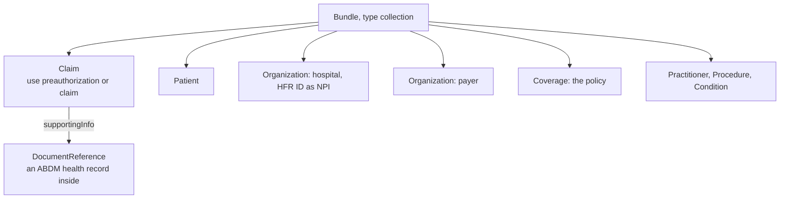

# FHIR collection bundles and the NHCX claim profiles

## In plain words

The payload inside every sealed NHCX message is a [FHIR](../../shared/glossary/fhir.md) bundle: a set of related records packed together. A claim bundle holds the claim itself, the patient, the hospital, the payer, the policy, the diagnoses and procedures, and the supporting documents.

The [NRCeS](../../shared/glossary/nrces.md) publishes the profiles these bundles must follow. A bundle that does not follow them is refused by the payer.

## Before you start

Read [the claim cycle](./claim-cycle.md), so you know which bundle each stage needs.

## What happens

### Collection, not document

ABDM health records are FHIR bundles of type `document`, headed by a `Composition`. NHCX claim messages are bundles of type `collection`. A collection groups the records one workflow needs, with the main resource first and no bundle-level `Composition`.

### The six claim bundles

| Bundle | Main resource | Used for |
|---|---|---|
| Coverage eligibility request | `CoverageEligibilityRequest` | Eligibility checks |
| Coverage eligibility response | `CoverageEligibilityResponse` | Eligibility answers |
| Claim | `Claim`, with `use` of `predetermination`, `preauthorization` or `claim` | Predetermination, preauthorisation, claim |
| Claim response | `ClaimResponse` | Every decision on a claim bundle |
| Task | `Task` | Communication, payment notice, search, reprocess, insurance plan request |
| Insurance plan | `InsurancePlan` | The payer's plan |

### Rules every bundle follows

- Reference resources inside the bundle with `urn:uuid:` references.
- Declare the NRCeS profile of each resource in `meta.profile`.
- Send the hospital's HFR ID in the hospital `Organization` identifier, with type code `NPI`.
- Attach files as Base64. Allowed content types are `application/pdf`, `application/jpg`, `application/jpeg`, `application/png` and `application/fhir+json`.

### Clinical records inside a claim

Under PMJAY, clinical records travel as structured ABDM [health information types](../../shared/glossary/hi-type.md). Each record is a FHIR bundle, Base64 encoded into a `DocumentReference`, and referenced from `Claim.supportingInfo` with category `DIA`, `HDS`, `CD` or `INF`. Each document may be up to 2 MB and the whole bundle up to 20 MB.

### Validate before you seal

Validate every bundle against the NRCeS profile package, `https://nrces.in/ndhm/fhir/r4/package.tgz`, before encryption. A payer can only report a bad bundle after decrypting it, which costs you a full round trip. The validator command is in [the validator recipe](../../shared/fhir/hl7-validator-recipe.md).

## How you know it worked

You have understood this when you can answer both of these.

1. You copied an ABDM discharge summary bundle and set its type to `collection` to use as a claim. What is still wrong with it?
2. Where in a preauthorisation bundle does a lab report go, and in what form?

## When it goes wrong

**Malformed bundle.** The PMJAY payer answers "Received FHIR bundle is malformed" with the validator's details. On the standard payer list the same code, [PAYR-1004](../errors/payr-1004.md), means something else, so read the message. Validate and fix.

**Unparseable bundle.** The PMJAY payer answers [PAYR-1008](../errors/payr-1008.md) from its structure checks: invalid FHIR bundle received.

**Dates in the wrong format.** The PMJAY payer refuses dates that do not follow the NRCeS date and date-time formats with [PAYR-1043](../errors/payr-1043.md) and [PAYR-1044](../errors/payr-1044.md).

**Attachment rejected.** A missing name, a non Base64 value or a content type outside the list above is refused. See [the bundle is rejected](../troubleshooting/bundle-rejected.md).
