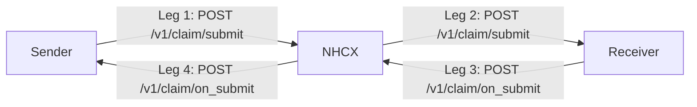

# The four legs of every exchange: request, acknowledgement, callback, acknowledgement

## In plain words

NHCX works like email. You hand a message to the exchange and walk away. The answer comes back later as a new message, on a separate call.

So every use case takes four legs. Your request goes to NHCX, NHCX delivers it, the recipient's answer goes to NHCX, and NHCX delivers the answer to you. Each leg is acknowledged at once, before any real work happens.

## Before you start

You need a registered endpoint URL that NHCX can reach. See [the participant registry](./participant-registry.md).

## What happens

| Leg | Who calls | NHCX checks | Acknowledged by |
|---|---|---|---|
| 1. Sender to NHCX | The sender | Sender and recipient status, headers | NHCX, HTTP 202 |
| 2. NHCX to receiver | NHCX, to the receiver's registered endpoint | Recipient status | The receiver, HTTP 202 |
| 3. Receiver to NHCX | The receiver, on the `on_` path | Both statuses, headers | NHCX, HTTP 202 |
| 4. NHCX to sender | NHCX, to the sender's registered endpoint | Sender status | The sender, HTTP 202 |

### The same path in both roles

NHCX forwards a message on the same path it received it on. So `/v1/claim/submit` is a call a provider makes to NHCX, and also a call NHCX makes to the payer. `/v1/claim/on_submit` is a call the payer makes to NHCX, and also a call NHCX makes to the provider.

Your system therefore implements the paths you receive. A provider implements the `on_` paths for its requests. A payer implements the request paths.

### Who is the sender

For eligibility, insurance plan, preauthorisation, claim and task requests, the provider is the sender. For payment notices and communication requests, the payer is the sender and the provider answers.

### Between exchange instances

The protocol allows relays between NHCX instances at the routing steps. Your system always talks to the one instance it is registered with.

## How you know it worked

You have understood this when you can answer both of these.

1. You are a payer. Which path do you implement to receive a claim, and which path do you call to answer it?
2. Leg 1 returned HTTP 202 an hour ago and leg 4 has not arrived. Which legs could have failed, and which acknowledgement would have told NHCX to retry?

## When it goes wrong

**Waiting on the leg 1 response for the answer.** The 202 only closes leg 1. The answer is leg 4. See [the 202 acknowledgement](./synchronous-acknowledgement.md).

**Leg 4 never arrives.** Your endpoint may be unreachable or slow to acknowledge. See [accepted, then no callback](../troubleshooting/accepted-then-no-callback.md).

**Leg 2 fails at the receiver.** NHCX retries, then gives up and reports to your `/v1/error` endpoint. See [retries and expiry](./retries-and-expiry.md).
