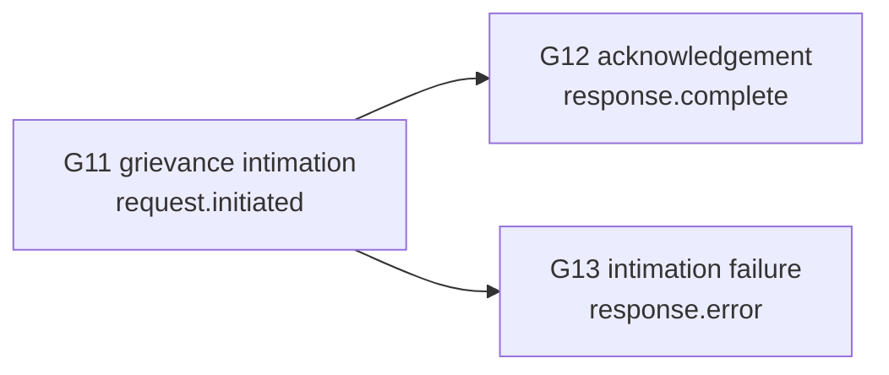

# Grievance redressal on the exchange

## In plain words

Disputes happen between hospitals, payers, TPAs and patients. A payer ignores a case for weeks. A hospital bills a patient wrongly. A participant is removed from the exchange and disagrees.

Each NHCX operator publishes a grievance policy that says how such disputes are raised, tracked and resolved, and how they escalate. The policy follows the insurance regulator's grievance guidelines, extended to disputes between any two participants.

## Before you start

Record a nodal contact for grievances, digital and physical, when your participant is onboarded. Other participants read it from the registry.

## What happens

### What the policy must provide

| Guarantee | What it means for you |
|---|---|
| Digital grievances | You raise, route and track a grievance online |
| A stated scope | The policy lists which grievances it covers and where others go |
| Nodal bodies | Every participant, and the operator, publishes a contact in the registry |
| Types, priorities and time limits | Published per grievance type, including those set by regulation |
| A versioned policy | You sign it at onboarding, and you are told of every change |
| Due diligence | Grievances are investigated and reviewed before a reply |
| Reopening | You can reopen a grievance you are not satisfied with |
| Escalation | You can escalate to the operator, on faster time limits |
| Status updates | You are kept informed while it is open |

### Grievance messages on the wire

Workflow ids `G11`, `G12` and `G13` identify grievance intimation, acknowledgement and failure. The path a participant uses to raise a `G11` grievance is not yet published.

A PMJAY payer also tells a hospital about a grievance that needs its action through a communication request with `Task.reasonCode` `grievance`. Acknowledge it like any communication request. See [queries and communication](./queries-and-communication.md).

### A grievance is not a claim dispute

To dispute a claim decision, raise a reprocess or erroneous claim through the task path. Under PMJAY those go to the [Claim Review Committee](../glossary/crc.md). See [reprocess and cancel](./reprocess-and-cancel.md).

### Appealing removal

A participant removed from the exchange against its will can appeal through the grievance process.

For help with an integration, write to hcx.integration@nha.gov.in.

## How you know it worked

You have understood this when you can answer both of these.

1. A payer has not answered your hospital's preauthorisation within the policy's time limit. Is that a reprocess, a query, or a grievance? What guarantees does the policy give you?
2. Your participant was blocked for repeated rate limit breaches. What route does the policy give you to challenge it?

## When it goes wrong

**Using a grievance to dispute a claim decision.** A rejected or short-paid claim goes through reprocess on the task path, not through grievance.

**No nodal contact in the registry.** Other participants cannot reach you, and grievances against you escalate to the operator.

**Ignoring a grievance communication.** Acknowledge a communication request with reason `grievance` like any other, within 30 seconds, and act on it.
