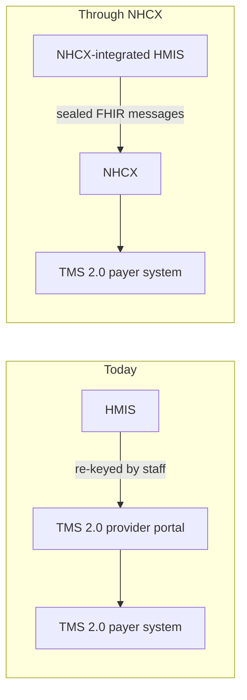

# Hospital HMIS integration for PMJAY through NHCX

## In plain words

Today a PMJAY hospital records a patient in its own [HMIS](../../shared/glossary/hmis.md), then types the same details again into the scheme's [TMS](../glossary/tms.md) provider portal. Two systems, two rounds of data entry.

With NHCX, the HMIS sends preauthorisations and claims itself, system to system, to the payer's TMS. The portal drops out of the hospital's workflow.

## Before you start

The hospital needs an [HFR](../../shared/glossary/hfr.md) facility ID with a registered mobile number, its PMJAY hospital ID, and an ABDM Milestone 1 compliant HMIS.

## What happens

### Before and after

### What the HMIS must hold

| Capability | Why |
|---|---|
| Session tokens and a certificate pair | To call NHCX and to seal and open messages |
| A public HTTPS endpoint | NHCX delivers payer responses there |
| An insurance plan store | Packages, rates, forms and required documents per policy |
| Biometric capture | Patient presence at registration, preauthorisation and discharge |
| A FHIR bundle builder and validator | Structured claims and clinical records |

### The migration, in six steps

1. **Create the participant** with registry type `10001` (HFR), role `10001` (provider), the HFR ID and the HFR-registered mobile number.
2. **Confirm it** with the transaction ID and the passcode sent to that mobile.
3. **Update it** with the HMIS endpoint URL and the Base64 encoded certificate.
4. **Confirm the update** with a second passcode, valid for 24 hours.
5. **Map it.** The hospital raises a ticket with the NHA NHCX operations team, giving the PMJAY hospital ID and the new participant ID. This step is manual.
6. **Go live.** The mapping is the switch.

### Dual processing

Cases submitted before the mapping finish in the TMS provider portal. Cases started after it go only through the HMIS. TMS stops accepting new preauthorisations from that hospital.

## How you know it worked

You have understood this when you can answer both of these.

1. A patient's preauthorisation was raised in the TMS portal the day before your mapping. Where does its claim go?
2. Steps 1 to 4 are complete but claims still show only in TMS. Which step is missing, and who performs it?

## When it goes wrong

**Mobile number mismatch.** Participant creation fails unless the mobile matches the HFR record exactly. Update HFR first.

**Wrong registry type or role.** A PMJAY hospital must use HFR (`10001`) and provider (`10001`). Anything else is rejected.

**Mapping not raised or not complete.** Until the NHA operations team maps the hospital ID to the participant ID, new cases do not route through the HMIS.

**Endpoint not reachable.** The mapping needs a live HTTPS endpoint that NHCX can reach.
