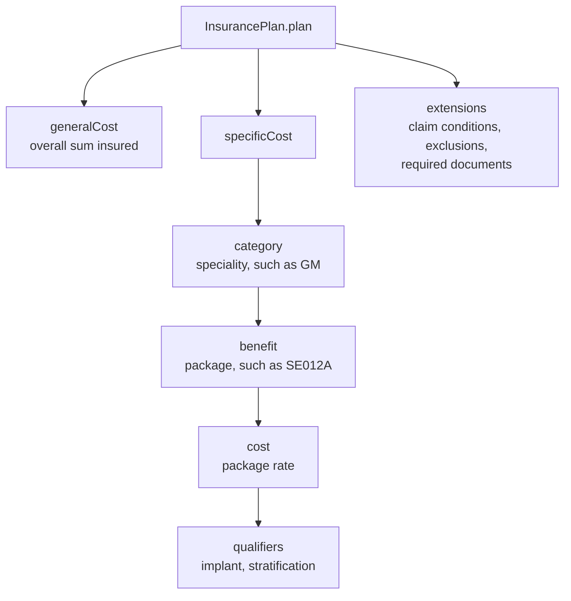

# The insurance plan and what a provider learns from it

## In plain words

An [insurance plan](../glossary/insurance-plan.md) is the payer's policy published as data rather than as a PDF. It tells a hospital what it may treat under the policy, at what rate, under which conditions, and with which documents.

The hospital fetches it through NHCX, stores it, and uses it to fill in preauthorisations and claims. Under [PMJAY](../glossary/pmjay.md) nearly every later step depends on it.

## Before you start

You need the policy code, your [HFR](../../shared/glossary/hfr.md) facility ID, and the payer's participant code.

## What happens

### Asking for the plan

You send a FHIR `Task` to `/v1/insuranceplan/request`:

| Element | Value |
|---|---|
| `Task.status` | `requested` |
| `Task.intent` | `order` |
| `Task.code` | `poll`, system `https://nhcx.abdm.gov.in/api` |
| `Task.input` | `policyNumber` and `providerId`; at least one is required |

The plan arrives later on `/v1/insuranceplan/on_request` as a `collection` bundle of `InsurancePlan`, `Organization` and `Questionnaire` resources.

### What the plan holds

- **Specialities and packages.** Only those your hospital is empanelled for. The plan is specific to the payer, the policy and your hospital.
- **Package rates and qualifiers.** ICU or HDU stratification and implants carry their own amounts.
- **Claim conditions.** Per package flags such as `ApprovalNotRequired`, `EnhancementAllowed`, `ImplantApplicable`, `CyclicProcedure`, `Standalone` and `Unspecified`.
- **Required documents.** At policy level and per package, for preauthorisation and for claim.
- **Questionnaires.** Standard treatment guideline forms. You return the questionnaire URL in the `QuestionnaireResponse` of your preauthorisation or claim.

### Keeping it current

- The bundle can exceed 20 MB. Store it in a queryable form, linked to the policy.
- Refresh it weekly, and at once when the payer renews or amends the policy.
- Keep versions of rates and packages, and record which version each preauthorisation and claim used.

## How you know it worked

You have understood this when you can answer both of these.

1. A package you want to add during an enhancement shows `EnhancementAllowed` as `N`. What should your system do?
2. Your weekly refresh fails for a policy while an earlier request is still running. What does the payer tell you, and how long do you wait?

## When it goes wrong

**A second request while one is running.** The PMJAY payer refuses it with [PAYR-1406](../errors/payr-1406.md). Wait 15 to 60 minutes. If no plan arrives after 60 minutes, contact support.

**Policy not allowed for your hospital.** [PAYR-1401](../errors/payr-1401.md).

**Policy or renewal unknown to the payer.** [PAYR-1402](../errors/payr-1402.md) and [PAYR-1403](../errors/payr-1403.md). Check the values in your `Task`.

**No speciality configured, or hospital not found.** [PAYR-1404](../errors/payr-1404.md) and [PAYR-1405](../errors/payr-1405.md). Check the HFR ID you sent.

**Stale rates.** A claim priced from an outdated plan version is rejected. Refresh before you price.
