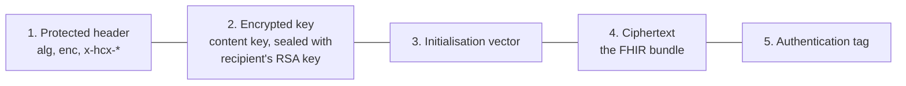

# The JWE envelope that seals every payload

## In plain words

Every use case message on NHCX is a [JSON Web Encryption (JWE)](../glossary/jwe.md) envelope. Think of a sealed envelope with the address printed on the outside.

The outside is the [protected header](../glossary/protected-header.md). It carries who sent the message, who must receive it and where it sits in the claim. NHCX reads it to route. The inside is the [FHIR](../../shared/glossary/fhir.md) bundle, encrypted so that only the recipient can read it.

## Before you start

You need the recipient's public certificate and your own private key. See [encryption certificates](./encryption-certificate.md).

## What happens

### The five parts

A sealed message is five Base64URL parts joined by dots.



1. **Protected header.** The JOSE fields `alg` and `enc`, plus the [protocol headers](./protocol-headers.md) and any domain headers.
2. **Encrypted key.** A random content key, wrapped with the recipient's RSA public key using RSA-OAEP. Which RSA-OAEP variant to set in `alg` is covered in [the key encryption algorithm](../decisions/key-encryption-algorithm.md).
3. **Initialisation vector.** Random, fresh for every message.
4. **Ciphertext.** The FHIR bundle, encrypted with AES-256-GCM, so `enc` is `A256GCM`.
5. **Authentication tag.** Proves nothing changed.

### Why there is no separate signature

AES-GCM authenticates the protected header as well as the ciphertext. If anyone changes a header or a byte of the payload, the tag no longer matches and the recipient must reject the message. So the envelope needs no second signature.

The protocol allows no unprotected headers and no multiple recipients. One envelope, one recipient.

### What goes on the wire

The request body carries the sealed string in a `payload` field:

```json
{ "payload": "<JWE_COMPACT_STRING>" }
```

How the five parts are serialised is covered in [JWE serialisation](../decisions/jwe-serialisation.md).

### What comes back

A response from a payer takes one of two forms, named by its `type`:

| `type` | When | Readable by NHCX |
|---|---|---|
| `JWEPayloadResponse` | The payer processed the request | No, sealed for you |
| `ProtocolResponse` | The payer could not open or validate the request | Yes, headers and error in the clear |

## How you know it worked

You have understood this when you can answer both of these.

1. A proxy between your system and NHCX rewrites `x-hcx-timestamp` inside the protected header. What happens when the payer tries to open the message, and why?
2. A payer cannot decrypt your request. In which of the two response forms does it tell you, and why can that form not be sealed?

## When it goes wrong

**The recipient cannot decrypt.** It reports [PAYR-1001](../errors/payr-1001.md). The usual cause is a stale or wrong certificate. Fetch it again.

**Error sent sealed.** An error reply must be a `ProtocolResponse` in the clear. A sealed reply where an error structure is expected is refused with [PAYR-1517](../errors/payr-1517.md).

**Header edited after sealing.** Any change to the protected header after encryption breaks the tag. Build the full header first, then seal.

**Plaintext bundle in the body.** Every use case request must be sealed. No FHIR content travels in the clear.
