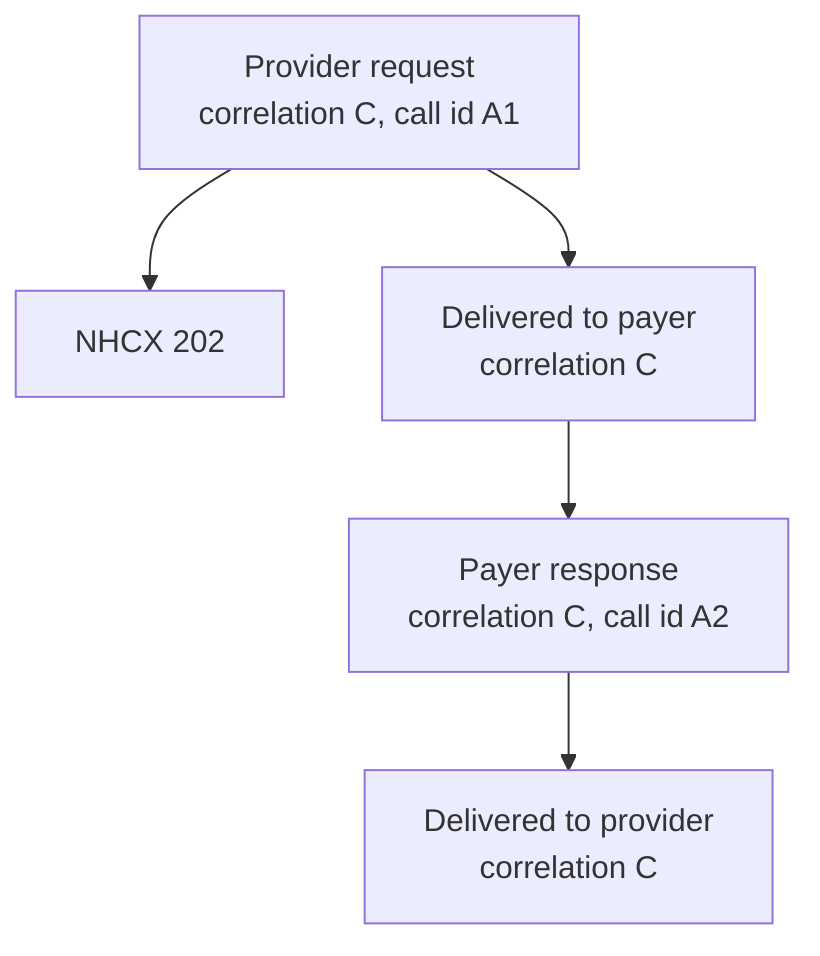

# Correlation id, API call id and workflow id

## In plain words

Many messages fly back and forth for one patient's claim. Four identifiers in the protocol headers keep them apart and tie them together.

The [API call id](../glossary/api-call-id.md) names one network call. The request id names one request. The [correlation id](../glossary/correlation-id.md) names one conversation, a request and everything that answers it. The [workflow id](../glossary/workflow-id.md) names the stage the case has reached.

## Before you start

Read [the protocol headers](./protocol-headers.md) first.

## What happens

| Identifier | Header | Scope | Who sets it |
|---|---|---|---|
| API call id | `x-hcx-api_call_id` | One HTTP call | The caller, new on every call |
| Request id | `x-hcx-request_id` | One originating request | The sender |
| Correlation id | `x-hcx-correlation_id` | One conversation | The initiator; responders copy it |
| Workflow id | `x-hcx-workflow_id` | The stage of the case | Whoever sends the message |

API call id, request id and correlation id are random 36 character UUIDs. The API call id and the correlation id on a message are always different values.

### How they relate in one exchange

The payer's response carries the same correlation id as the request, and a new API call id of its own. Your system matches the response to its request by the correlation id.

### Rules

- **New call, new API call id.** Never reuse one, even on a retry you send yourself.
- **New request, new correlation id.** NHCX refuses an initiating request whose correlation id it already holds.
- **A response copies the correlation id.** Every message that answers a request carries that request's correlation id.
- **After a failure, start again.** When a request fails, NHCX makes its correlation id inactive. Send a fresh request with a new correlation id.
- **The workflow id changes with the stage.** It says what this message is: a new preauthorisation, a query response, a payment acknowledgement.

## How you know it worked

You have understood this when you can answer both of these.

1. Your preauthorisation failed on the payer's side and you fixed the bundle. Which identifiers must be new on the resubmission, and why?
2. Two responses arrive for two different claims from the same payer. Which header tells you which claim each one belongs to?

## When it goes wrong

**Duplicate correlation id.** NHCX refuses the request with [NHCX-1006](../errors/nhcx-1006.md). Generate a fresh correlation id.

**Response with an unknown correlation id.** NHCX refuses a callback whose correlation id it does not hold with [NHCX-1010](../errors/nhcx-1010.md).

**Unknown API call id.** A lookup by an API call id NHCX has no record of returns [NHCX-1012](../errors/nhcx-1012.md).

**Wrong action for the conversation.** [NHCX-1016](../errors/nhcx-1016.md) means the action does not fit the correlation id you sent.

**The payer has no matching event.** The PMJAY payer reports [PAYR-1516](../errors/payr-1516.md) when it cannot find the API call id and correlation id pair. See [mismatched correlation](../troubleshooting/duplicate-or-mismatched-correlation.md).
