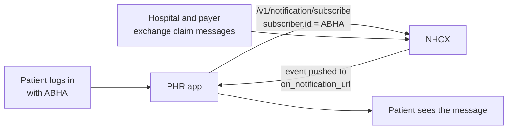

# Notifications to patient apps

## In plain words

A patient wants to know when their preauthorisation is approved or their claim is paid. NHCX can tell their [personal health record (PHR)](../../shared/glossary/phr.md) app directly.

The app subscribes for the patient when the patient logs in. From then on, NHCX pushes each claim event to the app as a short message the app can show as it is.

## Before you start

The app must have completed ABDM Milestone 1, be registered on NHCX as a beneficiary service provider, and host an HTTPS endpoint on TLS 1.2 or later. It needs a [session token](./session-token.md) and must be able to seal a [JWE](./jwe-envelope.md). It must also have the patient's explicit consent to receive claim updates.

## What happens

### Last linked wins

A subscription is for one ABHA. When the patient logs into another app and that app subscribes, the new subscription replaces the old one. At any moment exactly one app receives the patient's notifications, so no app needs to handle duplicates.

### The subscription

| Field | Holds |
|---|---|
| `subscription_id` | Your ID for this subscription |
| `topic_code` | A list of topics |
| `recipient_code` | Your participant code |
| `subscriber.id` | The patient's ABHA address or number |
| `on_notification_url` | Your HTTPS endpoint for pushed events |
| `expiry` | Optional end time |

| Topic | Carries |
|---|---|
| `workflow_events` | Preauthorisation, claim, payment and communication events for the patient |
| `network_events` | Platform updates and maintenance |
| `participant_events` | Changes to payer and provider registrations |

Most patient apps need only `workflow_events`.

### A pushed event

Each event carries `notification_id`, `topic_code`, `timestamp`, `subscriber.id` and `message`. The `message` is written for the patient, for example "Preauthorization approved for Rs. 50,000". An optional `domain_values` map repeats `x-hcx-*` headers for apps that want detail.

| Event type | Status values |
|---|---|
| `preauth_request`, `claim_request` | `queued`, `processing` |
| `preauth_response`, `claim_response` | `approved`, `rejected` |
| `payment_notice` | `paid`, `pending` |
| `communication` | `information_required` |

### Not the same as a payment notice

A [payment notice](../glossary/payment-notice.md) is a payer telling a hospital about money, as a FHIR bundle. A patient notification is NHCX telling an app about an event, as a short message.

## How you know it worked

You have understood this when you can answer both of these.

1. A patient uses app A, then logs into app B, which subscribes. Which app receives the next claim event, and does app A need to do anything?
2. Your app wants only to show updates to the patient. Which field of the pushed event do you display?

## When it goes wrong

**401 Unauthorized.** The session token expired. Fetch a new one and subscribe again.

**403 Forbidden.** Your participant is not authorised. Check your registration on NHCX.

**No events arrive.** Another app subscribed for the same patient later, or your endpoint is not reachable over HTTPS with TLS 1.2 or later.

**500 Server Error.** Retry the subscription with backoff.

**Trusting any caller.** Validate the token NHCX sends with each push, check that the sender code is NHCX's, and rate limit the endpoint.
