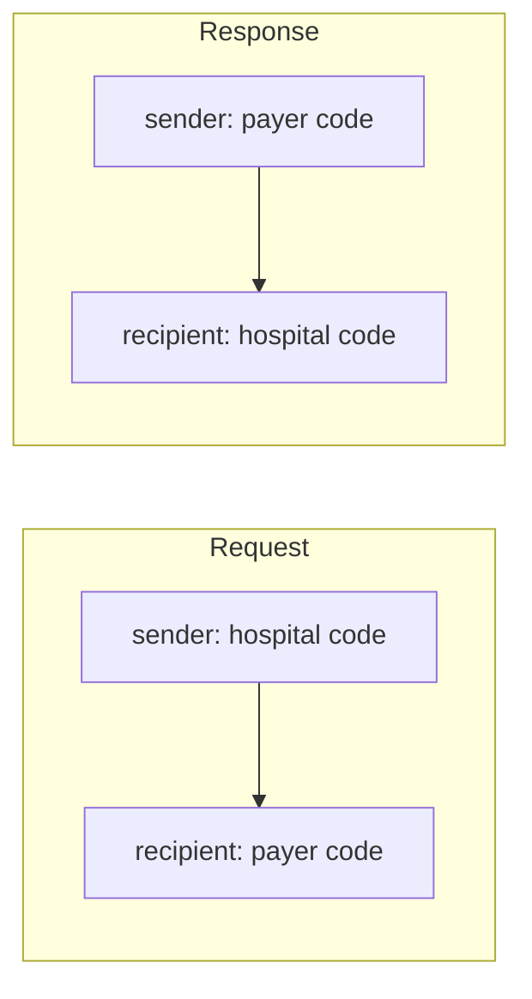

# Participant codes and how every message is addressed

## In plain words

A [participant code](../glossary/participant-code.md) is your address on the exchange. NHCX issues it when you register. It looks like a number followed by `@` and an instance code, for example `100001@sbx`.

Every message carries two codes: who sent it and who must receive it. NHCX routes on those two codes alone.

## Before you start

You need a confirmed participant record. See [the participant registry](./participant-registry.md).

## What happens

### Where the codes appear

| Place | Field | Holds |
|---|---|---|
| Protected header | `x-hcx-sender_code` | Your code |
| Protected header | `x-hcx-recipient_code` | The code of the participant that must act |
| Certificate lookup | `participantid` in `/fetch/certs` | The code whose certificate you need |
| Your 202 acknowledgement | `result.sender_code`, `result.recipient_code` | The codes from the message you received |
| Policy link | `payerid`, `processingid` | The insurer's code and the TPA's code |

### Codes swap on the way back

A response reverses the pair. The responder puts its own code in `x-hcx-sender_code`. It puts the original sender's code in `x-hcx-recipient_code`.

### One code per facility

An organisation can hold several participant codes, one for each HFR facility ID. It uses the same ABDM credentials to create all of them.

### Rules for handling a code

- Store the code exactly as NHCX issued it, suffix included.
- Do not build codes or read meaning into the suffix. Sandbox and production codes are both opaque strings.
- Take a payer's code from the participant list or from the policy, never from memory.

## How you know it worked

You have understood this when you can answer both of these.

1. A payer answers your claim. What must it put in `x-hcx-sender_code` and in `x-hcx-recipient_code`?
2. Your hospital group has three facilities with three HFR IDs. How many participant codes do you need, and how many sets of credentials?

## When it goes wrong

**Addressing the wrong party.** A provider must put the policy's `processingID` in `x-hcx-recipient_code`, not the `PayerID`.

**Codes not swapped on a response.** A payer's response must name the original sender as recipient. Otherwise NHCX cannot deliver it to the right system.

**Recipient not registered.** NHCX refuses the message with [NHCX-1003](../errors/nhcx-1003.md).

**Certificate fetched for the wrong code.** The recipient cannot open a message sealed with someone else's key and reports [PAYR-1001](../errors/payr-1001.md).
