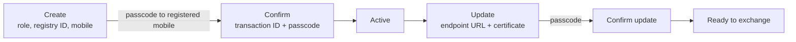

# The participant registry and what a participant record holds

## In plain words

The participant registry is the exchange's address book. It holds one record for every organisation that can send or receive through NHCX.

When a message arrives, NHCX looks up the sender and the recipient here. It finds where to deliver the message. Other participants find your public certificate here, so they can seal messages for you.

## Before you start

You need a session token from your ABDM credentials. See [the session token](./session-token.md). A provider also needs an [HFR](../../shared/glossary/hfr.md) facility ID whose registered mobile number you can receive a passcode on.

## What happens

### What a record holds

| Attribute | Required | What it is for |
|---|---|---|
| `participant_code` | Yes | Your address on the exchange, issued by NHCX. See [participant codes](./participant-code.md) |
| `participant_name` | Yes | Your organisation's name |
| `roles` | Yes | What you may send and receive. See [participant roles](./participant-roles.md) |
| `registry_code` | No | Your ID in the external registry, such as your HFR ID |
| `mobile` | Yes | One to three numbers; passcodes go here |
| `email`, `phone` | No | Up to three each |
| `status` | Yes | Where the record is in its life |
| `endpoint_url` | Yes | Where NHCX delivers your incoming messages |
| `encryption_cert` | Yes | Your public certificate, so others can seal messages for you |
| `signing_cert_path`, `address`, `payment_details` | No | Signing certificate, address, bank or UPI details |

### How a record comes to life

1. **Create.** You send the registry type, registry ID, role, mobile and email. NHCX checks the mobile number against the HFR record for a provider, or the payer record for a payer. It returns your participant code.
2. **Confirm.** When the create response carries a `transactionid`, NHCX sends a passcode to the registered mobile. You confirm with both. Until then the record cannot be used.
3. **Update.** You add your endpoint URL and your Base64 encoded certificate.
4. **Confirm the update.** A second passcode confirms it. The endpoint and certificate then become live.

In production the transaction ID and passcode are valid for 24 hours. A certificate alone can later be replaced without a passcode.

### The four states

The registry model defines four states: created and not yet verified, active, inactive, and blocked. Only an active participant can exchange messages.

### How others read the registry

A sender lists participants by role with `/fetch/participants/list`. It fetches a recipient's certificate with `/fetch/certs`, passing the recipient's participant code.

## How you know it worked

You have understood this when you can answer both of these.

1. Your participant is created and confirmed, but no endpoint URL is recorded. What happens to a claim response a payer sends you?
2. You changed your key pair. Which attribute must change in your record, and why do other participants care?

## When it goes wrong

**The mobile number does not match.** For a provider, the mobile you send must match the HFR record exactly. Correct it in HFR or send the registered number.

**Lost transaction ID or expired passcode.** Start the create or update call again. Each call issues a new transaction ID and passcode.

**Sender or receiver not registered.** NHCX refuses the message with [NHCX-1002](../errors/nhcx-1002.md) or [NHCX-1003](../errors/nhcx-1003.md). [NHCX-1004](../errors/nhcx-1004.md) means no receiver is registered for the scheme you addressed.

**HFR ID in the bundle differs from the registry.** The PMJAY payer checks the hospital HFR ID in the bundle. It refuses the bundle when that ID differs from the sender's registry ID.
