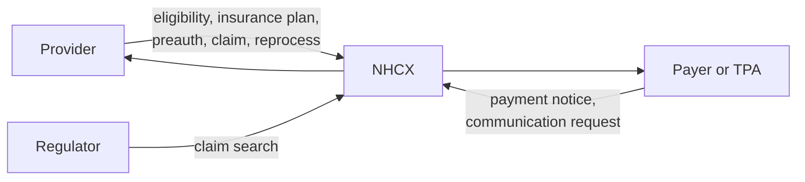

# Participant roles: provider, payer, TPA and the exchange

## In plain words

Every system that talks through NHCX registers with a role. A hospital registers as a [provider](../glossary/provider.md). An insurer registers as a [payer](../glossary/payer.md). A [third party administrator (TPA)](../glossary/tpa.md) processes claims on an insurer's behalf.

The role decides which messages your system sends and which it must receive. NHCX itself has no role in a claim. It routes messages between the participants.

## Before you start

Know which kind of organisation you are building for. A hospital system registers as a provider. An insurer or TPA system registers as a payer or TPA.

## What happens

### The role codes

You pass one of these codes in `role` when you create a participant.

| Role | Code | Who |
|---|---|---|
| `PROVIDER` | `10001` | Hospitals, clinics, diagnostic centres |
| `PAYER` | `10002` | Insurers and State Health Agencies |
| `AGENCY_TPA` | `10003` | Third party administrators acting for a payer |
| `AGENCY_REGULATOR` | `10004` | Regulators such as the [IRDAI](../glossary/irdai.md) |
| `RESEARCH` | `10005` | Research bodies |
| `MEMBER_ISNP` | `10006` | Insurance self network platforms |
| `AGENCY_SPONSOR` | `10007` | Scheme owners |
| `HIE_HIO_HCX` | `10008` | Other exchange instances |
| `EUA` | `10009` | [End user applications](../../shared/glossary/eua.md), such as patient apps |

### Who starts which exchange

A provider starts coverage eligibility, insurance plan, preauthorisation, claim and reprocess requests. A payer answers them. A payer starts payment notices and communication requests, and the provider answers those.

In version 1 of the exchange a TPA behaves like a payer. It receives the same requests and sends the same responses.

### The registry you prove yourself against

| Role | Registry ID you send | Registry type code |
|---|---|---|
| Provider | Your [HFR](../../shared/glossary/hfr.md) facility ID | `10001` (HFR) |
| Payer or TPA | Your IRDAI registration ID, without leading zeros | `10004` (PAYER) |
| End user application | Your client ID | `10001` |

The other registry type codes are `10002` (NIN) and `10003` (ROHINI).

### Payer and TPA together

Every insurer has its own participant code, even when a TPA processes its claims. When a policy is linked, `payerid` carries the insurer's code and `processingid` carries the TPA's code. A provider addresses claims on that policy to the `processingid`, because the TPA does the processing.

## How you know it worked

You have understood this when you can answer both of these.

1. An insurer uses a TPA. Which participant code does your hospital system put in `x-hcx-recipient_code` for a claim on that insurer's policy?
2. Which role sends a payment notice, and which role must answer it?

## When it goes wrong

**Addressing the insurer instead of the TPA.** A provider that uses the `PayerID` from the get policies response sends the claim to the wrong participant. Use the `processingID`. See [policy linking](./policy-linking.md).

**Wrong role or registry type at creation.** A code outside the lists above fails participant creation. A mismatch between role and registry type causes access problems and wrong routing later.

**No role on the sender.** A payer refuses a sender that has no role in NHCX with the message "No user role found/associated for sender code".
