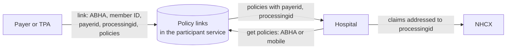

# Linking an ABHA to an insurance policy

## In plain words

When a person buys a health policy, the insurer can link it to the person's [ABHA number](../../shared/glossary/abha-number.md). After that, any hospital on NHCX can ask "which policies does this ABHA hold?" and get an answer.

The answer also says who processes claims on each policy: the insurer itself, or a [TPA](../glossary/tpa.md) acting for it. That is the participant a hospital must address.

## Before you start

A payer needs its own participant code. Every insurer has one, even when a TPA handles its claims. See [participant roles](./participant-roles.md).

## What happens

### Linking

The payer calls `/participant/link/abha/policy` on the participant service. The request carries:

| Field | Holds |
|---|---|
| `requestid` | A UUID for this request |
| `abhanumber` | The person's ABHA number |
| `mobilenumber` | The person's mobile number |
| `memberid` | The payer's member ID for the person |
| `payerid` | The insurer's participant code |
| `processingid` | The participant code of whoever processes claims: the TPA, or the insurer itself |
| `policies` | A list of `productid` and `productname` pairs |

### Looking up

A hospital calls `/participant/get/policies` with the ABHA number or mobile number. Each policy comes back with its payer and processor. The hospital puts the `processingid` in `x-hcx-recipient_code` for eligibility, preauthorisation and claim messages on that policy.

If the lookup returns nothing, the hospital can ask the payer directly with a coverage eligibility check using the `discovery` purpose. See [coverage eligibility purposes](./coverage-eligibility-purposes.md).

### De-linking

`/participant/delink/abha/policy` removes policies from the link. Only the participant named as `payerid` or `processingid` when the link was made may de-link it. NHCX reads the client ID from the session token and compares it with the one that registered that participant.

When an insurer moves to a new TPA, it de-links its existing policies and links them again with the new TPA's participant code as `processingid`.

## How you know it worked

You have understood this when you can answer both of these.

1. The get policies response shows `payerid` A and `processingid` B. To which participant does your hospital send the claim, and why?
2. A TPA stops handling an insurer's policies. What must happen to the existing links, and who is allowed to do it?

## When it goes wrong

**Claims addressed to the insurer.** A provider that uses the `PayerID` instead of the `processingID` sends claims to a participant that does not process them.

**De-link refused.** The session token belongs to a client other than the one registered for `payerid` or `processingid`. Generate the token with the credentials used when that participant was created.

**Policy not in the link.** De-linking a policy the link does not hold fails with "There is no policies with requested details".

**Nothing found for the patient.** Fall back to a `discovery` eligibility check.
