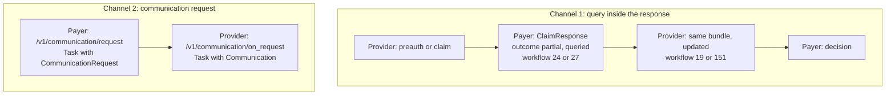

# Payer queries and the communication cycle

## In plain words

Payers often need more before they decide. A missing report, an unclear diagnosis, a bill that does not add up.

There are two ways a payer asks. It can answer your preauthorisation or claim with a query instead of a decision. Or it can send a separate [communication request](../glossary/communication-request.md). Your system must recognise both and answer each the right way.

## Before you start

Read [the claim cycle](./claim-cycle.md) and [workflow codes](./workflow-codes.md).

## What happens

### Channel 1: a query inside the response

The payer answers your preauthorisation or claim with a `ClaimResponse` whose `outcome` is `partial` and whose adjudication reason is `queried`. The workflow id says which stage: `24` for a preauthorisation, `241` for an enhancement, `27` for a claim.

You answer by sending the same kind of bundle again, updated with what was asked, to the same path. Use the query response workflow id: `19` for a preauthorisation, `131` for an enhancement, `151` for a claim. Do not use a resubmission code. A resubmission replaces all earlier instances of the request.

Under PMJAY, this is how every query on a preauthorisation or claim arrives. The PMJAY payer does not use the communication request for queries.

### Channel 2: a communication request

The payer calls `/v1/communication/request` with a `Task` bundle that carries a `CommunicationRequest`. Your system answers on `/v1/communication/on_request` with a `Task` bundle whose input is a `Communication`, carrying the documents or information asked for. The request and your answer share one correlation id.

A standard payer uses this channel to ask for additional documents during a claim cycle. The PMJAY payer uses it for other notices, named in `Task.reasonCode`: `tatquery`, `grievance`, `walletupdate`, `policychange`, `additionalinfo` and `claimArbitration`.

## How you know it worked

You have understood this when you can answer both of these.

1. A PMJAY `ClaimResponse` arrives with workflow id `27`. Which path do you answer on, with which workflow id, and with what bundle?
2. A communication request arrives from a standard payer during a claim. Which path carries your answer, and what must stay the same as in the request?

## When it goes wrong

**Answering too late.** A standard payer closes the query with [PAYR-1019](../errors/payr-1019.md), information not received in time.

**Answering a case that is not queried.** The PMJAY payer refuses a query update with [PAYR-1219](../errors/payr-1219.md), case not queried, or [PAYR-1218](../errors/payr-1218.md) for a preauthorisation. For a claim the codes are [PAYR-1304](../errors/payr-1304.md) and [PAYR-1303](../errors/payr-1303.md).

**Using the resubmission code for a query answer.** Workflow id `121` replaces the preauthorisation instead of answering the query. Use `19`.

**Treating a communication request as a decision.** A communication request never approves or rejects. The decision still arrives on the preauthorisation or claim path.
