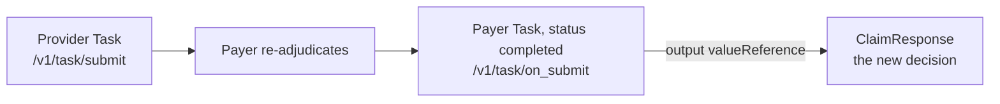

# Reprocess, cancel and the task resource

## In plain words

Sometimes a hospital needs to act on a decision already made. The claim was rejected and the hospital disagrees. The claim was paid, but less than it should have been. Or the planned treatment is not going ahead, so the preauthorisation should be cancelled.

All three are requests to the payer to do something, so they travel as a FHIR `Task` on `/v1/task/submit`. The payer answers on `/v1/task/on_submit`.

## Before you start

You need the earlier decision: the claim or preauthorisation number and the payer's response. Read [the claim cycle](./claim-cycle.md).

## What happens

### The three requests

| Request | When | `Task.code` | Reason | Workflow id |
|---|---|---|---|---|
| [Reprocess](../glossary/reprocess.md) | A claim was fully rejected | `reprocess` | Why the rejection is disputed | `36` |
| Erroneous claim | A claim was paid, but short | `reprocess` | `partialpayment` | `36` |
| Cancel | A preauthorisation should not proceed | `cancel` | Why, for example `treatmentplanchanged` | `PC01` |

`Task.code` comes from `http://terminology.hl7.org/CodeSystem/financialtaskcode`, which also holds `release` and `nullify`. Reason codes come from `https://nrces.in/ndhm/fhir/r4/CodeSystem/ndhm-reason-code`.

### What the task carries

- `Task.status` `requested` and `Task.intent` `order`.
- An input `claimNumber` with the case number, and for a preauthorisation an input `initimationNumber`, spelt that way.
- A supporting document. It is mandatory for a reprocess and for an erroneous claim.
- For an erroneous claim only, the amount: never more than the gap between claimed and paid.

### The answer

The answer is a `Task` with `status` `completed`. Its `output` points at a `ClaimResponse`, which you read exactly like any other decision.

### Rules under PMJAY

- A reprocess or erroneous claim can be raised once per claim.
- Reprocess needs no payment notice and can follow the rejection at once.
- An erroneous claim waits for payment settled, workflow id `33`, and your acknowledgement of it.
- The [Claim Review Committee (CRC)](../glossary/crc.md) decides reprocess cases, and its decision is final. No erroneous claim can follow a CRC decision.
- A preauthorisation can be cancelled only while it is submitted or approved. A claim cannot be cancelled.

## How you know it worked

You have understood this when you can answer both of these.

1. A claim for 10,000 was paid at 6,000. Which request do you raise, with which reason, and what is the largest amount you may ask for?
2. The answer to your reprocess arrives on `/v1/task/on_submit`. Where in the bundle is the new decision?

## When it goes wrong

**Wrong combination of code, reason and input.** The PMJAY payer refuses the task with "Invalid input, code and reason code received". Its structure checks use [PAYR-1017](../errors/payr-1017.md) for "No task code received" and [PAYR-1018](../errors/payr-1018.md) for "No task reason code received".

**Missing case number.** The payer refuses a task without a valid `claimNumber` or `initimationNumber`.

**Cancelling too late.** The PMJAY payer refuses to cancel a case that is not active ([PAYR-1252](../errors/payr-1252.md)), already cancelled ([PAYR-1253](../errors/payr-1253.md)), or in payment ([PAYR-1257](../errors/payr-1257.md), [PAYR-1258](../errors/payr-1258.md)).

**Raising an erroneous claim before settlement.** Wait for workflow id `33`, acknowledge it, then raise it.
