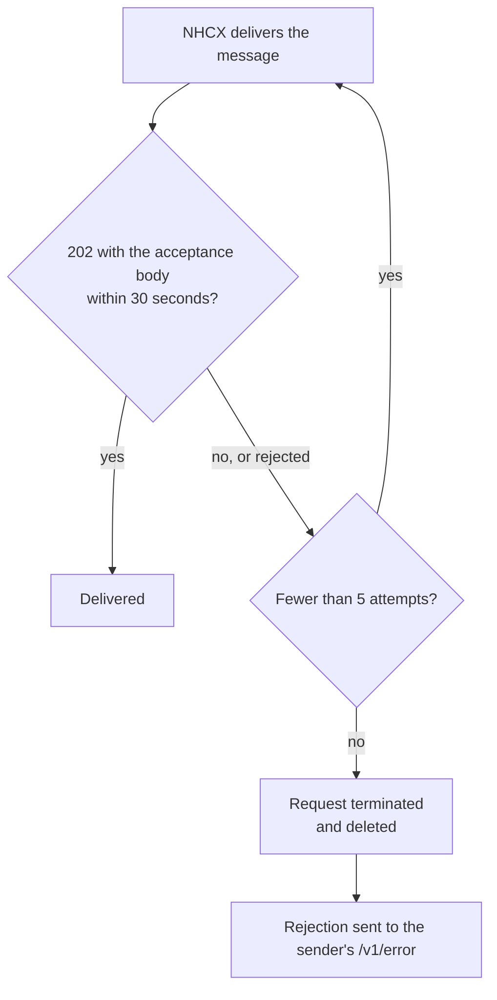

# Gateway retries and the 24 hour expiry window

## In plain words

NHCX does not give up on the first failed delivery. If the recipient does not accept a message, NHCX sends it again, up to five times. After that it drops the request and tells the sender through the sender's `/v1/error` endpoint.

Messages also go stale. A payer refuses a request whose timestamp is 24 hours or more away from the payer's own clock.

## Before you start

Read [the 202 acknowledgement](./synchronous-acknowledgement.md). Your system needs a `/v1/error` endpoint to hear about requests that were dropped.

## What happens

### The retry loop

NHCX counts a delivery as failed when the recipient rejects it, answers with the wrong format, or does not answer with 202 within 30 seconds. The interval between attempts is not published.

After the fifth failure, NHCX deletes the request for that correlation id and marks the correlation id inactive. The sender learns about it on `/v1/error`.

### What this means for each side

| You are | Your duty |
|---|---|
| The recipient | Accept within 30 seconds with the right body, or the same message arrives again |
| The recipient | Treat a repeat of a message you already accepted as the same message. Key your inbox on `x-hcx-api_call_id` and `x-hcx-correlation_id` |
| The sender | Implement `/v1/error`, record the rejection and alert your users |
| The sender | Resend a dropped request with a new correlation id |

### The 24 hour window

`x-hcx-timestamp` must be the time you actually send the message. The PMJAY payer refuses a request whose timestamp is 24 hours or more away from its current time. Keep your server clock synchronised, and never reuse a stored timestamp on a resend.

## How you know it worked

You have understood this when you can answer both of these.

1. Your endpoint was down for an hour. A payer's claim response was delivered during that time. What did NHCX do, and how does the payer find out?
2. You resend a request that was dropped yesterday, with the same headers. Name two things that make it fail.

## When it goes wrong

**The same message processed twice.** Your acknowledgement arrived late, so NHCX retried. Deduplicate on the identifiers above before you act.

**Resending with the old correlation id.** NHCX refuses it with [NHCX-1006](../errors/nhcx-1006.md). A dropped request's correlation id is inactive. Use a new one.

**Stale timestamp.** The PMJAY payer refuses it with the message "Maximum time limit exceeded in receiving the request". On the standard payer list [PAYR-1005](../errors/payr-1005.md) means something else, so read the message text.

**Receiver unreachable.** The sender sees [NHCX-1001](../errors/nhcx-1001.md). See [accepted, then no callback](../troubleshooting/accepted-then-no-callback.md).
