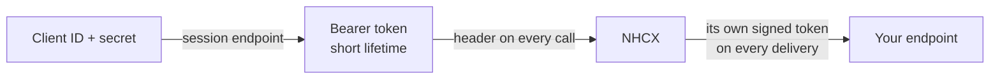

# The session token every NHCX call carries

## In plain words

Every call your system makes to NHCX carries a session token. The token tells NHCX which participant is calling.

You get the token by sending your client ID and client secret to a session endpoint. The token expires after a short time, so your system fetches a new one before it lapses.

## Before you start

You need a client ID and client secret from the ABDM [sandbox](../../shared/glossary/sandbox.md) registration. If your system already has credentials for ABDM [Milestone 1](../../shared/glossary/m1.md), the same credentials work for NHCX.

## What happens

Two tokens are in play, one in each direction.

| Direction | Who issues it | How it is checked |
|---|---|---|
| Your system to NHCX | NHCX, from your client ID and secret | NHCX checks it on every call |
| NHCX to your endpoint | NHCX signs its own token with RS256 | You check it with the NHCX instance's public key |

### Getting and keeping a token

- Call the session endpoint with your credentials. Which endpoint to call is covered in [choosing the session endpoint](../decisions/session-endpoint.md).
- Read the lifetime from the response, `expiresIn` or `expires_in` depending on the endpoint.
- Renew the token before it lapses, from a background task, so no request goes out with an expired token.
- Send it as `Bearer <ACCESS_TOKEN_FROM_SESSION_CALL>`. Each endpoint atom names the request header that carries it.

### Revocation

NHCX revokes access by issuing you a new client secret. Your old tokens stop working, and you must fetch a new token with the new secret.

### The token NHCX sends you

When NHCX delivers a message to your endpoint, it presents a token it signed itself with `alg` `RS256`. The claims are `jti`, `iss`, `sub`, `iat` and `exp`, with `iss` and `sub` both naming the NHCX instance. Validate the signature before you trust the delivery.

## How you know it worked

You have understood this when you can answer both of these.

1. Your token was issued at 10:00 and a call at 10:25 returns HTTP 401. What happened, and what does your system do before retrying?
2. Which token does your callback endpoint check when NHCX delivers a message, and whose key verifies it?

## When it goes wrong

**Expired token.** HTTP 401 with the message "Sender is not authorized to execute the operation" means the session token has expired. Fetch a new one and retry. See [NHCX-401](../errors/nhcx-401.md).

**Missing `Bearer` prefix.** The header value must start with `Bearer ` followed by the token. A bare token is refused with 401.

**Old secret.** After NHCX issues a new client secret, calls with tokens from the old secret fail. Update the secret in your configuration.

**Every call fails.** Work through [every call returns 401](../troubleshooting/everything-returns-401.md).
