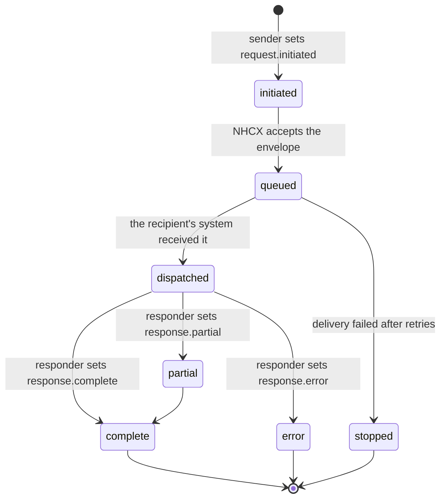

# Status values and how a request moves through them

## In plain words

Every message carries a status. The status says where the message is in its life: newly sent, waiting at the exchange, delivered, or answered.

Three parties set statuses. The sender marks a new request. NHCX tracks delivery. The responder marks its answer as final, partial or an error.

## Before you start

Read [the protocol headers](./protocol-headers.md) and [the four message legs](./four-message-legs.md).

## What happens

| Status | Set by | Meaning |
|---|---|---|
| `request.initiated` | The sender, in `x-hcx-status` | Starts a request cycle |
| `request.queued` | NHCX | Accepted and waiting for delivery |
| `request.dispatched` | NHCX | Reached the recipient's system |
| `request.stopped` | NHCX | Stopped after failed delivery attempts |
| `response.partial` | The responder, in `x-hcx-status` | A partial answer or an acknowledgement |
| `response.complete` | The responder, in `x-hcx-status` | The final answer, closing the cycle |
| `response.error` | The responder, in `x-hcx-status` | The request was rejected or failed |

You only ever put `request.initiated`, `response.partial`, `response.complete` or `response.error` in `x-hcx-status`. The `request.queued`, `request.dispatched` and `request.stopped` states belong to NHCX. You see them in acknowledgements and status answers.

### Message status is not claim status

`x-hcx-status` tracks the message. The claim's own progress lives in the [workflow id](./workflow-codes.md) and in the FHIR response, for example `ClaimResponse.outcome`. A `response.complete` message can carry a rejection.

### Asking for a status

Send `/v1/status` with the sealed request whose status you want. NHCX answers on your `/v1/on_status` endpoint with the protocol headers of that request. Whether to poll or wait is covered in [poll or wait](../decisions/status-poll-or-wait.md).

## How you know it worked

You have understood this when you can answer both of these.

1. You sent a claim an hour ago and a status check shows it `request.dispatched`. Has the payer decided? Where would the decision show?
2. A payer's answer arrives with `response.complete` and a rejected claim inside. Is that a protocol error? Which fields tell you it was rejected?

## When it goes wrong

**Invented status values.** NHCX refuses an `x-hcx-status` it does not recognise with [NHCX-1011](../errors/nhcx-1011.md). Use the exact lower case values above.

**Treating `response.partial` as final.** A partial answer means more is coming, or the payer wants something from you. Keep the case open until a `response.complete` or `response.error` arrives.

**Reading claim outcome from the message status.** Read the workflow id and the FHIR outcome for the business decision.
