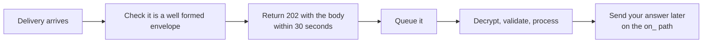

# The 202 acknowledgement and the 30 second rule

## In plain words

On NHCX, whoever receives a message answers it at once with HTTP 202 Accepted. The 202 says "I have it". It does not say "I have done it".

This applies in both directions. NHCX answers your call with 202. Your system answers NHCX with 202 when NHCX delivers a message to you, and it must do so within 30 seconds.

## Before you start

Read [the four message legs](./four-message-legs.md). Your endpoint must be reachable from NHCX. See [the callback URL requirements](../sandbox/callback-url-requirements.md).

## What happens

### Two acknowledgements

| When | Who sends the 202 | What it means |
|---|---|---|
| You call NHCX | NHCX | Your envelope passed validation and is queued for delivery |
| NHCX delivers a message to your endpoint | Your system | You received it and will process it |

If NHCX finds a problem with your envelope, it answers with an error instead of 202.

### Your acknowledgement body

When NHCX delivers a message to you, return HTTP 202 with this body:

```json
{
  "timestamp": "DD/MM/YYYY hh:mm:ss:sss",
  "api_call_id": "UUID",
  "correlation_id": "UUID",
  "result": {
    "sender_code": "PYRXX@hcx",
    "recipient_code": "INXXXXX@hcx",
    "entity_type": "coverageeligibility/preauth/claim/task/payment/insuranceplan",
    "protocol_status": "request.queued/request.dispatched/request.error"
  },
  "error": { "code": "", "message": "" }
}
```

`entity_type` takes one of `coverageeligibility`, `preauth`, `claim`, `task`, `payment` or `insuranceplan`. `protocol_status` takes one of `request.queued`, `request.dispatched` or `request.error`. The `error` fields stay empty when you accept.

### Acknowledge first, work later



Decrypting, validating FHIR and adjudicating can take longer than 30 seconds. So accept first, then do the work from a queue. If the work fails, send your answer as a `ProtocolResponse` with `x-hcx-status` set to `response.error`.

## How you know it worked

You have understood this when you can answer both of these.

1. Your callback handler decrypts and stores the bundle before it replies, and sometimes that takes 40 seconds. What does NHCX conclude, and what will it do next?
2. NHCX returns 202 to your claim submission. Which of the four legs does that close?

## When it goes wrong

**Replying late.** If NHCX gets no 202 within 30 seconds, it treats the delivery as failed and retries. See [retries and expiry](./retries-and-expiry.md).

**Replying with the wrong body or status.** A reply that does not follow the acceptance format counts as an error, and NHCX retries the same request. [NHCX-1015](../errors/nhcx-1015.md) and [NHCX-1017](../errors/nhcx-1017.md) report an invalid response from the receiver.

**Endpoint unreachable.** NHCX reports [NHCX-1001](../errors/nhcx-1001.md) to the sender. See [accepted, then no callback](../troubleshooting/accepted-then-no-callback.md).
