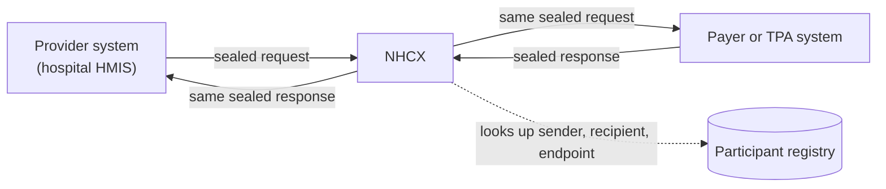

# What the National Health Claims Exchange is and what it does not do

## In plain words

The [National Health Claims Exchange (NHCX)](../../shared/glossary/nhcx.md) is the claims switch of [ABDM](../../shared/glossary/abdm.md). A hospital sends a claim message to NHCX. NHCX routes it to the insurer or [third party administrator](../glossary/tpa.md) that must answer, and carries the answer back.

It works like an email exchange. NHCX reads the address on the envelope and delivers the message. It cannot read the letter inside, because the sender seals it for the recipient.

NHCX is one of three ABDM gateways. The other two are the [Unified Health Interface](../../shared/glossary/uhi.md) and the [Health Information Exchange and Consent Manager](../../shared/glossary/hie-cm.md).

## Before you start

Nothing. Read this first. Then read [participant roles](./participant-roles.md) and [the four message legs](./four-message-legs.md).

## What happens

Every exchange has the same shape. A sender builds a [FHIR](../../shared/glossary/fhir.md) bundle, seals it for the recipient, and posts it to NHCX. NHCX checks the envelope and forwards the sealed message.

### What NHCX does

- Checks that the sender and the recipient are registered and allowed to exchange.
- Validates the protocol headers on the envelope.
- Accepts the call, then forwards the message to the recipient's registered endpoint.
- Retries delivery when the recipient does not acknowledge.
- Records each call it receives, using only the unencrypted envelope details.

### What NHCX does not do

| NHCX does not | Because | Who does it instead |
|---|---|---|
| Read the claim | The payload is sealed with the recipient's public key | The recipient, with its private key |
| Decide a claim | The gateway never returns an adjudication on your call | The payer, in a later callback |
| Authenticate the patient | Biometric authentication is a separate API, used for PMJAY | Your system, before preauthorisation |
| Create an ABHA | ABHA creation is ABDM Milestone 1 work | Your system, through the ABDM APIs |
| Hold your private key | You generate your own key pair | You |

### The use cases it carries

Coverage eligibility, insurance plan, preauthorisation, predetermination, claim, communication requests, payment notices, reprocess and cancel tasks, status checks and claim search. [The claim cycle](./claim-cycle.md) shows how they fit together.

## How you know it worked

You have understood this when you can answer both of these.

1. Your system submits a preauthorisation and receives HTTP 202 from NHCX. Has the payer approved anything yet? Where will the decision arrive?
2. Someone proposes that NHCX log the decrypted claim to help debugging. Why is that impossible, and where can the claim be read?

## When it goes wrong

**Treating the 202 as the answer.** The 202 means NHCX accepted the envelope. The payer's decision arrives later on your callback endpoint. See [the 202 acknowledgement](./synchronous-acknowledgement.md).

**Sending before you are registered.** NHCX refuses a sender it does not know with [NHCX-1002](../errors/nhcx-1002.md), and an unknown recipient with [NHCX-1003](../errors/nhcx-1003.md).

**Expecting NHCX to fix the payload.** NHCX cannot see the payload, so it cannot correct a bad bundle. The payer reports bundle problems back to you. See [error code spaces](./error-code-spaces.md).
