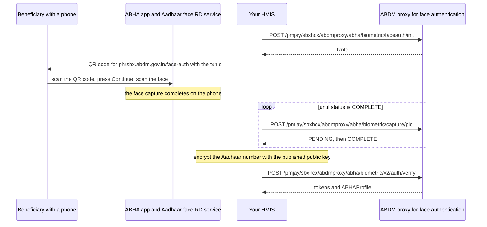

# Authenticate a beneficiary by face on a mobile device

## In plain words

Face authentication proves the same thing as a fingerprint or iris scan: the [PMJAY](../glossary/pmjay.md) beneficiary is at your hospital. The capture happens on a phone, in the [ABHA](../../shared/glossary/abha.md) app, rather than on a hospital device. Your system shows a QR code, the phone scans it, and your system polls until the scan is done.

It ends with the same 30-minute user token. A PMJAY integration must support all three methods, and one case can use different methods at different stages.

## Before you start

- The beneficiary's ABHA is linked to their PMJAY card.
- A session token, sent as `Authorization: Bearer <ACCESS_TOKEN_FROM_SESSION_TOKEN>`.
- A phone with the sandbox ABHA app, from `https://sandboxcms.abdm.gov.in/uploads/app_sbx_release_5_d4437e4aa1.apk`. It also needs the Aadhaar face [RD service](../glossary/rd-service.md) app from the Play Store or App Store.
- The beneficiary's Aadhaar number and the mobile number linked to that Aadhaar.
- A way to show a QR code on your screen.
- OpenSSL, for encrypting the Aadhaar number.
- The participant code of the scheme payer, for the `payerid` header.

## What happens



The sandbox host is `https://apisbx.abdm.gov.in`. Every call carries `Accept: application/json`, `Content-Type: application/json`, the `Authorization` header, a fresh UUID in `REQUEST-ID`, and the current ISO time in `TIMESTAMP`.

### 1. Start

`POST /pmjay/sbxhcx/abdmproxy/abha/biometric/faceauth/init`:

```json
{
  "scope": ["abha-enrol", "face-auth"]
}
```

The answer carries `txnId` and `message` `Transaction Id generated Successfully`.

### 2. Show the QR code

Render this address as a QR code on your screen:

```text
https://phrsbx.abdm.gov.in/face-auth?txnId=<TXN_ID_FROM_INIT>
```

### 3. The beneficiary scans

The beneficiary, or a hospital assistant, opens the sandbox ABHA app. They tap the QR code icon at the top left of the welcome screen and scan your screen. They press **Continue** on the FaceAuth screen and complete the face scan with the Aadhaar face RD service app.

### 4. Poll for the capture

`POST /pmjay/sbxhcx/abdmproxy/abha/biometric/capture/pid`:

```json
{
  "txnId": "<TXN_ID_FROM_INIT>"
}
```

**Wait:** there is no callback. The answer is `{"status": "PENDING", "message": "Awaiting PID capture"}` until the scan completes. Then it is `{"status": "COMPLETE", "message": "PID capture successful"}`. Poll while the QR code is on screen, and move on at `COMPLETE`.

### 5. Encrypt the Aadhaar number

Encrypt the 12-digit Aadhaar number with the published public key, using `RSA/ECB/OAEPWithSHA-1AndMGF1Padding`. With OpenSSL:

```sh
cat > aadhaar_face_auth_public.pem <<'EOF'
-----BEGIN PUBLIC KEY-----
MIICIjANBgkqhkiG9w0BAQEFAAOCAg8AMIICCgKCAgEAstWB95C5pHLXiYW59qyO
4Xb+59KYVm9Hywbo77qETZVAyc6VIsxU+UWhd/k/YtjZibCznB+HaXWX9TVTFs9N
wgv7LRGq5uLczpZQDrU7dnGkl/urRA8p0Jv/f8T0MZdFWQgks91uFffeBmJOb58u
68ZRxSYGMPe4hb9XXKDVsgoSJaRNYviH7RgAI2QhTCwLEiMqIaUX3p1SAc178ZlN
8qHXSSGXvhDR1GKM+y2DIyJqlzfik7lD14mDY/I4lcbftib8cv7llkybtjX1Aayf
Zp4XpmIXKWv8nRM488/jOAF81Bi13paKgpjQUUuwq9tb5Qd/DChytYgBTBTJFe7i
rDFCmTIcqPr8+IMB7tXA3YXPp3z605Z6cGoYxezUm2Nz2o6oUmarDUntDhq/PnkN
ergmSeSvS8gD9DHBuJkJWZweG3xOPXiKQAUBr92mdFhJGm6fitO5jsBxgpmulxpG
0oKDy9lAOLWSqK92JMcbMNHn4wRikdI9HSiXrrI7fLhJYTbyU3I4v5ESdEsayHXu
iwO/1C8y56egzKSw44GAtEpbAkTNEEfK5H5R0QnVBIXOvfeF4tzGvmkfOO6nNXU3
o/WAdOyV3xSQ9dqLY5MEL4sJCGY1iJBIAQ452s8v0ynJG5Yq+8hNhsCVnklCzAls
IzQpnSVDUVEzv17grVAw078CAwEAAQ==
-----END PUBLIC KEY-----
EOF
printf '%s' '<AADHAAR_NUMBER>' | openssl pkeyutl -encrypt -pubin -inkey aadhaar_face_auth_public.pem -pkeyopt rsa_padding_mode:oaep -pkeyopt rsa_oaep_md:sha1 -pkeyopt rsa_mgf1_md:sha1 | base64 | tr -d '\n'
```

The output is a single base64 line of 684 characters. Never log it or store it.

### 6. Verify

`POST /pmjay/sbxhcx/abdmproxy/abha/biometric/v2/auth/verify`, adding `payerid: <PAYER_PARTICIPANT_CODE>` and `process`. Use `Preauth` at admission, and `Discharge` at discharge and at each cycle.

```json
{
  "authData": {
    "authMethods": ["face_auth"],
    "face": {
      "txnId": "<TXN_ID_FROM_INIT>",
      "aadhaar": "<BASE64_RSA_ENCRYPTED_AADHAAR>",
      "mobile": "<AADHAAR_LINKED_MOBILE>"
    }
  },
  "authMode": "FACE_AUTH"
}
```

The answer carries `txnId`, `message`, a `tokens` object and an `ABHAProfile` object. `tokens` holds `token`, `expiresIn`, `refreshExpiresIn` and `refreshToken`. Here `expiresIn` and `refreshExpiresIn` are strings, `"1800"` and `"1296000"`, so parse them as numbers. `ABHAProfile` carries the verified identity, including `ABHANumber` and `abhaStatus`.

### 7. Use the user token

Pass the user `token` as a header parameter on the coverage eligibility check, the pre-authorisation and the claim. [Authenticate a beneficiary by fingerprint or iris](biometric-fingerprint-iris.md) covers the details. It lasts 30 minutes.

## How you know it worked

`capture/pid` answered `COMPLETE`. Then `v2/auth/verify` returned `tokens.token` with `tokens.expiresIn` `"1800"`, and `ABHAProfile.ABHANumber` equal to the beneficiary's ABHA number.

```observation schema=exit-condition
channel: synchronous
call: POST /pmjay/sbxhcx/abdmproxy/abha/biometric/v2/auth/verify
precondition:
  capture/pid status: COMPLETE
match:
  tokens.expiresIn: "1800"
  ABHAProfile.ABHANumber: <BENEFICIARY_ABHA_NUMBER>
```

## When it goes wrong

- **`capture/pid` stays `PENDING`.** The beneficiary has not finished the scan, or the face RD service app is missing from the phone. If they abandon the scan, start again with a new `faceauth/init` and a new QR code.
- **Verify fails straight after the scan.** You called it before `capture/pid` answered `COMPLETE`. Keep polling.
- **Verify rejects the Aadhaar value.** It was sent in the clear, or encrypted with other padding. Use the command in step 5 exactly.
- **Verify rejects the mobile.** It is not the mobile number linked to the beneficiary's Aadhaar.
- **The payer rejects the user token.** It expired after 30 minutes, or belongs to another beneficiary. See [PAYR-1272](../errors/payr-1272.md), and [PAYR-1366](../errors/payr-1366.md) at discharge.
- **The payer says the consent questionnaire is missing.** No biometric token and no Authentication Consent Questionnaire went with the request. See [PAYR-1256](../errors/payr-1256.md) and [PAYR-1363](../errors/payr-1363.md).
