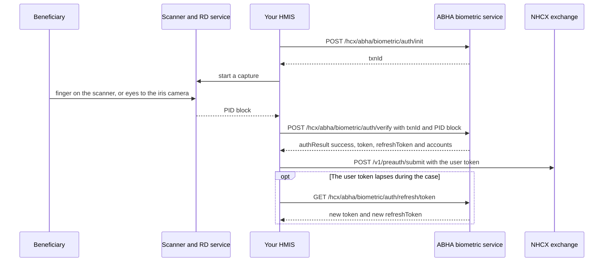

# Authenticate a beneficiary by fingerprint or iris

## In plain words

[PMJAY](../glossary/pmjay.md) pays only for care given to a beneficiary who was physically present. Your hospital proves presence by authenticating the beneficiary against their [ABHA](../../shared/glossary/abha.md), with a fingerprint or iris scan. A success returns a user token that is valid for 30 minutes.

That token goes with the eligibility check, the pre-authorisation and the claim. These are [ABDM](../../shared/glossary/abdm.md) calls made for the PMJAY payer, not NHCX messages. They are not sealed, and nothing arrives by callback.

## Before you start

- The beneficiary's ABHA is linked to their PMJAY card. If it is not, this flow does not apply: follow the PMJAY-approved [KYC](../../shared/glossary/kyc.md) protocols instead.
- A registered fingerprint or iris device, with its [RD service](../glossary/rd-service.md) running on the machine.
- A session token, sent as `Authorization: Bearer <ACCESS_TOKEN_FROM_SESSION_TOKEN>`.
- The participant code of the scheme payer the authentication is for, sent in the `payerid` header.
- The beneficiary at the desk, and the stage: `Preauth` at admission, `Discharge` at discharge and at every visit of a cyclic procedure.

## What happens



The sandbox host is `https://apisbx.abdm.gov.in`. Every call answers in its own response.

### 1. Start the authentication

`POST /hcx/abha/biometric/auth/init` with these headers:

| Header | Value |
|---|---|
| `accept` | `*/*` |
| `Content-Type` | `application/json` |
| `Authorization` | `Bearer <ACCESS_TOKEN_FROM_SESSION_TOKEN>` |
| `process` | `Preauth` or `Discharge`, one value |
| `payerid` | `<PAYER_PARTICIPANT_CODE>` |

For a fingerprint, the body is:

```json
{
  "scope": ["abha-login", "aadhaar-bio-verify"],
  "loginHint": "abha-number",
  "loginId": "<BENEFICIARY_ABHA_NUMBER>",
  "otpSystem": "aadhaar",
  "authMode": "FINGERPRINT"
}
```

For an iris, `scope` is `["abha-login", "aadhaar-iris-verify"]` and `authMode` is `IRIS`. The answer carries `txnId`.

### 2. Capture

Your HMIS asks the RD service for a capture. The beneficiary places a finger on the scanner, or looks into the iris camera. The RD service returns an encrypted [PID block](../glossary/pid-block.md) as a base64 string.

### 3. Verify

`POST /hcx/abha/biometric/auth/verify`, with the same five headers:

```json
{
  "scope": ["abha-login", "aadhaar-bio-verify"],
  "authData": {
    "authMethods": ["bio"],
    "bio": {
      "txnId": "<TXN_ID_FROM_INIT>",
      "fingerPrintAuthPid": "<PID_BLOCK_FROM_RD_SERVICE>"
    }
  },
  "authMode": "FINGERPRINT"
}
```

For an iris, `authMethods` is `["iris"]`, and an `iris` object carries `txnId` and `irisAuthPid`. Use the iris `scope` and `authMode` from step 1.

The answer carries `txnId`, `authResult`, `message`, `token`, `refreshToken`, `expiresIn` `1800`, `refreshExpiresIn` `1296000` and an `accounts` array. Each account carries `ABHANumber`, `preferredAbhaAddress`, `name`, `gender`, `dob`, `verifiedStatus`, `verificationType`, `status` and `profilePhoto`.

### 4. Use the user token

Pass the user `token` as a header parameter on the PMJAY claim events that follow. These are the coverage eligibility check, the pre-authorisation and, after discharge authentication, the claim. The payer validates it before accepting the request.

The token lasts 30 minutes. Submit within that time, or refresh it.

### 5. Refresh

`GET /hcx/abha/biometric/auth/refresh/token` with `R-token: Bearer <REFRESH_TOKEN_FROM_VERIFY>`, plus `Authorization`, `payerid` and `process`. The answer carries a new user token and a new refresh token. The new refresh token lasts 15 days from that moment.

Refresh at least once every 10 days and store the new refresh token. That keeps the chain alive for as long as the case needs. If the refresh token lapses, authenticate again with a live capture.

A refresh never replaces a live capture on a cyclic procedure. Every visit needs a capture with `process` `Discharge`. A refresh token from the last cycle serves only at the final claim, and a new capture is preferred there too.

### 6. At discharge

Authenticate again with `process` `Discharge`, and attach the new token to the claim. The method may differ from admission: a pre-authorisation by fingerprint can end in a claim by iris or face.

## How you know it worked

The verify call returns `authResult` `success`, a `token` with `expiresIn` `1800`, and a `refreshToken` with `refreshExpiresIn` `1296000`. `accounts` holds the beneficiary's ABHA number with `status` `ACTIVE`. The payer then accepts the pre-authorisation without [PAYR-1272](../errors/payr-1272.md).

```observation schema=exit-condition
channel: synchronous
call: POST /hcx/abha/biometric/auth/verify
match:
  authResult: success
  expiresIn: 1800
  accounts[0].ABHANumber: <BENEFICIARY_ABHA_NUMBER>
  accounts[0].status: ACTIVE
```

## When it goes wrong

- **The device fails with `K-547`.** Build the `wadh` value with `lr` set to `'Y'`. Keep `ra` as the device type (`'F'` for fingerprint), `rc` `'Y'`, `de` `'N'` and `pfr` `'N'`:

  ```javascript
  text = '2.5' + ra + rc + lr + de + pfr;
  wadh = Base64.stringify(sha256(text));
  ```

- **The payer rejects the user token.** It expired after 30 minutes, or belongs to another beneficiary. Authenticate again, or refresh. See [PAYR-1272](../errors/payr-1272.md), and [PAYR-1366](../errors/payr-1366.md) at discharge.
- **The payer says the consent questionnaire is missing.** You sent no biometric token and no Authentication Consent Questionnaire. See [PAYR-1256](../errors/payr-1256.md) at pre-authorisation and [PAYR-1363](../errors/payr-1363.md) at the claim.
- **The beneficiary cannot give a biometric.** Obtain the Aadhaar exemption consent document, signed by the patient and a hospital representative. Store it digitally and link it to the beneficiary record. Answer the plan's Authentication Consent Questionnaire. This route is closed for cyclic procedures, which need a live biometric.
- **Verify fails.** The PID block sits under the wrong key for the modality. Fingerprint goes in `bio.fingerPrintAuthPid`, iris in `iris.irisAuthPid`.
- **A cycle goes unpaid.** It was covered by a refresh token instead of a live capture. The payer pays only for captured cycles.
